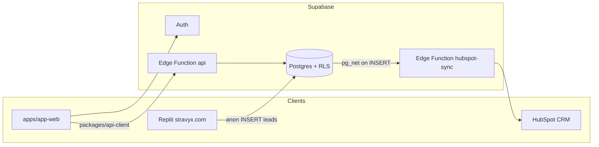

# Architecture — Stravyx

> Runtime and phase architecture. Product rules: [PROJECT_CONTEXT.md](./PROJECT_CONTEXT.md). Implementation status: [CURRENT_STATE.md](./CURRENT_STATE.md).

## Phase model (locked)

| Code | Name | Runtime | Status |
|------|------|---------|--------|
| **1A** | Supabase platform | Auth + Postgres + Edge | **In use** |
| **2A** | Demo vertical slice | Edge REST + `app-web` + leads→HubSpot | **Demo-ready** |
| **1B** | NestJS platform | `services/api` modular monolith | **Not started** (no Nest code in repo) |
| **2C** | Full ERD MVP | Admin/ops complete; payment rail when chosen | **Not started** |
| **P1+** | Docks / MSDK / native | Live ops gated by privacy + ReOC | Spec/ADRs only |

### Migration rules (1A→1B)

1. Schema follows **ERD** (enums, cents, visibility) — not Make prototype fields.
2. Clients talk stable REST `/api/...` via **`packages/api-client`** only.
3. HubSpot stays **one-way after persist**.

Auth migration cost is explicit later: Supabase Auth now → Auth0/Cognito later (map provider id; keep stable Stravyx user id).

## Current topology (Phase 1A/2A)

### Request path — marketplace

Browser → Supabase Auth (JWT) → `NEXT_PUBLIC_API_URL` → Edge Function **`api`** → service_role/authenticated DB access with **role-projected** responses.

Gateway note: Edge functions may use `verify_jwt: false` at the platform gateway; **JWT auth is enforced inside handlers** where required. Lead sync uses a shared secret header, not end-user JWT.

### Request path — marketing leads

Form (Replit) → `@supabase/supabase-js` **plain insert** (no `.select()`) → insert-only RLS → trigger `notify_hubspot_lead_sync` (pg_net) → `hubspot-sync` with `x-hubspot-sync-secret` → HubSpot contact upsert → writeback `hubspot_contact_id`.

## Target topology (Phase 1B/2C — docs only)

- NestJS modular monolith (`auth`, `identity`, `catalogue`, `pricing`, `missions`, `dispatch`, `visibility`, `payments`, `media`, `processing`, `compliance`, `crm`, `admin`, gated `dji`/`realtime`).
- Same or migrated Postgres (+ PostGIS); primary region **Sydney** (`ap-southeast-2`) later (demo project currently Tokyo — see `.env.example` URL).
- Redis for hot state/queues; S3 + CDN for media; DJI MQTT → NestJS bridge → Redis → WebSocket (ADRs 0001–0002, **0005**).
- Mobile: React Native + Expo custom dev client; DJI native quarantined in `packages/dji-msdk` (ADR 0003).
- **Flight integration direction (ADR 0005):** Cloud API + `manual` for Live-ops A; FH2 deferred. Full architecture: [dji-integration-architecture.md](./dji-integration-architecture.md). Operator journeys: [dji-vs-nondji-operator-journeys.md](./dji-vs-nondji-operator-journeys.md). **Do not scaffold** NestJS/MQTT until Phase 1B + APP 8 privacy gate.

**None of the NestJS/DJI/Redis/RN packages above exist in this repository today.**

## Database architecture

| Layer | Choice |
|-------|--------|
| Engine | PostgreSQL (Supabase; `config.toml` major **17**) |
| Target geo | PostGIS (ERD); demo eligibility is simplified (online verified ReOC) |
| Money | `bigint` cents + `currency` |
| Race safety | Partial unique index for one accepted offer per mission (ERD target; demo implements first-to-accept path) |
| Auth tables | Supabase `auth.users` + public `profiles` (signup trigger from `app_metadata.role`) |

### Domains vs demo subset

| Domain | Focus | Demo |
|--------|--------|------|
| A Identity | Users, orgs, ReOC | Thin: `profiles`, `organizations`, `reoc_profiles` |
| B Catalogue | Categories, equipment, pricing, urgency | Seeded tables |
| C Missions | Missions, locations, offers, status events | Core path implemented |
| D Payments | Payments, splits, payouts | `payments` stub / mock |
| E Media / L2 | Media, deliverables, jobs | `media_files` upload stub |
| F Devices / docks / telemetry | DJI | **Docs only** |
| G Compliance / audit | Audits, disputes | **Docs only** / thin events |
| H Academy & growth | Lead tables + HubSpot | **Live** (7 lead tables) |

Migrations live in `supabase/migrations/` — see [CURRENT_STATE.md](./CURRENT_STATE.md).

## Authentication & authorisation

| Concern | Demo behaviour |
|---------|----------------|
| IdP | Supabase Auth email/password |
| Role claim | `app_metadata.role` → `profiles.primary_role` |
| API authz | Edge `api` resolves JWT → role; mission mutations check role + `assigned_reoc_id` |
| RLS | Enabled on public tables; leads = **INSERT-only** for anon (no SELECT) |
| Money exposure | Fee fields not safely exposable via PostgREST; Edge is choke point |
| Role shell | JWT `/me` selects customer / operator / admin views — no client Switch View |

Long-term IdP (Auth0/Cognito) is planned; not implemented.

## APIs (stable contract)

Implemented by Edge `api` and mirrored in `packages/api-client`:

| Method | Path | Purpose |
|--------|------|---------|
| GET | `/api/health` | Health |
| POST | `/api/pricing/quote` | Network Price quote |
| GET | `/api/me` | Profile + role |
| POST | `/api/missions` | Create mission (book) |
| GET | `/api/missions` | Role-projected list / offers |
| POST | `/api/offers/:id/accept` | First-to-accept |
| POST | `/api/missions/:id/status` | `allocated` \| `flown` \| `delivered` |
| POST | `/api/missions/:id/upload-stub` | Media stub |

Shared types: `packages/types` (`pricing`, `visibility`, `mission-authz`, `models`).

## Frontend architecture

- **Next.js 14 App Router** with essentially a single route (`/`) mounting a client SPA (`src/stravyx/`).
- Role UIs coexist in one app (`customer` / `operator` / `admin` components) — split apps (`consumer-web` / `operator-web` / `admin-web`) are a later P2.
- Maps: MapTiler via `NEXT_PUBLIC_MAPTILER_KEY` (iframe URLs in booking / track / navigation).

## Integrations

| System | Direction | Status |
|--------|-----------|--------|
| Supabase | Core platform | Live |
| HubSpot | Outbound contact upsert | Live (`hubspot-sync`) |
| MapTiler | Client maps | Wired (env required) |
| Vercel | Host `app-web` | Configured (`apps/app-web/vercel.json`) |
| Replit | Marketing host | External SoT |
| DJI Cloud / MSDK | Telemetry / flight | Spec + ADRs only |
| Stripe (or other rail) | Payments | **Open** — provider-agnostic refs in ERD; demo mocks pay |

## Infrastructure & deployment

| Piece | Notes |
|-------|-------|
| CI | `.github/workflows/ci.yml` — Node 22, pnpm 9.15.0, `typecheck` + `test:contracts` |
| App deploy | Vercel monorepo: install/build from repo root filtering `@stravyx/app-web` |
| API deploy | Supabase Edge Functions |
| DB | Supabase hosted Postgres + migrations |
| CORS | Edge `api` allowlist includes localhost, stravyx.com, Vercel aliases, `app.stravyx.com` (**verify** current deployed version) |

## Packages planned but absent

Do not create casually: `services/api`, `packages/realtime`, `packages/dji-msdk`, `packages/ui`, `packages/maps`, `apps/marketing-web`, split role apps, `infra/`.
