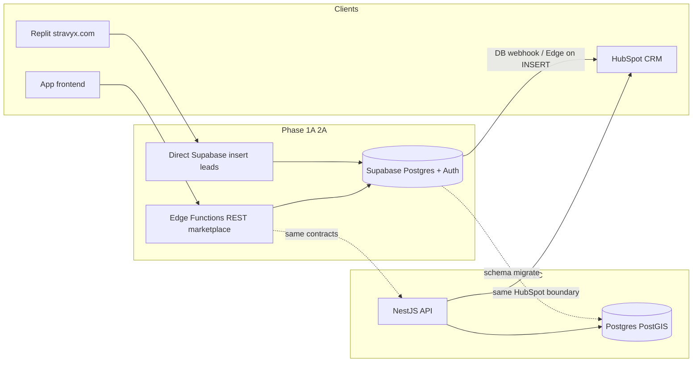
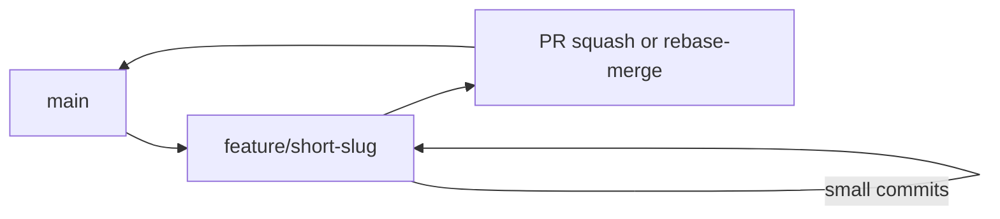

# Stravyx — Backend Build Plan (Phase 1A/2A → 1B/2C)

> **Status:** Active — Phase 1A/2A **demo-ready** (API + seed + app-web + Replit leads→HubSpot). Phase 2 (NestJS / 1B+2C) not started.  
> **Synced from:** Cursor plan `supabase_demo_backend` (25 Jul 2026).  
> **Use this file** as the git-tracked reference for current and next-phase sessions.

### Live progress (2026-07-25)

| Slice | State |
|-------|--------|
| Lead tables + insert-only RLS | Applied on `ruzblzcvnayajmnwyjyc` (+ `home_owner_leads`, `talent_interests`) |
| Marketplace MVP schema + catalogue seed + profile trigger | Applied |
| API role grants (`service_role` / `authenticated`) | Applied (`20260725022000`) |
| Edge `api` + `hubspot-sync` | Deployed (`verify_jwt: false`; auth inside handlers; HubSpot allowlist includes all 7 lead tables) |
| Demo users | Seeded — see `supabase/seed/demo_users.sql` (password `DemoPass123!`) |
| Smoke: book → dispatch → accept → status → upload → admin list | Passed |
| HubSpot `HUBSPOT_ACCESS_TOKEN` + INSERT triggers | Secret set; sync proven (`hubspot_contact_id` written) |
| Replit marketing Secrets → this project | **Done** — forms insert to lead tables; no client HubSpot |
| `apps/app-web` → `packages/api-client` | Wired — Auth + quote/book/accept/status/upload/admin |
| CORS allowlist (localhost + stravyx.com) | **Done / Deployed** — Edge `api` v6 allowlist (localhost + stravyx.com) |
| Playwright BDD / CI vertical slice | Deferred (contracts green; BDD skipped without base URL) |

# Supabase demo backend → NestJS later

## Answer to your question

**Yes.** Start **1A + 2A**, then move to **1B + 2C**, if we lock three migration rules day one:

1. **Schema = ERD v0.3** for marketplace tables (Postgres enums/cents/visibility) — not Make prototype fields. NestJS later sits on the same (or migrated) database.
2. **Marketplace clients talk REST** at stable paths (`/api/...`). Edge Functions today → NestJS controllers tomorrow; `packages/api-client` stays the only app surface.
3. **HubSpot stays one-way** after persist ([`data-model-erd.md`](./data-model-erd.md) §12 / §13.15). Never SoT for licence, pricing, or mission state.

Auth is the main later cost: Supabase Auth now → Auth0/Cognito later (map `auth.users.id` → `users.auth_provider_id` / keep a stable Stravyx `users.id`).

## Future growth posture (global enterprise)

**Short answer:** Yes for **domain and API evolution** — if we keep the ERD + NestJS-shaped contracts + visibility firewall as the durable core. **No** if “future-proof” means the **Supabase Edge runtime itself** is the forever home; that is a deliberate **demo → platform** stepping stone (1A → 1B).

### What is already enterprise-shaped (keep)

| Concern | Why it scales |
|---------|----------------|
| **ERD v0.3 domains** | Identity/orgs, catalogue, missions/dispatch, payments, media/L2, devices/docks, compliance, Academy/CRM — Phase tables marked without forcing them live |
| **Visibility firewall** | Margin/address rules are structural (API + RLS), not UI-only — survives new clients (mobile, reseller, API partners) |
| **Money as integer cents + provider-agnostic `provider_*_ref`** | Multi-currency and rail swaps without rewriting mission history |
| **First-to-accept + race safety in DB** | Correct under concurrency; ranking/bidding can return later as *features*, not schema rewrites |
| **Stable REST via `packages/api-client`** | Web, mobile, partners share one contract; NestJS can replace Edge without client rewrites |
| **HubSpot one-way boundary** | CRM never becomes a second system of record |
| **Idempotency on external writes** | Webhooks, CRM, payments, uploads stay safe at scale |

### What we intentionally defer (do not pretend demo = global GA)

| Concern | Demo (now) | Enterprise later |
|---------|------------|------------------|
| Runtime | Supabase Edge + Postgres | NestJS modular monolith → extract hot paths (DJI/telemetry per ADR 0002) |
| Region | Tokyo project OK | Primary `ap-southeast-2`; multi-region read replicas / data residency |
| Auth | Supabase email users | Enterprise SSO (SAML/OIDC), SCIM, Auth0/Cognito |
| Tenancy | Single Stravyx platform orgs | Harder org isolation, reseller/enterprise rate cards, API keys |
| Eligibility | Online ReOCs only | PostGIS approvals, coverage, equipment, urgency caps |
| Observability | Logs + advisors | OpenTelemetry, SLOs, audit export, incident playbooks |
| Delivery | Localhost demo | CDN, blue/green, feature flags, API versioning (`/v1`) |
| Compliance | Demo security bar | Privacy Act ops, retention jobs, DJI overseas disclosure gate |

### Extension rules (so “freely extend” stays true)

1. **New capabilities = new modules/tables behind the same contracts** — prefer additive migrations; avoid breaking `packages/api-client` without a version bump.
2. **Never put business rules only in the UI or only in HubSpot.**
3. **Feature-flag Phase 1/2 tables** rather than inventing parallel schemas.
4. **Keep money and PII projections server-side** when adding clients (RN, B2B API).
5. **Event-friendly seams:** status changes already append `mission_status_events` / `audit_log` — later fan-out to queues without rewriting the mission aggregate.
6. **Do not couple domain IDs to Supabase Auth UUIDs forever** — stable `users.id` + `auth_provider_id` mapping.

### Honest limit

No architecture adapts to *any* future need without cost. This one is **future-tolerant**: domain model and API boundaries absorb most product evolution; infrastructure (region, auth vendor, NestJS, multi-region) is a planned upgrade path, not a rewrite of the marketplace logic — provided we do not shortcut visibility or CRM boundaries during the demo.

## Marketing website — corrected source of truth

**Host / source:** live marketing is **built and hosted on Replit**, published at **[https://stravyx.com](https://stravyx.com)** (Next.js → Google Frontend).

**Do not use** local an obsolete sibling `stravyx-web` scaffold (outdated sibling scaffold).

| Live Replit app (SoT) | Local `stravyx-web` (stale) |
|---|---|
| `/for-operators`, `/academy`, `/free-flight`, `/solutions/*` | `/operators`, `/get-licensed`, `/dock-infrastructure`, … |
| Working forms → Supabase `.insert()` | `preventDefault` / `#` stubs |
| Nav: How it works · For operators · Missions · Academy · About | Older dock/finance-heavy IA |

**Live forms already write via `@supabase/supabase-js`** (Replit Secrets: `NEXT_PUBLIC_SUPABASE_URL` / `NEXT_PUBLIC_SUPABASE_ANON_KEY`):

| Page | Table insert |
|------|----------------|
| `/academy` | `academy_enquiries` |
| `/for-operators` | `operator_leads` |
| `/contact` | `contact_leads` |
| `/enterprise` | `enterprise_leads` |
| `/free-flight` | `business_leads` |

Shared helper also attaches UTM params. Honeypot field `website` on operator/free-flight forms.

**Supabase project `ruzblzcvnayajmnwyjyc` has lead + marketplace tables** and Replit Secrets now target it. Live forms insert via `@supabase/supabase-js` (plain insert, no `.select()`).

### Phase 1 marketing strategy (locked)

- **Keep marketing on Replit** — do not migrate into the monorepo for 1A/2A.
- Backend work in this repo provisions **lead tables + RLS + HubSpot-on-INSERT** to match the deployed client.
- Form/env source edits via **Replit MCP** (`ask_question` / `update_app_using_prompt`) when needed.
- Optional later (1B+): export Replit app into `apps/marketing-web`; not required for demo slice.



## Engineering operating system (locked)

Quality, history, and security are not afterthoughts — they gate every slice.

### TDD + BDD

| Layer | Practice | Tooling (default) |
|-------|----------|-------------------|
| **Unit / contract (TDD)** | Red → green → refactor for pricing, visibility projectors, first-to-accept race, HubSpot idempotency | Vitest in `packages/*` and Edge Function unit tests |
| **API contract** | Role-projected response snapshots; forbid L1/L2 leaks to customer/operator | Vitest + fixture JWTs per role |
| **BDD vertical slice** | Feature files for: book → pay(mock) → dispatch → accept → status → upload stub; academy/operator lead → HubSpot | Playwright + Gherkin (`@cucumber/cucumber` or Playwright BDD) under `tests/bdd/` |
| **Schema / RLS** | Migration PRs include failing RLS tests first; `supabase db advisors` must be clean | SQL tests + Supabase MCP advisors |

**Rule:** no feature code merged without a failing test written first (except pure scaffold/boilerplate commits that enable the harness).

### Auto run loop (test → debug → fix)

On each feature branch, after the first red test:

1. Implement minimum code to green.
2. Run focused suite → full monorepo suite → advisors/security checks.
3. On failure: diagnose (logs, failing assertion, advisor finding) → fix → re-run (no silent skips).
4. Use Cursor **`/loop`** during long slices to re-run the failing suite until green or a human decision is needed.
5. Use **babysit** on open PRs: triage CI, conflicts, and review comments until merge-ready.

Stop conditions for the loop: all required checks green, visibility contract suite green, no new advisor Critical/High, PR description complete.

### Git / branching / PRs (readable history)



- **Trunk:** `main` always deployable (demo staging).
- **Branches:** `feature/<area>-<intent>` (e.g. `feature/leads-hubspot-sync`, `feature/missions-first-accept`) — short-lived (&lt; 2–3 days of work).
- **Commits:** conventional, one concern each — `test:`, `feat:`, `fix:`, `security:`, `chore:`, `docs:`. Message explains **why**.
- **Never** commit secrets, `.env`, HubSpot PAT, or service_role keys.
- **PRs:** one vertical concern; Summary + Test plan; link BDD scenarios; require CI + visibility tests + advisor pass before merge.
- **History style:** prefer **squash-merge** of feature PRs into `main` for a linear narrative; keep WIP commits on the branch as needed, squash at merge.
- **Incremental delivery order (each = own PR):**
  1. harness (Vitest/Playwright/CI)  
  2. lead tables + RLS + HubSpot sync  
  3. marketplace schema + RLS  
  4. pricing + visibility contracts  
  5. missions/dispatch Edge API  
  6. wire `apps/app-web`  
  7. security hardening pass  

### Launch security bar (must pass before calling the slice “demo-ready”)

Aligned with Supabase skill checklist + ERD visibility firewall:

**Demo-ready (required now):**
- RLS on every `public` table; lead tables: `anon` INSERT-only, no public SELECT.
- Roles via `app_metadata` only (never `user_metadata`); no client-side role elevation in “real” mode.
- No `service_role` / HubSpot token in browser; Edge/secrets only.
- Marketplace money/address only via Edge (visibility firewall).
- CORS allowlist: `http://localhost:3000` (+ marketing origin when wired).
- Idempotent HubSpot push; advisors Critical/High clean (**manual** pre-demo check via Supabase advisors — not automated in CI).
- `.env.example` names only.
- Mission status / upload-stub: server-side authz (assigned operator or admin only).
- `HUBSPOT_SYNC_SECRET` required on `hubspot-sync`; pg_net sends `x-hubspot-sync-secret` from Vault `hubspot_sync_secret`.

**GA / later (explicitly not blocking demo):**
- Full rate limiting / WAF, AU Privacy Act retention jobs, Auth0/Cognito, production CORS, branch protection on GitHub, PostGIS approval-area eligibility, DJI overseas disclosure.

## Working demo — definition of done

A **working demo** means a founder can run this **5-minute script** on a laptop (two browser profiles):

1. **Customer** signs in (seeded account) → books a Sydney mission → sees **one Network Price** → confirms with **mock pay** → tracker advances on real statuses.
2. **Operator** (second profile) sees offer with **suburb only** → accepts → sees **full address** → advances status → upload stub OK.
3. **Admin** lists the mission with full economics visible.
4. **Leads path (API/test):** insert academy/operator lead → row in Supabase → contact appears in HubSpot (or HubSpot sync logged with `hubspot_contact_id`). Live Replit forms work only after Secrets point here (deferred OK if API demo proves the path).

Host for demo v1: **localhost** (`apps/app-web` + Supabase cloud). Public app hosting (Vercel) optional stretch.

## Gaps / risks to watch (review findings)

| Item | Why it matters for demo | Plan response |
|------|-------------------------|---------------|
| **Empty Supabase schema** | Live inserts fail until tables exist | Create lead + marketplace tables first |
| **Replit Secrets unknown** | Live site may still use placeholders | Demo proves HubSpot via test insert; wire Replit later |
| **Exact lead columns** | Live JS inserts specific fields — mismatch = silent form errors | Reverse-engineer columns from live chunks before migration; nullable extras OK |
| **HubSpot PAT scopes** | Token may lack Contacts write | Verify on first sync; rotate if chat-exposed |
| **ViewToggle role switch** | Insecure for anything beyond pure UI demo | **Retired 2026-08-11** — JWT `/me` role only; no Account Switch View |
| **SF mock addresses in zip** | Unconvincing AU demo | Seed Sydney CBD / suburbs |
| **Full eligibility (PostGIS approvals)** | Too heavy for first demo | Fan-out to **online verified ReOCs** only; geometry later |
| **Realtime status** | Zip uses `setTimeout` | Poll every few seconds or Supabase Realtime on `missions` |
| **Two sessions** | First-to-accept needs customer + operator | Document two browsers / profiles in demo script |
| **Auth UX** | Mock “any password” vs Supabase Auth | Seed email/password users; skip Google OAuth for demo |
| **TDD/BDD overbuild** | Can delay working UI | One happy-path BDD + visibility contract suite; expand after demo green |
| **Docs-only repo noise** | `.agents/`, PDFs, `node_modules` clutter PRs | Tighten `.gitignore`; don’t commit skills or secrets |
| **Monorepo package manager** | Undefined | **pnpm** workspaces + simple root scripts (default) |
| **CI host** | No Actions yet | GitHub Actions on PRs to `main` |
| **CORS / Edge URL** | App must call `*.supabase.co/functions/v1/...` | Document `NEXT_PUBLIC_API_URL` in `.env.example` |
| **Upload stub** | Need Storage bucket + policies | Private bucket + signed URL only |
| **Idempotency from live forms** | Site may not send key | DB default `gen_random_uuid()` or hash(email+day) server-side |
| **Region Tokyo vs Sydney** | Spec wants `ap-southeast-2` | Accept for demo; note migrate later |

## Phase 1 (now) — 1A + 2A

### Repo layout

Turn [`prototype-project`](.) into the product monorepo (docs stay under `docs/`):

```
apps/app-web           # from ~/Downloads/stravyx-nextjs.zip (Figma Make → Next.js)
packages/types
packages/api-client
supabase/migrations
supabase/functions
# marketing: stays on Replit (stravyx.com) — Replit MCP later
```

### App frontend seed (locked)

Historical source import has already been materialized under `apps/app-web`; do not depend on a developer-local ZIP path.

- Next.js 14 App Router; SPA client tree under `src/stravyx/` (customer / operator / admin). Zip originally included ViewToggle; **removed 2026-08-11** — shell follows `/me` role.
- **Mock-only today:** `App.tsx` holds jobs in `useState` + `setTimeout` status progression — no Supabase/API client yet
- Types still use Make-era `JobStatus` (`pending|accepted|in_progress|completed`) and `flightFee`/`totalPrice` dollars; booking still uses `basePrice × (duration/30) × urgency` and `×1.4`
- Urgency multipliers already match product (0.85 / 1.0 / 1.35 / 2.25)

**Wiring approach:** keep screens; swap mock handlers for `packages/api-client` against Edge Functions; map UI labels → ERD statuses; customer sees one Network Price; operator offers suburb-only. Do not treat zip types as DB schema.

Use existing Supabase project **Stravyx's Project** (`ruzblzcvnayajmnwyjyc`) once Replit Secrets are confirmed to target it. Region is Tokyo today; document a later Sydney move for prod — do not block the demo.

### Schema — two layers

**A. Website lead tables (match live site first)** so forms work without waiting on Nest-shaped CRM APIs:

- `academy_enquiries` (align columns to live form: `first_name`, `mobile`, `email`, `state`, … + `hubspot_contact_id`, `idempotency_key`)
- `operator_leads` (`holds`, `service_area`, `contact`, UTMs, …)
- `contact_leads`, `enterprise_leads`, `business_leads`
- RLS: `anon` INSERT only (no SELECT for public); service role for HubSpot worker
- Optional later: migrate operator/academy paths to ERD `POST /api/operators/register` + `POST /api/academy/enquiry` without breaking live forms

**B. Marketplace ERD v0.3 MVP subset** for the app demo:

- Identity: `users`, `roles`, `user_roles`, `organizations`, `reoc_profiles`, `pilot_profiles` (thin), `operator_credentials` (stub)
- Catalogue: `mission_categories` (5 MVP), `equipment_classes`, `pricing_configs`, `urgency_tiers`
- Missions: `missions`, `mission_locations`, `mission_offers`, `mission_status_events`
- Payments: `payments` with mock/`provider_*_ref` only
- Media: `media_files` stub + private Storage bucket
- Money as **integer cents**; mission status enum per ERD
- First-to-accept: partial unique index on `mission_offers (mission_id) WHERE status = 'accepted'`
- **Demo fan-out:** all ReOCs with `online=true` (and verified stub); defer PostGIS approval-area eligibility
- **Seed:** 5 categories, active `pricing_configs` ($250/hr), 4 urgency tiers, Sydney demo users
- RLS on all tables; marketplace fee fields not exposed via PostgREST to anon/authenticated

### HubSpot wiring (website)

Because live already inserts to Supabase, prefer **persist-first already done → async HubSpot push on INSERT** (Database Webhook or Edge Function trigger), storing `hubspot_contact_id`. Do not embed HubSpot tokens in the Next.js client. HubSpot MCP is for ops/dev only.

### Marketplace API surface (Edge Functions, NestJS-shaped)

| Area | Endpoints |
|------|-----------|
| Health | `GET /api/health` |
| Auth bridge | sync profile on login; roles in `app_metadata` only |
| Pricing | `POST /api/pricing/quote` — single `network_price_cents` to customer |
| Missions | create/book, list (role-projected), get, status transitions |
| Dispatch | fan-out offers; accept with DB race; suburb-only until accept |
| Admin | list missions + verification stub |
| Upload | signed URL stub for raw media |

Visibility contract tests before wiring UI.

### Client wiring

- **Website (Replit):** leave deployed insert path; set Secrets when ready (MCP later). Provision matching tables + HubSpot sync in Supabase.
- **App frontend:** unzip → `apps/app-web`; replace in-memory mocks with `api-client` (auth → book → mock pay → offer → accept → status → upload stub → admin list).
- **Ignore** outdated local `stravyx-web`.

### Out of scope for Phase 1

Live DJI / telemetry (hard gate §13.16), real payment rail, NestJS, full admin, Host-a-Node, bidding (retired), Replit MCP edits, migrating Replit marketing into the monorepo, pixel-perfect Make parity on Decline/checklist/ReOC uploads.

## Phase 2 (later) — 1B NestJS + 2C full MVP

**Entry criteria:** Phase 1 demo script green; visibility contract suite green; HubSpot sync proven; `packages/api-client` paths stable.

**Goal:** Same product contracts on a production-shaped NestJS modular monolith + full ERD **[MVP]** surface (still not Phase-1 docks live-ops / native apps unless flagged).

### 2.1 Target topology

```
apps/
  app-web              # stays; points NEXT_PUBLIC_API_URL at Nest
  marketing-web        # optional: import from Replit
  consumer-web | operator-web | admin-web   # optional later split of the single SPA
services/
  api                  # NestJS modular monolith
packages/
  types | api-client | ui | …
infra/
  docker-compose       # api + postgres+postgis + redis
  terraform/cdk        # later: ECS/Fargate ap-southeast-2
```

**NestJS modules (map 1:1 from Edge handlers + ERD):**

| Module | Owns |
|--------|------|
| `auth` | JWT validation (Cognito/Auth0), `users.auth_provider_id` |
| `identity` | users, orgs, reoc/pilot profiles, credentials, roles |
| `catalogue` | categories, equipment, pricing_configs, urgency_tiers |
| `pricing` | Network Price calculator (cents) |
| `missions` | lifecycle, locations, status events |
| `dispatch` | offers fan-out, first-to-accept, eligibility |
| `visibility` | role projections — single choke point for responses |
| `payments` | provider-agnostic hold/capture/split stubs → real rail |
| `media` | STS/S3 upload, raw → processing_jobs |
| `processing` | Layer 2 job queue (stub → AI pipeline) |
| `compliance` | checklist gate allocated→flown; audit_log |
| `crm` | academy/operator/pilot register + HubSpot worker |
| `admin` | verification, disputes, audit export, pricing config |
| `dji` / `realtime` | **gated** until §13.16 disclosure (ADR 0002 NestJS bridge) |

### 2.2 Cutover sequence (keep clients green)

1. Stand up Nest against **same Postgres** (or dump/restore to RDS Sydney + PostGIS).
2. Implement controllers with **identical paths** as Edge (`/api/...`); OpenAPI from Nest.
3. Dual-run: shadow traffic or feature-flag `NEXT_PUBLIC_API_URL` per env.
4. Move HubSpot worker to Nest job/queue; retire Edge CRM function.
5. Flip app + (later) marketing to Nest; delete Edge marketplace functions.
6. Auth migration: Cognito/Auth0; backfill `auth_provider_id`; deprecate Supabase Auth when sessions migrated.
7. Expand schema to remaining ERD **[MVP]** tables (approvals, feasibility, payout lines, etc.) behind flags.
8. Turn on Redis for dispatch/session; S3+CDN for media; observability baseline.

### 2.3 Full MVP product scope (2C)

**In:**
- Customer book / track / deliverables status; single Network Price
- Operator online, offers (suburb), accept, decline/expiry, checklist gate, raw upload
- Admin verification queue, dispute freeze, job oversight, audit CSV, pricing config
- 5 MVP categories; payment rail when decided (columns already provider-agnostic)
- Marketing forms via Nest CRM routes (or keep direct insert + Nest worker)
- Visibility contract tests remain merge gates

**Still out / gated:**
- DJI live telemetry/livestream/dock cloud until Consent & Privacy overseas disclosure
- Native iOS/Android (ADR 0003 post-GA programme)
- Host-a-Node / public network dock owner economics
- Competitive bidding / BEST MATCH SCORE (retired)
- Full Layer 2 AI (manual/placeholder SLA OK at first GA)

### 2.4 Phase 2 PR train (suggested)

1. Nest scaffold + Docker Compose + health
2. auth + identity + JWT migrate
3. pricing + visibility (port Vitest contracts)
4. missions + dispatch (port first-accept tests)
5. payments + media + processing stubs
6. crm HubSpot worker cutover
7. admin ops (verify/dispute/audit)
8. ap-southeast-2 RDS/ECS staging
9. marketing → Nest or confirmed Replit Secrets
10. retire Edge; update plan status

### 2.5 Phase 2 DoD

- Staging: two-sided loop with real test payment rail (when chosen)
- Operator never sees L2 / network total; customer one price; suburb→address gate
- Security review on Nest + RDS; no secrets in clients
- `packages/api-client` unchanged except base URL / auth header source
- Demo script still passes; BDD expanded for decline/checklist/dispute

## Phase map (quick reference)

| Code | Name | When | Runtime |
|------|------|------|---------|
| **1A** | Supabase platform | Now | Auth + Postgres + Edge |
| **2A** | Demo vertical slice | Now | Edge REST + app-web + leads→HubSpot |
| **1B** | NestJS platform | Next | `services/api` + same/migrated DB |
| **2C** | Full ERD MVP API/UI | Next | Nest modules + admin/ops complete |
| **P1+** | Docks live-ops, MSDK, native | Later | Gated by disclosure + ReOC strategy |

## Canonical doc location

- **This file (`docs/backend-build-plan.md`):** git-tracked source of truth for Phase 1 and Phase 2 sessions.
- **Data model:** [`data-model-erd.md`](./data-model-erd.md) v0.3.
- **Demo UX inventory:** [`figma-make-frontend-gap-review.md`](./figma-make-frontend-gap-review.md) §12.
- **ADR:** NestJS bridge [`adr/0002-bridge-runtime-nestjs-vs-rust.md`](./adr/0002-bridge-runtime-nestjs-vs-rust.md).

## Prerequisites

- Replit marketing SoT; **Replit MCP deferred**.
- **HubSpot PAT:** Supabase secret `HUBSPOT_ACCESS_TOKEN` only (never git). Rotate if shared in chat.
- **HubSpot sync auth:** Edge secret `HUBSPOT_SYNC_SECRET` + Vault secret `hubspot_sync_secret` (same value); header `x-hubspot-sync-secret` on pg_net calls.
- Historical app source ZIP is no longer an active dependency; `apps/app-web` is the repository source of truth.
- Confirm Replit Secrets → `ruzblzcvnayajmnwyjyc` when connecting marketing.
- Skills: Supabase + Playwright now; NestJS / AWS skills in Phase 2.

## How to continue in a new session

**Phase 1 (demo):**

```
Execute the Stravyx backend build plan (Cursor plan or docs/backend-build-plan.md).
Phase: 1A+2A working demo first.
Start at: harness + monorepo PR.
Do not paste secrets; use Supabase HUBSPOT_ACCESS_TOKEN.
Follow TDD/BDD + squash PR train in the plan.
```

**Phase 2 (NestJS + full MVP):**

```
Continue docs/backend-build-plan.md Phase 2 (1B+2C).
Entry: Phase 1 demo DoD must be green.
Port Edge → NestJS; keep packages/api-client paths.
Expand to full MVP admin/ops; DJI still gated.
```
