# Stravyx — Draft Data Model / ERD

> **Status:** Draft (**v0.3.1**) — v0.3 base per **Data Model ERD Feedback v2** (Liz Ip, July 2026; checked against User Journey v5 · Web App Master v6 · Website Master v5 · Consent & Privacy Policy v4 · Operator Database Brief Feedback v3). **v0.3.1** syncs Domain H + HubSpot boundary to the live Supabase lead schema (Phase 1A). Supersedes v0.3 / v0.2.
> **Biggest change in v0.2:** the marketplace is **not** a competitive bidding market. Stravyx sets a single Network Price and **fans the mission out to every eligible ReOC; the first to accept wins** (first-to-accept dispatch). Bidding, price guides, and "BEST MATCH SCORE" ranking are **retired**. See §14 changelog.
> **v0.3 additions (feedback v2):** **approvals registry** (`operator_approvals` + `approval_areas` — CASA geometry, not self-declared service areas), **ReOC-operated dock model** (`operating_reoc_id`, `covering_approval_id`, `mission_schedules`), **`assessed` status** + feasibility record, **payment rail left open** (provider-agnostic refs — not locked to Stripe or Xero), **integer cents** for money.
> **v0.3.1 additions (Supabase Phase 1A):** website **growth lead tables** aligned to live `stravyx.com` inserts (`operator_leads`, `contact_leads`, `enterprise_leads`, `business_leads`, `home_owner_leads`, `talent_interests`) + live `academy_enquiries` columns; HubSpot push via **INSERT triggers / pg_net** (§12 / §13.15). Marketplace target model unchanged — demo subset lives in [`backend-build-plan.md`](./backend-build-plan.md) / `supabase/migrations/`.
> **Aligned to:** [`executive-summary.md`](./executive-summary.md), [`mvp-build-timeline.md`](./mvp-build-timeline.md), [`backend-build-plan.md`](./backend-build-plan.md), [`dji-frontend-technical-spec.md`](./dji-frontend-technical-spec.md), [`dji-bridge-and-client-internals.md`](./dji-bridge-and-client-internals.md), ADRs [0001](./adr/0001-dji-telemetry-unified-types.md) / [0002](./adr/0002-bridge-runtime-nestjs-vs-rust.md).
> **Target stack:** PostgreSQL 15+ with **PostGIS** (geo), Redis (hot state/queues), S3 + CDN (media), AWS `ap-southeast-2`. Telemetry is a **time-series** table (TimescaleDB hypertable or native partitioning) — see §9.
> **Scope note:** MVP (launch) tables are marked **[MVP]**; Phase 1 / Phase 2 tables are marked **[P1]** / **[P2]**. They are included now so the schema doesn't need destructive migrations later — build the MVP subset, leave the rest feature-flagged / unmigrated until needed.

---

## 0. How to read this document

1. **§1 Conventions** — the rules every table follows (keys, timestamps, money, soft delete, visibility).
2. **§2 High-level map** — one diagram showing the eight domains and how they connect.
3. **§2b Dispatch mechanic** — the confirmed **first-to-accept** flow the whole marketplace hangs off.
4. **§3–§12 Domain sections** — each has a focused ER diagram, a table-by-table breakdown with **column comments**, and an **association rationale** (why the relationship exists and its cardinality).
5. **§13 Recommendations** — things beyond the original brief worth locking (audit immutability, visibility views, race safety, retention, KYC/insurance expiry, HubSpot boundary, etc.).
6. **§14 Changelog** and **§15 Open questions.**

The single most important architectural constraint is the **two-layer revenue model + five visibility layers** (exec summary §"Information architecture"). Money and Layer 2 data must be **structurally** unreachable by ReOCs/pilots/dock owners — not just hidden in the UI. Sensitive figures live in separate tables and I recommend DB-level projections (§13.2) so a leaky query can't expose margin.

---

## 1. Conventions

| Rule | Decision | Why |
|---|---|---|
| **Primary keys** | `uuid` (v7 preferred) `id` on every table | Non-guessable, shard-friendly, safe to expose in URLs; v7 is time-sortable for index locality |
| **Timestamps** | `created_at`, `updated_at` (`timestamptz`, UTC) on every table | Auditability; store UTC for future multi-region |
| **Soft delete** | `deleted_at timestamptz NULL` on user-facing entities | Marketplace disputes/regulatory audit need recoverable history; hard-delete only via retention job (§13.7) |
| **Money** | `bigint` minor units (cents) + explicit `currency char(3)` (default `AUD`); never floats | Financial correctness; 85/15 + L1/L2 split avoids `numeric` rounding drift (feedback §08 — **decided**) |
| **Payment / payout provider** | Provider-agnostic external refs (`provider_*_ref` columns); **no** hard-coded rail | Capture rail and payout rail are **open decisions** (e.g. card capture vs monthly consolidated ReOC payout) — do not bake in Stripe, Xero, or any single vendor until confirmed |
| **Enums** | Postgres `enum` for stable machine states; **lookup tables** for admin-editable sets | Balance integrity vs runtime flexibility (§13.9) |
| **Geo** | PostGIS `geography(Point,4326)` / `geography(Polygon,4326)` | Distance for eligibility/coverage + coverage polygons |
| **JSON** | `jsonb` for flexible/vendor payloads (DJI raw, requirement specs) | Schema churn insulation (ADR 0001); index with GIN where queried |
| **Idempotency** | `idempotency_key` on externally-triggered writes (payments, uploads, **HubSpot push**) | At-least-once webhooks/MQTT/CRM (bridge doc §6, feedback §06) |
| **Race safety** | DB-level constraints decide contested writes, not the app | First-to-accept is a race by design — the winner is decided by a **partial unique index** (§5, §13.14) |
| **Audit** | Append-only `audit_log` + status-event tables; no `UPDATE`/`DELETE` | Immutable audit log is a launch requirement |
| **Naming** | `snake_case` tables (plural) and columns; FK = `{singular}_id` | Convention consistency |

---

## 2. High-level domain map

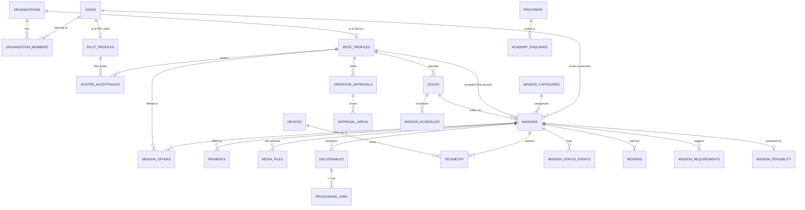

**Eight domains** (detailed sections below):

| # | Domain | Section | Core tables | Verdict (feedback v2) |
|---|---|---|---|---|
| A | Identity, orgs & supply-side | §3 | `users`, `organizations`, `reoc_profiles`, `pilot_profiles`, `roster_acceptances`, `operator_credentials`, **`operator_approvals`**, **`approval_areas`**, `service_areas`, `operator_equipment` | **Reshape** — split profiles, roster, **+ approvals registry** |
| B | Catalogue & pricing | §4 | `mission_categories`, `equipment_classes`, `pricing_configs`, `urgency_tiers` | **Reshape** — drop price guides |
| C | Missions & dispatch | §5 | `missions`, `mission_locations`, `mission_offers`, **`mission_requirements`**, **`mission_feasibility`**, **`mission_schedules`**, `mission_status_events` | **Reshape** — dispatch + **restricted-ops path** |
| D | Payments | §6 | `payments`, `payment_splits`, `payouts`, **`payout_lines`**, `refunds` | **Reshape** — provider-agnostic; payout cardinality **open** |
| E | Media, deliverables & processing | §7 | `media_files`, `deliverables`, `processing_jobs` | **Aligned** |
| F | Devices, docks & telemetry (DJI) | §8–§9 | `devices`, **`docks`** (ReOC-operated model), `device_bindings`, `telemetry`, `hms_alerts`, `livestreams` | **Reshape** — ReOC-operated docks **[MVP]**; live-ops **gated** (§13.16) |
| G | Compliance, audit, reviews & notifications | §10–§11 | `compliance_checks`, `audit_log`, `reviews`, `disputes`, `notifications` | **Aligned** — feasibility overlaps compliance gate |
| H | Academy & growth (CRM boundary) | §12 | `academy_enquiries`, **`operator_leads`**, **`contact_leads`**, **`enterprise_leads`**, **`business_leads`**, **`home_owner_leads`**, **`talent_interests`**, `providers` (+ HubSpot mapping fields) | **Synced** — live website lead schema **[MVP]** |

---

## 2b. The dispatch mechanic — first-to-accept (confirmed)

This is the mechanic the marketplace hangs off, confirmed by Joel (feedback §03). Read this before Domains A–C.

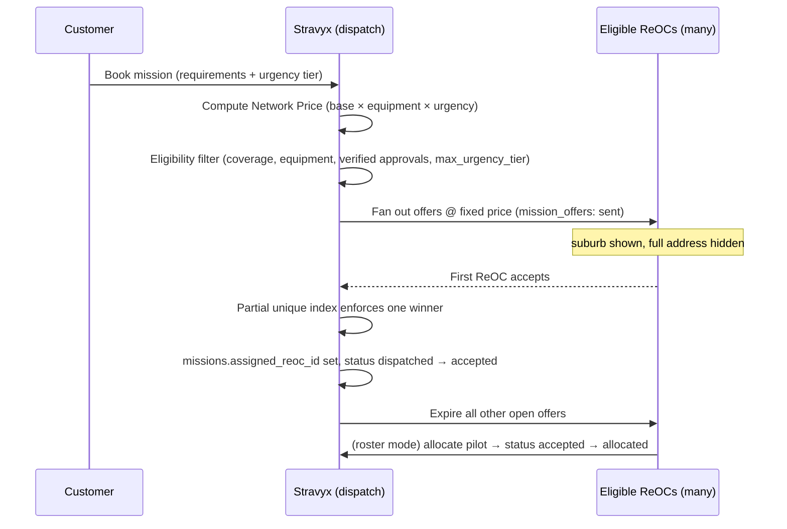

**Rules baked into the schema:**

1. **Stravyx sets the price.** No bids, no floor, no ceiling, no ranking on price. The price lives on the mission; `mission_offers` carries **no price** — there is nothing to compete on.
2. **Eligibility decides who sees the offer; speed decides who wins.** Fan-out targets only ReOCs that pass: location coverage (`service_areas` — where the ReOC *says* it works), requirements/equipment match (`operator_equipment`), **verified CASA approvals whose geometry covers the mission point** (`operator_approvals` + `approval_areas` — **not** `service_areas`; see §3), document credentials (`operator_credentials` — ReOC/insurance/RePL expiry), and **urgency-tier capability** (`reoc_profiles.max_urgency_tier_id`). A mission with a restricted-ops requirement is **never** fanned out to a ReOC without a verified approval whose area covers the location — no override, no scraped-flag shortcut.
3. **First to accept wins — decided in the database.** A partial unique index `UNIQUE (mission_id) WHERE status = 'accepted'` guarantees exactly one winner under a two-tap race; the loser gets a clean "mission already taken" (§5, §13.14).
4. **Offer expiry is tier-driven.** `expires_at = offered_at + urgency_tiers.dispatch_window`. Immediate = short expiry + aggressive fan-out; Scheduled = wide window.
5. **FLIGHT SCORE ≠ dispatch ranking.** FLIGHT SCORE ranks *pilots in the verified pool* for ReOC **roster** selection — it is a `pilot_profiles` attribute, not a bid-scoring table.

**Confirmed mission state machine:** `draft → booked → dispatched → accepted → allocated → assessed → flown → delivered` (with `disputed`/`cancelled` branches). `dispatched` = offers fanned out; `accepted` = first eligible ReOC accepted; `allocated` = pilot or dock allocated; **`assessed`** = Responsible Person feasibility sign-off for restricted-ops missions (see §5 / §10 — skipped when not required); `flown` / `delivered` unchanged. The **compliance gate** (airspace/weather/NOTAM/HMS) sits on **`allocated → flown`** (or **`assessed → flown`** when assessed applies). **Solo ReOC:** `allocated_pilot_id` stays **null** — no `roster_acceptance` required.

---

## 3. Domain A — Identity, organizations & supply-side

```mermaid
erDiagram
    USERS {
        uuid id PK
        text email UK
        text auth_provider_id "Auth0/Cognito sub"
        text full_name
        text phone
        text primary_role "enum: consumer|reoc|pilot|admin|dock_owner|enterprise"
        uuid organization_id FK "nullable"
        text hubspot_contact_id "CRM sync ref (nullable)"
        text status "enum: active|suspended|pending"
        timestamptz created_at
        timestamptz deleted_at
    }
    ROLES {
        uuid id PK
        text key UK "consumer|reoc|pilot|admin|..."
        text description
    }
    USER_ROLES {
        uuid id PK
        uuid user_id FK
        uuid role_id FK
        uuid scope_org_id FK "nullable, org-scoped grant"
    }
    ORGANIZATIONS {
        uuid id PK
        text legal_name
        text abn_acn "AU business number"
        text type "enum: reoc|enterprise|reseller|dock_owner"
        text status
        timestamptz created_at
    }
    ORGANIZATION_MEMBERS {
        uuid id PK
        uuid organization_id FK
        uuid user_id FK
        text member_role "owner|admin|pilot|billing"
    }
    REOC_PROFILES {
        uuid id PK
        uuid organization_id FK, UK
        text reoc_number "own ReOC"
        text mode "enum: solo|roster (both first-class)"
        uuid max_urgency_tier_id FK "highest tier eligible to receive"
        text payout_account_ref "nullable — provider-agnostic payout destination (provisional)"
        text verification_status "enum: unverified|pending|verified|rejected"
        numeric rating_avg
        int completed_missions
        numeric acceptance_rate "derived from mission_offers"
        timestamptz verified_at
    }
    PILOT_PROFILES {
        uuid id PK
        uuid user_id FK, UK
        text rpl_number "RPL/RePL"
        text pool_status "enum: verified|available|rostered"
        numeric flight_score "FLIGHT SCORE — roster ranking"
        int completed_flights
        timestamptz verified_at
    }
    ROSTER_ACCEPTANCES {
        uuid id PK
        uuid reoc_profile_id FK
        uuid pilot_profile_id FK
        timestamptz accepted_at "CASA compliance timestamp"
        numeric split "private share of the 85% (recorded, not set by Stravyx)"
        text status "enum: pending|active|ended"
        timestamptz ended_at
    }
    OPERATOR_CREDENTIALS {
        uuid id PK
        uuid reoc_profile_id FK "nullable"
        uuid pilot_profile_id FK "nullable"
        text kind "enum: repl|reoc|insurance"
        text document_url "S3 signed"
        date issued_at
        date expires_at
        text status "enum: pending|approved|rejected|expired"
        uuid reviewed_by FK "admin user"
    }
    OPERATOR_APPROVALS {
        uuid id PK
        uuid reoc_profile_id FK "ReOC only — never pilot"
        text approval_type "enum: bvlos|night|over_people|above_400ft|controlled_airspace"
        text instrument_ref "CASA instrument sighted"
        jsonb conditions "instrument conditions"
        date issued_at
        date expires_at
        text verification_status "enum: unverified|pending|verified|rejected|expired"
        timestamptz verified_at
    }
    APPROVAL_AREAS {
        uuid id PK
        uuid operator_approval_id FK
        geography area "Polygon 4326 — GIST indexed"
    }
    SERVICE_AREAS {
        uuid id PK
        uuid reoc_profile_id FK
        geography coverage "Polygon 4326"
        int travel_radius_km
    }
    OPERATOR_EQUIPMENT {
        uuid id PK
        uuid reoc_profile_id FK
        uuid equipment_class_id FK
        text make_model "e.g. Mavic 3E"
        text serial_number "nullable until device-bound"
        jsonb capabilities "cameras, payloads, sensors"
    }

    USERS ||--o{ USER_ROLES : "granted"
    ROLES ||--o{ USER_ROLES : "assigned via"
    ORGANIZATIONS ||--o{ ORGANIZATION_MEMBERS : has
    USERS ||--o{ ORGANIZATION_MEMBERS : "member of"
    ORGANIZATIONS ||--o| REOC_PROFILES : "is (if ReOC)"
    USERS ||--o| PILOT_PROFILES : "is (if pilot)"
    REOC_PROFILES ||--o{ ROSTER_ACCEPTANCES : rosters
    PILOT_PROFILES ||--o{ ROSTER_ACCEPTANCES : "flies under"
    REOC_PROFILES ||--o{ OPERATOR_CREDENTIALS : holds
    PILOT_PROFILES ||--o{ OPERATOR_CREDENTIALS : holds
    REOC_PROFILES ||--o{ OPERATOR_APPROVALS : holds
    OPERATOR_APPROVALS ||--o{ APPROVAL_AREAS : covers
    REOC_PROFILES ||--o{ SERVICE_AREAS : covers
    REOC_PROFILES ||--o{ OPERATOR_EQUIPMENT : owns
```

### Tables

- **`users`** — Every human/principal. `primary_role` is a fast-path denormalization of the RBAC in `user_roles`. `auth_provider_id` maps to Auth0/Cognito `sub` — no passwords stored. **New:** `hubspot_contact_id` is the one-way CRM sync ref (§12 / §13.15) so the outbound push is idempotent and traceable rather than a lookup-by-email guess.
- **`roles` / `user_roles`** — RBAC. A user can hold multiple roles, and grants can be **org-scoped** (`scope_org_id`). This enforces the field-level visibility matrix at the API layer.
- **`organizations`** — Company entity: ReOC operators, enterprises (direct/reseller), dock owners. `abn_acn` supports AU compliance/invoicing.
- **`organization_members`** — Many-to-many `users`↔`organizations` with an intra-org `member_role`.
- **`reoc_profiles`** ⚑ *(was `operator_profiles`, split)* — The **dispatchable** supply entity (1:1 with a `reoc` organization). Confirmed additions:
  - **`mode`** (`solo | roster`) — both first-class, selectable states (not an edge case). `solo` = the ReOC flies with its own pilot; `roster` = it draws a pilot from the verified pool via `roster_acceptances`.
  - **`max_urgency_tier_id`** — FK to `urgency_tiers`; the most demanding tier this ReOC can service. Tiers are ordered, so Immediate implies all lower tiers. Applied as a **hard pre-filter** in dispatch fan-out (a gate before the offer, never a fee mechanic).
  - Holds **`payout_account_ref`** (provider-agnostic — provisional until payment rail confirmed), reputation, and `acceptance_rate` (derived from `mission_offers`, a future ReOC-side reputation input).
- **`pilot_profiles`** ⚑ *(new, split out)* — Verified **RPL pilots in the pool**, 1:1 with a `user`. Not directly dispatchable until rostered. `pool_status` (`verified | available | rostered`) and **`flight_score`** (FLIGHT SCORE — ranks pilots for roster selection) live here directly, not in a bid-scoring table.
- **`roster_acceptances`** ⚑ *(new — the missing third supply-chain entity)* — The **ReOC↔pilot pairing** that makes a mission legally operable under CASA. Holds `reoc_profile_id`, `pilot_profile_id`, `accepted_at` (the **compliance timestamp**), `split` (**standing, per-pairing** — the privately-agreed share of the 85%; Stravyx **records but does not set** it; not per-mission), and `status`. Append-only in spirit; end a pairing with `ended_at` + `status='ended'`. **Roster mode** requires an active row; **solo mode** requires none.
- **`operator_credentials`** — Identity/compliance **documents** (RePL / ReOC certificate / insurance) with **`expires_at`** (critical — expiring credentials must auto-suspend eligibility, §13.5). Attaches to **either** a `reoc_profile` **or** a `pilot_profile` (exactly one FK — check constraint). **Not** the restricted-ops registry — CASA authorisations with geometry live in `operator_approvals`.
- **`operator_approvals`** ⚑ *(new — approvals registry)* — One row per **CASA authorisation** a ReOC holds. **`reoc_profile_id` only** — approvals belong to the ReOC, never the pilot. `approval_type` (`bvlos | night | over_people | above_400ft | controlled_airspace`), `instrument_ref`, `conditions` (jsonb), `expires_at`, `verification_status`. Expiry drives auto-suspension via the same job as §13.5. This is what makes the restricted-ops eligibility filter **executable** — not a document row alone.
- **`approval_areas`** ⚑ *(new)* — PostGIS **`geography(Polygon,4326)`** geometry for each approval (**GIST-indexed**). One approval may cover several areas. Eligibility uses `ST_Covers(approval_areas.area, mission_locations.point)` — **never** conflate with `service_areas` (self-declared coverage ≠ CASA-approved airspace).
- **`service_areas`** ⚑ *(was `operator_service_areas`)* — PostGIS coverage polygons + travel radius on the **ReOC** — "where we say we work." **First** coarse filter in dispatch; **must not** substitute for `approval_areas` when a mission carries a restricted-ops requirement.
- **`operator_equipment`** — Drones the ReOC can bring (BYO). `capabilities` (jsonb) feeds the **equipment/requirements match** eligibility filter. `serial_number` links to a `devices` row once the drone streams telemetry (§8).

### Association rationale

- `organizations ||--o| reoc_profiles` (**1:0..1**) and `users ||--o| pilot_profiles` (**1:0..1**): a ReOC is an org-level dispatchable supplier; a pilot is an individual pool member. Splitting them mirrors the two distinct real-world entities (Webapp Master v4 §03) and keeps dispatch logic (ReOC-only) clean from pool logic (pilot-only).
- `roster_acceptances` is the **many-to-many-over-time** bridge between ReOCs and pilots — a ReOC rosters many pilots; a pilot may fly under more than one ReOC over time. `accepted_at` + `split` make each pairing individually auditable for CASA.
- `operator_credentials` uses **two nullable FKs + a check** so one table serves both supply entities without a polymorphic type column.
- `operator_approvals ||--o{ approval_areas` (**1:many**): CASA geometry is separate from document credentials and from self-declared `service_areas`. Fan-out eligibility for restricted ops joins through here (§13.17).

---

## 4. Domain B — Catalogue & pricing

> **Reshaped (feedback §B):** `price_guides` is **dropped** — Stravyx sets the price; there is no floor, ceiling, or band. The formula tables survive and compute a **flat** price. `urgency_tiers.dispatch_window` is **repurposed** as the offer-expiry driver.

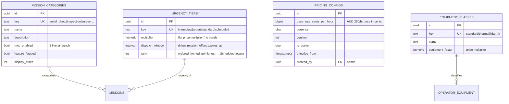

### Tables

- **`mission_categories`** — The ten mission categories. `mvp_enabled`/`feature_flagged` drive "5 live at launch, remainder flagged" without code changes.
- **`equipment_classes`** — Drives the **equipment factor** in the price formula (`base × equipment_factor × urgency`). Thermal/LiDAR/RTK cost more.
- **`pricing_configs`** — **Versioned, immutable** base-rate config ($250/hr base, stored as **`base_rate_cents_per_hour`**). Never update a row — insert a new version and flip `is_active`; missions snapshot `pricing_config_id` at booking.
- **`urgency_tiers`** ⚑ *(reshaped)* — The four tiers. **`multiplier`** is now a single flat multiplier (no min/max band, since there's no bidding). **`dispatch_window`** takes on a new job: **offer expiry** (`mission_offers.expires_at = offered_at + dispatch_window`). **`rank`** orders tiers so `reoc_profiles.max_urgency_tier_id` can express "this tier and all below."

### Association rationale

- Pricing tables are **referenced by** missions (not vice-versa) so historical financial records reproduce even after admins retune. `price_guides` is gone — there is no floor/ceiling entity because there is nothing to bid within.
- `urgency_tiers` now has a **dual role**: a pricing multiplier *and* the temporal driver of offer expiry — one column (`dispatch_window`) cleanly produces "Immediate = short window, Scheduled = wide window" dispatch behaviour.

---

## 5. Domain C — Missions & dispatch (the core)

> **Reshaped (feedback §02/§03/§C — the one issue that matters most):** `bids`, `match_scores` ("BEST MATCH SCORE"), and bid-ranked `mission_assignments` are **removed**. The one-to-many between missions and supply is now **`mission_offers`** (fan-out, no price, no ranking). Assignment **collapses into mission fields**, set by the first accepted offer.

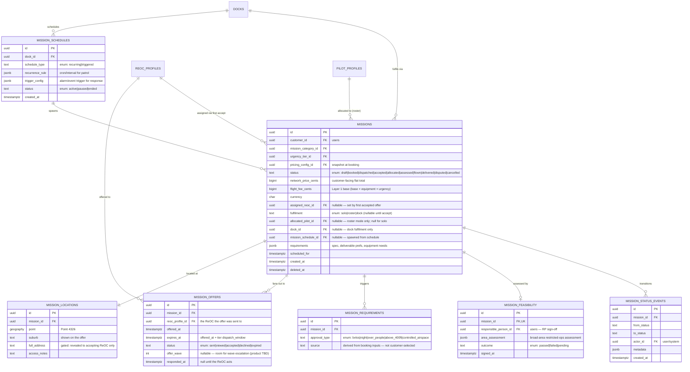

### Tables

- **`missions`** — The heart of the platform. Confirmed changes:
  - **State machine:** `draft → booked → dispatched → accepted → allocated → assessed → flown → delivered` (+ `disputed`/`cancelled`). **`assessed`** = Responsible Person feasibility sign-off when `mission_requirements` includes restricted-ops types (skipped otherwise). **`fulfilment`** adds **`dock`** (third mode alongside `solo | roster`).
  - **Assignment collapsed onto the row:** `assigned_reoc_id`, `fulfilment`, `allocated_pilot_id` (null for solo and dock), **`dock_id`** (dock fulfilment). Frozen snapshot of the accepted offer.
  - **Money separation preserved:** `network_price_cents` / `flight_fee_cents` (integer cents). Layer 2 fee lives in `payments`/`payment_splits` (admin-only).
  - **`mission_schedule_id`** — nullable FK when a mission is spawned from a recurring patrol or alarm-triggered schedule (§8).
- **`mission_locations`** — Address visibility is **gated**: `suburb` on the offer; `full_address` to accepting ReOC only. PostGIS `point` powers coverage eligibility, **approval-area** tests, and the live map.
- **`mission_offers`** ⚑ — Fan-out record: no price, tier-driven expiry. Optional **`offer_wave`** for future cap/wave escalation (product decision — do not block schema). Race safety unchanged (§13.14).
- **`mission_requirements`** ⚑ *(new)* — Authorisation types a booking **derives** from inputs (customer never picks a flight type). Drives the approval-area eligibility pre-filter at fan-out.
- **`mission_feasibility`** ⚑ *(new)* — Pre-flight **feasibility assessment** for broad-area restricted work: **`responsible_person_id`**, `area_assessment` (jsonb), `outcome`, `signed_at`. Drives transition to **`assessed`**. Overlaps `compliance_checks` (§10) — compliance gate remains on `allocated/assessed → flown`; feasibility is the RP sign-off step before that.
- **`mission_schedules`** ⚑ *(new)* — Recurring patrol and alarm-triggered response schedules anchored to a **`dock_id`**. Spawns `missions` with `mission_schedule_id` set.
- **`mission_status_events`** — Append-only state-transition log (event sourcing).

### Association rationale

- `missions ||--o{ mission_offers` (**1:many**) is the new supply-side relationship — the fan-out. There is **no** `bids` table and **no** `match_scores` table; nothing ranks offers because the winner is decided by speed, not score.
- `reoc_profiles ||--o{ missions` via `assigned_reoc_id` (**1:0..1 per mission**): exactly one ReOC wins; the FK is null until the first accept.
- `pilot_profiles ||--o{ missions` via `allocated_pilot_id`: roster mode only; must have active `roster_acceptance`. Solo: **null**.
- `docks ||--o{ missions` via `dock_id`: dock fulfilment; operating ReOC must match `assigned_reoc_id`.
- `missions ||--o{ mission_requirements` drives approval-area fan-out filter (§13.17).
- `missions ||--|| mission_locations` (**1:1**), split purely for the address-visibility gate.
- `mission_status_events` (**1:many**) is immutable — append only.

> **FLIGHT SCORE, relocated:** the retired `match_scores` table's purpose (ranking) does **not** apply to dispatch. FLIGHT SCORE now ranks **pilots** for ReOC roster selection and lives on `pilot_profiles.flight_score`.

---

## 6. Domain D — Payments (the margin firewall)

> **Reshaped (feedback v2 §06):** 85/15 split and Layer 2 firewall unchanged. **Payment rail is unconfirmed** — fields are **provider-agnostic** (`provider_*_ref`); do **not** treat as Stripe Connect, Xero, or any single vendor until Liz + Joel close the decision. **Payout cardinality is open:** per-mission release vs **monthly consolidated ReOC batches** — model supports both via `payout_lines`. ReOC↔pilot split stays private on `roster_acceptances.split`.

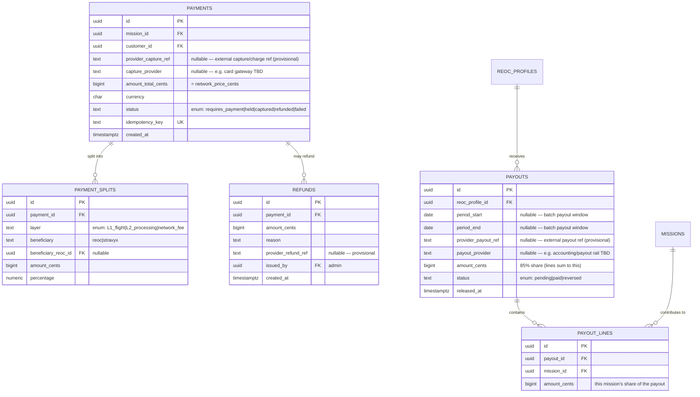

### Tables

- **`payments`** — One customer charge per mission. **`provider_capture_ref`** + **`capture_provider`** are **provisional** — card capture at booking is still required regardless of payout rail; capture and payout may be **different providers**. `amount_total_cents` = mission `network_price_cents`. Status models hold → capture. `idempotency_key` guards duplicate webhooks.
- **`payment_splits`** — Two-layer firewall in **cents**. `L1_flight` (85% ReOC / 15% Stravyx) + `L2_processing` (100% Stravyx). Reconcile `sum(amount_cents) = amount_total_cents` (DB check).
- **`payouts`** ⚑ *(reshaped)* — ReOC-facing transfer batch. **`period_start`/`period_end`** support **monthly consolidated** payouts (confirmed direction — not yet final); nullable for interim per-mission settlement. **`provider_payout_ref`** + **`payout_provider`** — **open**, not Stripe/Xero-specific. **`reoc_profile_id`** receives the 85%; pilot settlement remains off-platform via `roster_acceptances.split`.
- **`payout_lines`** ⚑ *(new)* — Links **missions → payout batches**. Enables monthly consolidation without 1:1 `payments ↔ payouts`. One mission appears on exactly one paid line per payout cycle (enforce in app).
- **`refunds`** — Admin-issued; **`provider_refund_ref`** provisional.

### Association rationale

- `payments ||--o{ payment_splits` (**1:many**): sum reconciles to `amount_total_cents`.
- **`payouts ||--o{ payout_lines ||--o{ missions`** — decouples payout timing from capture; cardinality **held open** until payment rail confirmed.
- **Visibility enforcement:** unchanged (§13.2). ReOCs never see L2/network-fee rows.

---

## 7. Domain E — Media, deliverables & processing (Layer 2)

> **Aligned (feedback §E):** Layer 1 (raw, customer + operator visible) / Layer 2 (AI-processed, operator-invisible) split is correct. **No changes.**

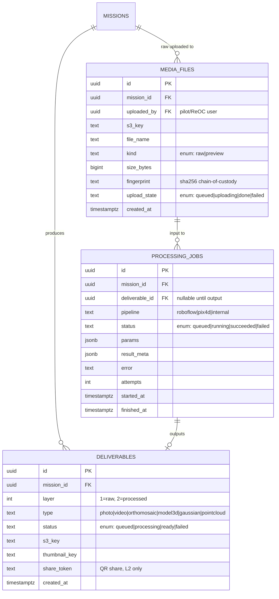

### Tables

- **`media_files`** — Raw uploads to S3 (multipart via STS creds). `fingerprint` (sha256) = **chain-of-custody** for dispute audit. `kind` separates raw evidence from previews.
- **`deliverables`** — **Layer 1** (raw, visible to customer + operator) and **Layer 2** (AI-processed, **operator-invisible**). `type` matches the media viewers. `share_token` supports QR sharing of L2 outputs. Only `s3_key` stored — the API issues signed short-TTL URLs.
- **`processing_jobs`** — The **Layer 2 queue**. Tracks pipeline, retries, SLA timing. MVP can be a stub/manual step; ready for the AI engine (Roboflow/Pix4D) later.

### Association rationale

- `media_files ||--o{ processing_jobs ||--o| deliverables`: processing consumes raw media and emits a processed deliverable (0..1 because a job may fail before output).
- `deliverables.layer` is the single switch the visibility projector uses; L2 rows are filtered out for operator roles.

---

## 8. Domain F — Devices & docks (DJI)

> **Reshaped (feedback v2 §05/§07):** **ReOC-operated docks** are **[MVP]** scope (e.g. E Group Security) — a CASA-verified ReOC runs the dock under **its own certificate**. Stravyx **never** operates and **never** holds a ReOC; the Stravyx-operated public network stays end-state. **Live-ops build** (Pilot-to-Cloud, Dock-to-Cloud, telemetry ingestion) is a **hard gate** until DJI Cloud overseas disclosure closes (§13.16) — not a parallel doc track. DJI Enterprise Ecosystem **application** proceeds now.

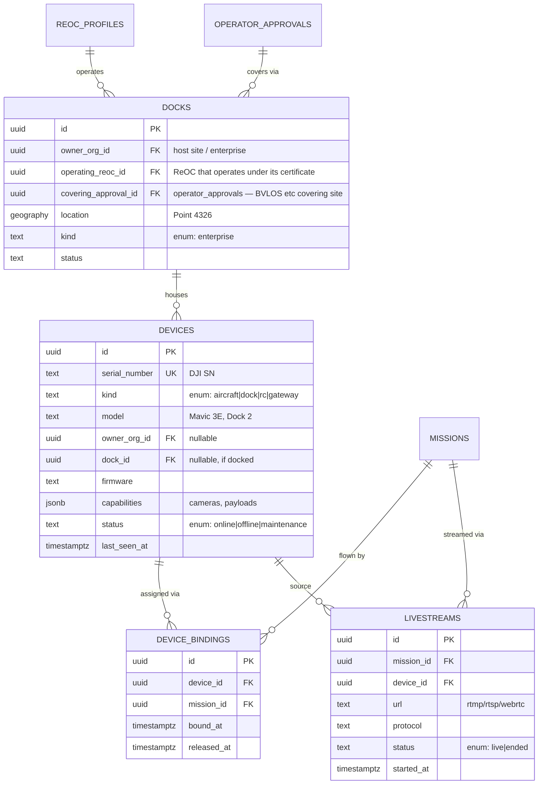

### Tables

- **`devices`** — Every DJI aircraft/dock/RC/gateway keyed by **serial number** (MQTT join key). `last_seen_at`+`status` power the admin fleet view.
- **`docks`** **[MVP]** ⚑ *(reshaped)* — Fixed DJI Dock 2/3 at an enterprise/host site.
  - **`operating_reoc_id`** (FK → `reoc_profiles`, **not null**) — who operates the dock under **whose ReOC certificate**. Without this the record cannot distinguish compliant from non-compliant.
  - **`covering_approval_id`** (FK → `operator_approvals`) — the BVLOS (or other) approval covering the site.
  - **`kind`** = **`enterprise`** only — interim hosted docks. **`public_network`** and **`per_flight_fee`** **dropped** (Stravyx-operated network economics are end-state; dock revenue flows through normal mission/payout path).
- **`device_bindings`** — Device↔mission mapping over time (`released_at NULL` = active).
- **`livestreams`** [P1] — Live video session metadata; media plane is RTMP/RTSP/WebRTC. **Gated** behind §13.16.

### Association rationale

- `reoc_profiles ||--o{ docks` (**1:many**): ReOC-operated model — the operating ReOC is mandatory.
- `operator_approvals ||--o{ docks`: site must sit inside an verified approval area.
- Restricted ops **do not require a dock** — a ReOC can fly BYO under its approval; docks are one fulfilment path (`missions.fulfilment = dock`).

---

## 9. Domain F (cont.) — Telemetry & HMS (time-series)

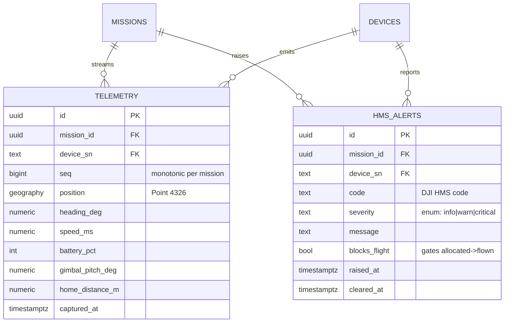

### Tables

- **`telemetry`** — Normalized OSD stream (matches `packages/types` `Telemetry`, ADR 0001). High-volume, append-only, time-series.
  - **Recommendation:** TimescaleDB **hypertable** (or native range partition on `captured_at`) with retention/downsampling — full-resolution for N days, then continuous aggregates for path replay. Hot last-known stays in Redis; Postgres is the durable audit/dispute path.
  - `seq` gives per-mission ordering. `battery_pct` only — never raw cell data.
- **`hms_alerts`** — DJI Health Management System alerts. **`blocks_flight`** is the compliance gate: a `critical`/`blocks_flight` alert prevents the **`allocated → flown`** transition (the former READY→AIRBORNE gate) and can trigger an admin freeze.

### Association rationale

- Both are **1:many** off missions/devices, append-only, never soft-deleted (immutable flight record). They reference `device_sn` (natural key) to match the SN-keyed bridge pipeline.

---

## 10. Domain G — Compliance, audit & disputes

> **Aligned (feedback §G/§08):** immutable audit log + compliance gate. **`compliance_checks`** and **`mission_feasibility`** overlap — feasibility carries the **Responsible Person identity** and area assessment for restricted ops and drives **`assessed`**; compliance gate (airspace/weather/NOTAM/HMS) remains on **`allocated/assessed → flown`**.

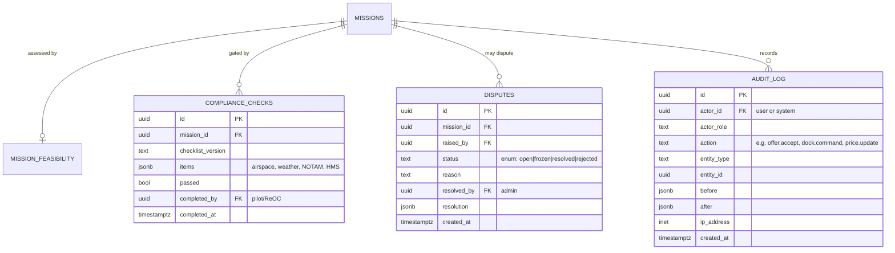

### Tables

- **`compliance_checks`** — Pre-flight **compliance gate** on **`allocated → flown`** (or **`assessed → flown`** when assessed applies). `items` (jsonb): airspace/weather/NOTAM/HMS. Cross-check `hms_alerts.blocks_flight`. Distinct from **`mission_feasibility`** (RP sign-off → `assessed`).
- **`audit_log`** — **Immutable, append-only** audit of every sensitive action, now including `offer.accept` (the race-decided assignment), dock commands, pricing changes, verification decisions, payout releases, dispute freezes. Stores `before`/`after` + `ip_address`. Satisfies immutable-audit + CSV-export requirements. **No UPDATE/DELETE.**
- **`disputes`** — Dispute lifecycle with admin **freeze** (halts payouts + progression). Links to refunds (§6).

### Association rationale

- `missions ||--o| compliance_checks` (recommend **1:many** to keep every attempt for audit).
- `audit_log` is **loosely coupled** (`entity_type`+`entity_id` polymorphic ref, not hard FKs) so it records actions across any table and survives archival of referenced rows.

---

## 11. Domain G (cont.) — Reviews & notifications

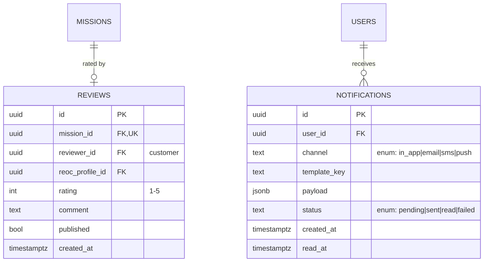

### Tables

- **`reviews`** — Customer rating (1–5) after `delivered`. Feeds `reoc_profiles.rating_avg`. 1:1 with a mission.
- **`notifications`** — Essential for a dispatch marketplace: **offer-received** alerts (with tier-driven urgency), offer-expiring, mission-taken, upload complete, deliverable ready, credential-expiry warnings. Multi-channel with delivery status.

---

## 12. Domain H — Academy & growth (CRM boundary)

> **Synced (v0.3.1 / Phase 1A):** Domain H now matches the **live website lead tables** on Supabase (`ruzblzcvnayajmnwyjyc`) — columns reverse-engineered from Replit `stravyx.com` form inserts. HubSpot remains the **engagement layer, not a second database** — one-way sync only. `providers` stays for future Academy routing (`POST /api/academy/enquiry`); live forms write **direct inserts** today (insert-only RLS), then a Postgres trigger fans out to HubSpot.

| Website page | Table |
|---|---|
| `/academy` | `academy_enquiries` |
| `/for-operators` | `operator_leads` |
| `/contact` | `contact_leads` |
| `/enterprise` | `enterprise_leads` |
| `/free-flight` | `business_leads` |
| `/home-owners` | `home_owner_leads` |
| `/about` (talent) | `talent_interests` |

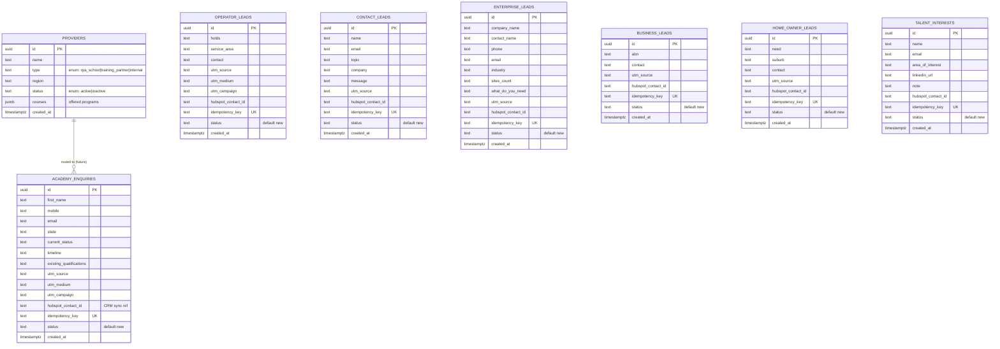

### Tables

- **`academy_enquiries`** **[MVP]** — Live `/academy` form columns (`first_name`, `mobile`, `email`, `state`, `current_status`, `timeline`, `existing_qualifications`, UTM fields). Persist-first; HubSpot push is secondary. `hubspot_contact_id` + `idempotency_key` keep CRM sync idempotent. Optional later: Nest `POST /api/academy/enquiry` + `provider_id` routing without breaking live inserts.
- **`operator_leads`** **[MVP]** — `/for-operators` intake (`holds`, `service_area`, `contact`, UTMs). Distinct from marketplace `reoc_profiles` registration — growth funnel until onboarding converts a lead into a verified ReOC.
- **`contact_leads`** **[MVP]** — `/contact` general enquiries (`name`, `email`, `topic`, `company`, `message`, UTMs).
- **`enterprise_leads`** **[MVP]** — `/enterprise` (`company_name`, `contact_name`, `phone`, `email`, `industry`, `sites_count`, `what_do_you_need`, UTMs).
- **`business_leads`** **[MVP]** — `/free-flight` and similar (`abn`, `contact`, UTMs).
- **`home_owner_leads`** **[MVP]** — `/home-owners` (`need`, `suburb`, `contact`, UTMs).
- **`talent_interests`** **[MVP]** — `/about` talent interest (`name`, `email`, `area_of_interest`, `linkedin_url`, `note`).
- **`providers`** **[P1]** — Training providers / RPA schools for future Academy routing. `courses` (jsonb) lists programs. Live Phase 1A does **not** require this table; keep for Nest/CRM routing without a second store.

**RLS (all lead tables):** `anon` / `authenticated` **INSERT only** (no public SELECT). Service role / Edge worker updates `hubspot_contact_id` after sync.

### Association rationale

- `providers ||--o{ academy_enquiries` (**1:many**, future): one provider fields many enquiries; enquiries can exist before assignment. Live inserts leave provider unassigned.
- Lead tables are **siblings**, not a hierarchy — each maps 1:1 to a marketing surface. Shared pattern: UTM attribution, `hubspot_contact_id`, `idempotency_key`, `status` default `new`.
- **CRM boundary:** HubSpot is never queried for matching, dispatch, or verification, and never becomes a parallel store of licence status, mode, split, or mission state. Touchpoints are `hubspot_contact_id` on **every lead table** (and on `users` / demo `profiles` for marketplace principals) plus the outbound idempotent push (§13.15).

---

## 13. Recommendations & suggestions

### 13.1 Event-sourced mission state
Keep `mission_status_events` (and now `mission_offers`) as sources of truth; treat `missions.status`/`assigned_reoc_id` as projections. Free audit, time-travel for disputes, clean analytics.

### 13.2 Enforce visibility at the database, not just the API
The margin firewall is the business. Add **Postgres views / RLS** per role so a bug can't leak margin: a ReOC view exposes `flight_fee_cents` + own `payment_splits(beneficiary='reoc')` and **omits** `network_price_cents`, `L2_processing`, `network_fee`; a consumer view omits operator identity pre-accept and all cost internals. Pair with contract tests.

### 13.3 Money as integer minor units
**Decided (feedback v2 §08):** store money as **`bigint` cents**. Reconcile `sum(payment_splits.amount_cents) = payments.amount_total_cents` with a DB check. Avoids rounding drift on the 85/15 split and L1/L2 decomposition.

### 13.4 Pricing versioning is mandatory
Never mutate `pricing_configs`. Missions reference the version active at booking (`pricing_config_id`) so historical charges are reproducible.

### 13.5 Credential, approval & insurance expiry automation
`operator_credentials.expires_at` and **`operator_approvals.expires_at`** drive a scheduled job that **auto-suspends dispatch eligibility** (ReOC) or **pool availability** (pilot) when RePL/ReOC/insurance/CASA authorisations lapse, and fires `notifications` ahead of expiry.

### 13.6 Idempotency everywhere external
Payments (capture webhooks), uploads (STS/multipart), MQTT ingestion, **and the HubSpot push** are all at-least-once. `idempotency_key` + dedupe on `seq`/event-id prevent double charges/payouts/telemetry/contacts.

### 13.7 Data retention & privacy (AU Privacy Act)
Retention per class: telemetry (downsample after N days), media (customer-controlled deletion, held during disputes), PII (soft-delete + scheduled hard-delete). Full address and chain-of-custody media are sensitive — document lawful basis and TTLs.

### 13.8 Multi-tenancy / partner readiness
Enterprise (direct/reseller) and white-label **Stravyx Finance** (4K Group) imply a future `tenant_id`/`partner_id`. Reserve an `organization`-based tenancy boundary now.

### 13.9 Lookup tables vs enums
Lookup tables for admin-editable sets (mission categories, urgency tiers, equipment classes); native enums for stable machine states (`mission.status`, `mission_offers.status`, `payment.status`).

### 13.10 ReOC-side reputation from offer data
`mission_offers` yields acceptance-rate and response-time per ReOC — a natural future input to ReOC-side reputation. `reoc_profiles.acceptance_rate` is a materialized rollup; keep the raw offer rows for recompute.

### 13.11 Geospatial from day one
PostGIS on `mission_locations`, `service_areas`, **`approval_areas`**, `docks`. Coverage eligibility, **CASA approval-area** tests (`ST_Covers`), and dock placement all depend on **GIST** indexing.

### 13.12 Feature flags in-schema
`mission_categories.mvp_enabled/feature_flagged` ships "5 live, 5 flagged"; a small generic `feature_flags` table can gate pilot/dock/enterprise portals.

### 13.13 Soft-delete + archival
User-facing entities soft-delete; append-only tables (`audit_log`, `*_events`, `mission_offers`, `telemetry`, `hms_alerts`) never delete — archive to cold storage on a retention schedule.

### 13.14 Race-safe first-to-accept (critical)
The winner **must** be decided by the database. Implement:
```sql
CREATE UNIQUE INDEX one_winner_per_mission
  ON mission_offers (mission_id)
  WHERE status = 'accepted';
```
The accepting transaction: flip the offer to `accepted`, set `missions.assigned_reoc_id`, move `dispatched → accepted`, then expire remaining open offers — all atomically. The second concurrent tap hits the constraint and returns "mission already taken." Never resolve the winner in application code.

### 13.15 HubSpot — one-way sync boundary
Website forms **INSERT** into the Domain H lead tables (insert-only RLS). After persist, a Postgres trigger (`notify_hubspot_lead_sync`, via **pg_net**) POSTs the row to the `hubspot-sync` Edge Function (authenticated with Vault `supabase_anon_key` + `x-hubspot-sync-secret`). The worker writes `hubspot_contact_id` back. Covered tables: `academy_enquiries`, `operator_leads`, `contact_leads`, `enterprise_leads`, `business_leads`, `home_owner_leads`, `talent_interests`. Marketplace principals keep `hubspot_contact_id` on `users` (demo: `profiles`). HubSpot is never a source of truth for licence status, mode, split, or mission state.

### 13.16 DJI Cloud overseas disclosure — **hard build gate**
Pilot-to-Cloud and Dock-to-Cloud route live video, telemetry, and site imagery through the **DJI Cloud API** — an overseas processor handling potentially personal/sensitive imagery (APP 8). Joel has confirmed this as a **hard gate: do not start the live-ops build** (telemetry ingestion, livestreams, dock cloud commands) until Consent & Privacy Policy v4 disclosure closes (Liz, in progress). **Separate** from the APP 3/5 operator-database outreach review — do not merge. The DJI Enterprise Ecosystem **application** should proceed now (approval lead time; it is not a build).

**Action pack for Liz and Joel:** [`app8-live-ops-gate-closeout.md`](./app8-live-ops-gate-closeout.md) (what is in/out of the gate, scenarios, DPIA hop list, decisions, sign-off). Manual per-mission upload in Stravyx is **not** blocked by this gate.

### 13.17 Restricted-ops eligibility — approval geometry (critical)
A mission with a `mission_requirements` row is **never** fanned out without a verified approval whose area covers the location. **Do not** use `service_areas` as a substitute.

```sql
-- eligibility fragment (see feedback v2 §04)
SELECT r.id FROM reoc_profiles r
JOIN operator_approvals oa ON oa.reoc_profile_id = r.id
JOIN approval_areas aa ON aa.operator_approval_id = oa.id
WHERE oa.approval_type = :required_type
  AND oa.verification_status = 'verified'
  AND oa.expires_at > now()
  AND ST_Covers(aa.area, :mission_point);
```

### 13.18 Payment / payout rail — **open decision**
Do **not** implement further against a specific vendor until Liz + Joel confirm. **`provider_*_ref`** columns are placeholders. Key open questions: per-mission vs **monthly consolidated** ReOC payouts; who holds funds between booking and payout; whether capture and payout use the same or different providers. **`payout_lines`** holds cardinality open for batch payouts.

---

## 14. Changelog

### v0.3 → v0.3.1 (Supabase Phase 1A schema sync, July 2026)

| Area | v0.3 | v0.3.1 |
|---|---|---|
| **Growth lead tables** | `academy_enquiries` + `providers` only | **+** `operator_leads`, `contact_leads`, `enterprise_leads`, `business_leads`, `home_owner_leads`, `talent_interests` (live website columns) |
| **`academy_enquiries` columns** | Abstract `full_name` / `interest` / `provider_id` | **Aligned** to live form: `first_name`, `mobile`, `state`, `current_status`, `timeline`, `existing_qualifications`, UTMs |
| **HubSpot push** | Described as backend secondary step | **Documented** INSERT-trigger + pg_net → `hubspot-sync` pattern; secret header; all seven lead tables |
| **RLS** | Implied | **Explicit** insert-only anon/authenticated on lead tables |
| **Marketplace target** | Full ERD v0.3 | **Unchanged** — Phase 1A demo subset (`profiles`, thin missions, …) tracked in [`backend-build-plan.md`](./backend-build-plan.md), not a target-model rewrite |

### v0.2 → v0.3 (per Data Model ERD Feedback v2, July 2026)

| Area | v0.2 | v0.3 |
|---|---|---|
| **Approvals registry** | Restricted ops implied via `operator_credentials` | **`operator_approvals` + `approval_areas`** (CASA geometry, ReOC-only); **`mission_requirements`** at fan-out |
| **Feasibility / assessed** | — | **`mission_feasibility`** + **`assessed`** status (RP sign-off) |
| **Docks** | Deferred; `per_flight_fee`, `public_network` | **ReOC-operated [MVP]**: `operating_reoc_id`, `covering_approval_id`; dropped end-state economics |
| **Dock missions** | `fulfilment: solo\|roster` only | **`dock`** fulfilment, **`dock_id`**, **`mission_schedules`** (recurring + triggered) |
| **Payments** | Stripe-shaped fields; 1:0..1 payout per payment | **Provider-agnostic** refs; **`payout_lines`**; rail **open** (not Stripe/Xero-locked) |
| **Money** | `numeric(12,2)` | **`bigint` cents** (decided) |
| **DJI live-ops** | Privacy-doc action (§13.16) | **Hard build gate** until overseas disclosure closes |
| **Open questions** | 8 open | **5 answered** (solo null pilot, Academy scope, cents, roster split standing, enterprise billing defer) |

### v0.1 → v0.2 (per ERD Feedback v1)

| Area | v0.1 (bidding) | v0.2 (first-to-accept dispatch) |
|---|---|---|
| **Marketplace** | `bids` + `match_scores` ("BEST MATCH SCORE") + `mission_assignments` | **Dropped.** `mission_offers` (fan-out, no price/rank) + assignment collapsed onto `missions` |
| **Winner** | Highest BEST MATCH SCORE | **First to accept** (DB partial unique index) |
| **Pricing** | `price_guides` floor/ceiling; urgency = bid multiplier band | **`price_guides` dropped;** Stravyx sets flat price; `urgency_tiers.dispatch_window` = offer expiry |
| **Supply profiles** | Single `operator_profiles` | **Split** into `reoc_profiles` (`mode`, `max_urgency_tier_id`) + `pilot_profiles` (`pool_status`, `flight_score`) |
| **Supply chain** | — | **`roster_acceptances`** added (ReOC↔pilot, `split`, CASA `accepted_at`) |
| **FLIGHT/BEST MATCH SCORE** | Bid ranking table | **FLIGHT SCORE** relocated to `pilot_profiles.flight_score` (roster ranking) |
| **State machine** | DRAFT…QUOTING…READY→AIRBORNE…CLOSED | `draft → booked → dispatched → accepted → allocated → flown → delivered` |
| **Compliance gate** | READY → AIRBORNE | **`allocated → flown`** |
| **Payments** | `payouts.operator_profile_id` | **Renamed** `payouts.reoc_profile_id` (ReOC↔pilot split is private) |
| **Academy** | Absent | **Added** `academy_enquiries` + `providers` |
| **CRM** | Not modelled | `hubspot_contact_id` on `users` + `academy_enquiries`; one-way sync boundary |
| **Unchanged (aligned)** | — | Payments firewall, media/Layer 2, devices/telemetry (deferred), compliance/audit |

---

## 15. Open questions to resolve before locking v1

**Answered (feedback v2 §09 — no longer open):**

1. ~~**Solo vs roster defaults**~~ — **`allocated_pilot_id` stays null** for solo ReOC; no `roster_acceptance` required. Roster mode requires active pairing.
4. ~~**Academy scope**~~ — **Owned by this schema** (monolith); no side store.
5. ~~**Money representation**~~ — **Integer cents** (§13.3).
6. ~~**Roster split recording**~~ — **Standing, per-pairing** on `roster_acceptances.split`; Stravyx records, does not set; not per-mission.
8. ~~**Enterprise/reseller billing**~~ — **Defer**; reserve org-based tenancy (§13.8).

**Still open (product / infra — do not block schema lock):**

1. **Offer fan-out cap / wave escalation** — product decision (Joel). Schema leaves **`mission_offers.offer_wave`** nullable.
2. **No-acceptance path** — if every offer expires, what happens? Needs product answer (Joel + Liz); customer-facing failure cannot be silence.
3. **Payment / payout rail** — capture provider, payout provider, fund custody, monthly vs per-mission settlement (Liz + Joel). **`provider_*_ref`** fields are provisional (§13.18).
4. **Telemetry store** — TimescaleDB vs native partitioning vs external TSDB (§9). Gated behind DJI privacy gate regardless.
5. **Mission categories & urgency tier counts** — seed values need a live source of truth (Liz + Joel); tables unchanged.
6. **`max_urgency_tier_id`** — adopted in schema; needs landing in Web App Master (Liz).

---

*Draft v0.3.1 — Domain H synced to live Supabase lead schema (Phase 1A); marketplace target remains Feedback v2. Reconcile field names against the NestJS `visibility` module, live DJI payloads, and the **open** payment/payout rail at build time. Related: [`backend-build-plan.md`](./backend-build-plan.md) · [`dji-frontend-technical-spec.md`](./dji-frontend-technical-spec.md) · [`dji-bridge-and-client-internals.md`](./dji-bridge-and-client-internals.md) · [`executive-summary.md`](./executive-summary.md).*
