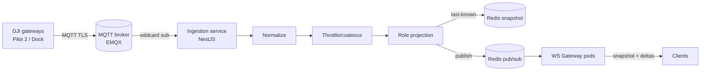

# DJI Bridge & Client Internals — MQTT Ingestion, Projection, Reconnect

> **Purpose:** The implementation layer below [`dji-frontend-technical-spec.md`](./dji-frontend-technical-spec.md): how the **NestJS Cloud API bridge** ingests DJI MQTT, throttles, projects by role, and fans out; and a **reference `useMissionStream`** client with snapshot + reconnect logic.
> **Decision context:** [`adr/0001-dji-telemetry-unified-types.md`](./adr/0001-dji-telemetry-unified-types.md) (unified types, Option A).
> **Status:** Proposed reference implementation (Phase 1+). Illustrative code — harden, test, and security-review before production.

---

## 1. Bridge topology



**Why a broker + Redis, not direct socket fan-out:**
- DJI gateways speak MQTT → a broker (EMQX) is the natural ingress and handles TLS/auth/QoS.
- **Redis pub/sub** decouples ingestion from the WS pods so we can scale each independently and run many WS pods behind a load balancer without sticky routing of device data.
- **Redis snapshot** (last-known state per mission/device) lets any WS pod hydrate a newly-subscribed client instantly — critical for reconnect.

---

## 2. MQTT subscription

```ts
// services/api/src/dji/mqtt.gateway.ts
import mqtt, { MqttClient } from 'mqtt';

const TOPICS = [
  'thing/product/+/osd',        // high-freq telemetry
  'thing/product/+/state',      // sparse state changes
  'thing/product/+/events',     // upload progress, HMS
  'sys/product/+/status',       // online/offline, update_topo
];

@Injectable()
export class DjiMqttGateway implements OnModuleInit {
  private client: MqttClient;

  onModuleInit() {
    this.client = mqtt.connect(process.env.MQTT_URL!, {
      username: process.env.MQTT_USER,
      password: process.env.MQTT_PASS,
      protocol: 'mqtts',
      reconnectPeriod: 2000,
      clean: false,                 // durable session: don't lose msgs on blip
      clientId: `stravyx-bridge-${process.env.POD_ID}`,
    });
    this.client.on('connect', () => this.client.subscribe(TOPICS, { qos: 1 }));
    this.client.on('message', (topic, payload) => this.onMessage(topic, payload));
  }

  private onMessage(topic: string, payload: Buffer) {
    const sn = topic.split('/')[2];               // {sn} segment
    const kind = topic.split('/').pop()!;         // osd | state | events | status
    void this.pipeline.ingest(sn, kind, payload); // → §3
  }
}
```

**Notes**
- `clean: false` + `qos: 1` = durable session, at-least-once — the pipeline must be **idempotent** (dedupe on `seq`/event id).
- One broker connection **per pod**; the broker shared-subscription group (`$share/bridge/...`) can load-balance OSD volume across pods if needed.

---

## 3. Ingestion pipeline: normalize → throttle → project → publish

```ts
// services/api/src/dji/ingest.pipeline.ts
async ingest(sn: string, kind: string, raw: Buffer) {
  const msg = JSON.parse(raw.toString());
  const missionId = await this.deviceMap.missionForDevice(sn);   // cached lookup
  if (!missionId) return;                                        // idle device

  switch (kind) {
    case 'osd':    return this.onTelemetry(missionId, sn, msg);
    case 'state':  return this.onState(missionId, sn, msg);
    case 'events': return this.onEvent(missionId, sn, msg);      // upload | hms
    case 'status': return this.onTopo(sn, msg);                  // fleet
  }
}
```

### 3.1 Normalization (raw thing-model → `packages/types`)

```ts
private normalizeTelemetry(sn: string, missionId: string, osd: any): Telemetry {
  return {
    missionId, deviceSn: sn,
    position: { lat: osd.latitude, lng: osd.longitude, altM: osd.height },
    headingDeg: osd.attitude_head ?? osd.head,
    speedMs: Math.hypot(osd.horizontal_speed ?? 0, osd.vertical_speed ?? 0),
    batteryPct: osd.battery?.capacity_percent ?? osd.battery_percent,
    gimbalPitchDeg: osd.gimbal_pitch,
    homeDistanceM: osd.home_distance,
    capturedAt: new Date().toISOString(),          // bridge clock (device clock skews)
    seq: this.nextSeq(missionId),                  // monotonic per mission
  };
}
```

Normalization is the **only** place DJI field names appear. Everything downstream is `packages/types`.

### 3.2 Throttling / coalescing

OSD arrives at ~10 Hz; clients need ~1–2 Hz. Coalesce **per mission** with a leading edge + trailing flush so the UI is smooth but the pipeline isn't flooded:

```ts
// keeps newest sample; emits at most every INTERVAL_MS, always flushes the last
private throttlers = new Map<string, { last: number; pending?: Telemetry; timer?: NodeJS.Timeout }>();
private INTERVAL_MS = 700;   // ~1.4 Hz

private emitTelemetryThrottled(t: Telemetry) {
  const key = t.missionId;
  const s = this.throttlers.get(key) ?? { last: 0 };
  const now = Date.now();
  if (now - s.last >= this.INTERVAL_MS) {
    s.last = now; this.publish(t);                 // leading edge
  } else {
    s.pending = t;                                 // keep newest
    s.timer ??= setTimeout(() => {                 // trailing flush
      if (s.pending) { s.last = Date.now(); this.publish(s.pending); s.pending = undefined; }
      s.timer = undefined;
    }, this.INTERVAL_MS - (now - s.last));
  }
  this.throttlers.set(key, s);
}
```

`state`, `events` (HMS/upload) are **not** throttled — they are low-frequency and each matters. Upload progress may be lightly throttled (e.g. every 500 ms) but always emits the terminal `done`/`failed`.

### 3.3 Visibility projection layer (the margin firewall)

Projection runs **before** publish and is keyed by the **subscriber's role**, not the sender. We store the full normalized object once (admin view) and project per role at fan-out:

```ts
// services/api/src/dji/visibility.projector.ts
type Projected<T> = { admin: T; mobile_operator: Partial<T>; consumer: Partial<T> };

export function projectTelemetry(t: Telemetry): Projected<Telemetry> {
  const operator = t;                              // operator sees own full telemetry
  const consumer: Partial<Telemetry> = {           // consumer: safe subset only
    missionId: t.missionId, position: t.position,
    batteryPct: t.batteryPct, seq: t.seq, capturedAt: t.capturedAt,
  };
  return { admin: t, mobile_operator: operator, consumer };
}

export function projectDeliverable(d: Deliverable, role: Role): Deliverable | null {
  if (d.layer === 2 && role === 'mobile_operator') return null;   // operator NEVER sees L2
  return d;                                                        // no cost fields exist on type
}
```

- Published to **role-scoped Redis channels**: `mission:{id}:telemetry:{role}`. A WS pod subscribes only to the channels matching its connected clients' roles → **no client-side filtering, no leak path.**
- Contract tests assert operator/consumer channel payloads contain no forbidden keys (ADR follow-up + tech spec § 6).

### 3.4 Snapshot store + publish

```ts
private async publish(t: Telemetry) {
  const p = projectTelemetry(t);
  for (const role of ['admin', 'mobile_operator', 'consumer'] as Role[]) {
    const data = p[role]; if (!data || Object.keys(data).length === 0) continue;
    await this.redis.set(`snap:mission:${t.missionId}:telemetry:${role}`, JSON.stringify(data), 'EX', 120);
    await this.redis.publish(`mission:${t.missionId}:telemetry:${role}`, JSON.stringify({ type: 'telemetry', id: t.missionId, seq: t.seq, data }));
  }
}
```

Snapshot keys hold the **last-known** projected value (short TTL); the WS gateway reads them to build the initial `snapshot` frame on subscribe.

---

## 4. WS gateway (fan-out to clients)

```ts
// services/api/src/ws/mission.gateway.ts  (socket.io or ws)
@WebSocketGateway({ path: '/ws' })
export class MissionGateway {
  // on upgrade: verify JWT → attach { userId, role }
  async handleSubscribe(client: Ctx, { id }: { id: string }) {
    await this.authz.assertCanView(client.userId, client.role, id);   // RBAC on the mission
    const role = client.role;

    // 1) snapshot: hydrate from Redis last-known
    const snap = await this.buildSnapshot(id, role);
    client.emit({ type: 'snapshot', channel: 'mission', id, data: snap });

    // 2) deltas: subscribe to this mission's role-scoped channels
    const channels = [`mission:${id}:telemetry:${role}`, `mission:${id}:status:${role}`,
                      `mission:${id}:upload:${role}`, `mission:${id}:hms:${role}`];
    this.redisSub.subscribe(channels, (chan, msg) => client.emit(JSON.parse(msg)));
    client.onClose(() => this.redisSub.unsubscribe(channels));
  }
}
```

- **Auth once** on WS upgrade; **authorize per subscribe** (can this user view this mission?).
- Any pod can serve any client — state lives in Redis, so **no sticky sessions** required.
- Horizontal scale: add WS pods behind the LB; Redis pub/sub fans out to all.

---

## 5. Reference `useMissionStream` (client)

Single multiplexed socket, snapshot-then-deltas, `seq` ordering, heartbeat, and backoff reconnect. Works in web and React Native.

```ts
// packages/realtime/src/socket.ts — one shared connection, ref-counted subscriptions
class SocketManager {
  private ws?: WebSocket;
  private backoff = 1000;
  private readonly maxBackoff = 30000;
  private subs = new Map<string, Set<(f: ServerFrame) => void>>();  // key = `${channel}:${id}`
  private heartbeat?: any;

  constructor(private url: string, private token: string) {}

  private connect() {
    this.ws = new WebSocket(`${this.url}?token=${this.token}`);
    this.ws.onopen = () => {
      this.backoff = 1000;                       // reset on success
      for (const key of this.subs.keys()) this.send({ type: 'subscribe', ...parse(key), token: this.token });
      this.heartbeat = setInterval(() => this.send({ type: 'ping', t: Date.now() }), 20000);
    };
    this.ws.onmessage = (e) => {
      const frame: ServerFrame = JSON.parse(e.data);
      if (frame.type === 'pong') return;
      const key = frameKey(frame);               // `${channel}:${id}`
      this.subs.get(key)?.forEach((cb) => cb(frame));
    };
    this.ws.onclose = () => { clearInterval(this.heartbeat); this.scheduleReconnect(); };
    this.ws.onerror = () => this.ws?.close();
  }

  private scheduleReconnect() {
    const jitter = Math.random() * 300;
    setTimeout(() => this.connect(), this.backoff + jitter);
    this.backoff = Math.min(this.backoff * 2, this.maxBackoff);   // exponential
  }

  subscribe(channel: Channel, id: string, cb: (f: ServerFrame) => void) {
    const key = `${channel}:${id}`;
    if (!this.subs.has(key)) this.subs.set(key, new Set());
    this.subs.get(key)!.add(cb);
    if (!this.ws) this.connect();
    else if (this.ws.readyState === WebSocket.OPEN)
      this.send({ type: 'subscribe', channel, id, token: this.token });
    return () => {                               // unsubscribe / ref-count down
      const set = this.subs.get(key); set?.delete(cb);
      if (set && set.size === 0) { this.subs.delete(key); this.send({ type: 'unsubscribe', channel, id }); }
    };
  }

  private send(f: ClientFrame) { if (this.ws?.readyState === WebSocket.OPEN) this.ws.send(JSON.stringify(f)); }
}
```

```ts
// packages/realtime/src/hooks.ts
export function useMissionStream(missionId: string) {
  const socket = useContext(RealtimeCtx);                 // from RealtimeProvider
  const [status, setStatus] = useState<MissionStatus>('CONFIRMED');
  const [telemetry, setTelemetry] = useState<Telemetry>();
  const [uploads, setUploads] = useState<Record<string, UploadProgress>>({});
  const [hms, setHms] = useState<HmsAlert[]>([]);
  const [connected, setConnected] = useState(false);
  const lastSeq = useRef(-1);

  useEffect(() => {
    const off = socket.subscribe('mission', missionId, (f) => {
      switch (f.type) {
        case 'snapshot':                                  // full hydrate on (re)connect
          lastSeq.current = f.data.telemetry?.seq ?? -1;
          setStatus(f.data.status); setTelemetry(f.data.telemetry);
          setUploads(indexBy(f.data.uploads ?? [], 'fileId'));
          setHms(f.data.hms ?? []); setConnected(true);
          break;
        case 'telemetry':                                 // drop out-of-order
          if (f.seq <= lastSeq.current) return;
          lastSeq.current = f.seq; setTelemetry(f.data);
          break;
        case 'mission_status': setStatus(f.data.status); break;
        case 'upload_progress': setUploads((u) => ({ ...u, [f.data.fileId]: f.data })); break;
        case 'hms': setHms((h) => dedupeByCode([...h, f.data])); break;
      }
    });
    return off;                                           // cleanup → unsubscribe + ref-count
  }, [missionId, socket]);

  return { status, telemetry, uploads: Object.values(uploads), hms, connected };
}
```

**Behaviours delivered**
- **Snapshot-then-deltas:** every (re)connect resends `subscribe`; server replies with a fresh `snapshot` that re-hydrates state within ~1 socket round-trip.
- **Ordering:** `lastSeq` guards against out-of-order/duplicate telemetry (at-least-once upstream).
- **Reconnect:** exponential backoff + jitter, capped at 30 s; heartbeat detects dead sockets.
- **Multiplexing:** one socket for the whole app; ref-counted subscriptions so multiple components sharing a `missionId` don't open duplicate streams.

---

## 6. Operational concerns

| Concern | Approach |
|---|---|
| Backpressure | Throttle at bridge (§3.2); WS drops to snapshot cadence if a client is slow (coalesce per key) |
| Idempotency | Dedupe upstream events by id/`seq`; QoS 1 means at-least-once |
| Ordering across pods | `seq` is per-mission monotonic (assigned in bridge, single writer per mission) |
| Security | JWT on upgrade + per-subscribe RBAC; role-scoped Redis channels so a pod can't emit another role's data |
| Scaling | Stateless WS pods + Redis pub/sub; broker shared-subscriptions for OSD volume |
| Observability | Metrics: msgs/s per topic, throttle drop ratio, WS connections, reconnect rate, snapshot hydrate latency |
| Failure isolation | Ingestion crash ≠ WS outage (separate services); Redis snapshot TTL bounds staleness |

---

## 7. Test hooks

| Target | Test |
|---|---|
| Normalizer | Replay recorded OSD/state/event fixtures → assert exact `packages/types` output |
| Projection | Operator/consumer channel payloads contain no L2 / customerTotal keys (contract test) |
| Throttle | 10 Hz input → assert ≤ ~2 Hz output and last sample always flushed |
| Reconnect | Kill socket mid-mission → snapshot re-hydrates tracker < 2 s; no stuck stale pin |
| Ordering | Inject seq [5,4,6] → client renders 5 then 6, ignores 4 |
| RBAC | Subscribe to a mission the user can't view → `error` frame, no data |

---

*Related: [`dji-frontend-technical-spec.md`](./dji-frontend-technical-spec.md) · [`adr/0001-dji-telemetry-unified-types.md`](./adr/0001-dji-telemetry-unified-types.md) · [`dji-integration-catalogue.md`](./dji-integration-catalogue.md). Reference code is illustrative — harden and security-review before production.*
