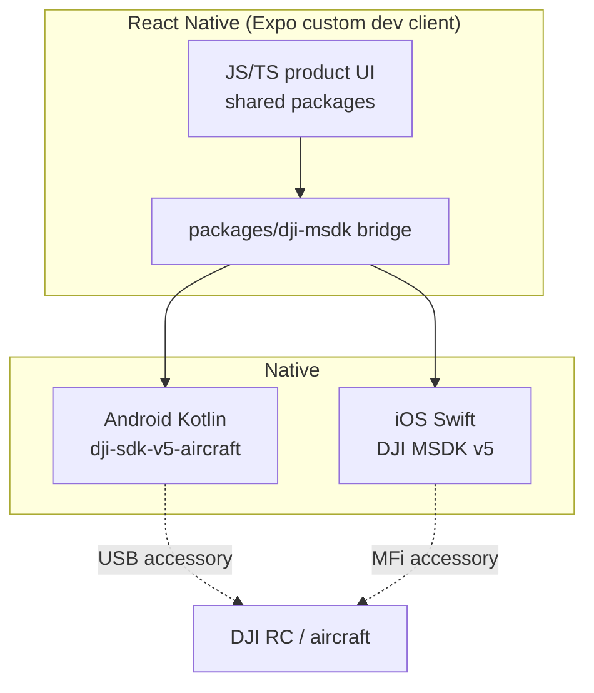
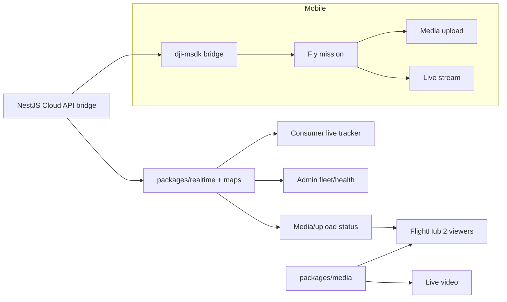

# DJI Frontend Integration — Feature Map & Build Plan (Web + Mobile)

> **Purpose:** Map every DJI-facing feature to concrete **Next.js routes**, **React components**, and **`packages/ui` primitives**, and give a phased **build plan** for the web apps and the **iOS + Android** mobile apps.
> **Companion to:** [`dji-integration-catalogue.md`](./dji-integration-catalogue.md) (what DJI offers) — this doc is *how it lands in the frontend*.
> **Aligned to:** [`executive-summary.md`](./executive-summary.md) (§ tech stack: Next.js 14, React Native/Expo, MSDK V5) and [`mvp-build-timeline.md`](./mvp-build-timeline.md) (monorepo, frame naming, visibility rules).
> **Phasing rule:** The **19 Jun MVP** ships *manual* equivalents (status timeline, file-list deliverables, manual upload, static admin lists). Everything DJI-powered here is **Phase 1+ (2026–2027)**, designed to swap into the same screens without redesign.

---

## 0. Assumptions & conventions

**Target monorepo** (from build timeline § 12):

```
apps/
  consumer-web        Next.js 14 (App Router)
  operator-web        Next.js 14
  admin-web           Next.js 14
  marketing-web       Next.js 14
  consumer-mobile     React Native (Expo, custom dev client)   [Phase 1]
  operator-mobile     React Native (Expo, custom dev client)   [Phase 1]
packages/
  ui                  Shared React primitives (Button, Card, Badge, Modal, Table…)
  ui-native           Shared React Native primitives            [Phase 1]
  api-client          Typed REST client (visibility-aware)
  types               Shared TS types (Mission, Bid, Telemetry…)
  realtime            WebSocket/MQTT-bridge client + hooks       [NEW — Phase 1]
  maps                Mapbox wrappers (LiveMap, RouteMap)        [NEW — Phase 1]
  media               Video player + deliverable/3D viewers      [NEW — Phase 1]
  dji-msdk            Native MSDK bridge (Android/iOS)           [NEW — mobile Phase 1]
services/api          NestJS (pricing, matching, visibility, missions, payments, processing, compliance)
```

**Conventions**
- Routes use the **App Router** (`app/…/page.tsx`), matching Figma frame naming `{app}/{feature}/{screen}` (build timeline § 5.1).
- **Visibility is server-enforced** (NestJS `visibility` module). Frontend never reconstructs hidden fields; DJI telemetry is rendered only through visibility-filtered API/WS payloads.
- New DJI data reaches the browser via **`packages/realtime`** (WebSocket) — the Cloud API's device MQTT is bridged server-side; the browser never speaks MQTT directly.

---

## 1. Shared frontend primitives (build once, reused everywhere)

Most DJI features reduce to **four cross-cutting primitives**. Build these first.

| Primitive | Package · Component | Backed by | Consumes |
|---|---|---|---|
| **Real-time channel** | `packages/realtime` · `useMissionStream(missionId)`, `RealtimeProvider` | Cloud API MQTT → server WS bridge | OSD telemetry, mission `state`/`events`, upload progress, HMS |
| **Live map** | `packages/maps` · `<LiveMap>`, `<RouteMap>` | Mapbox GL | Aircraft position pins, site polygons, no-fly zones, dock markers |
| **Video player** | `packages/media` · `<LiveVideoPlayer>` | WebRTC/HLS (from RTMP/RTSP livestream) | Live camera feed |
| **Geo/3D viewers** | `packages/media` · `<OrthoViewer>`, `<Model3DViewer>`, `<PointCloudViewer>` | three.js / potree / 3DGS viewer | FlightHub 2 Modeling API outputs |

**Supporting `packages/ui` primitives** these compose from (already planned for MVP): `Button`, `Card`, `Badge`, `Modal`, `Table`, `Tabs`, `ProgressBar`, `Toast`, `Skeleton`, `EmptyState`, `StatusPill`.

---

## 2. Consumer web (`apps/consumer-web`)

| Feature | Route (App Router) | Component(s) | `packages/ui` + shared primitives | Phase |
|---|---|---|---|---|
| **Live mission tracker** (C-05) | `app/missions/[id]/page.tsx` | `<MissionTracker>` → `<LiveMap>` + `<StatusTimeline>` | `Card`, `Badge`, `StatusPill`, `Skeleton` · `useMissionStream`, `LiveMap` | MVP=timeline → **P1=live pin** |
| **"Watch live" feed** | `app/missions/[id]/live/page.tsx` (modal or tab) | `<LiveFeedPanel>` → `<LiveVideoPlayer>` | `Modal`, `Tabs`, `Badge` · `LiveVideoPlayer` | Phase 1 |
| **Processed deliverables** (C-06 / $-06) | `app/missions/[id]/deliverables/page.tsx` | `<DeliverableGallery>`, `<OrthoViewer>`, `<Model3DViewer>` | `Tabs`, `Card`, `ProgressBar`, `Button` (download) · media viewers | MVP=file list → **P1=viewers** |
| **Auto status updates** | (all mission screens) | `<MissionStatusProvider>` | `StatusPill`, `Toast` · `useMissionStream` | Phase 1 |
| **Deliverable share (QR)** | `app/missions/[id]/deliverables` | `<ShareModel>` | `Modal`, `Button` · QR util | Phase 1 |

**Example — tracker upgrade (same screen, new data source):**

```tsx
// apps/consumer-web/app/missions/[id]/page.tsx
'use client';
import { useMissionStream } from '@stravyx/realtime';
import { LiveMap } from '@stravyx/maps';
import { StatusPill, Card } from '@stravyx/ui';

export function MissionTracker({ missionId }: { missionId: string }) {
  const { status, telemetry } = useMissionStream(missionId); // WS-backed; visibility-filtered
  return (
    <Card>
      <StatusPill status={status} />
      <LiveMap aircraft={telemetry?.position} route={telemetry?.route} />
    </Card>
  );
}
```

---

## 3. Mobile operator web (`apps/operator-web`)

| Feature | Route | Component(s) | Primitives | Phase |
|---|---|---|---|---|
| **DJI account / device binding** (O-01) | `app/onboarding/devices/page.tsx` | `<DeviceBindingPanel>` | `Card`, `Button`, `Badge`, `Modal` · `api-client` | Phase 1 |
| **Assigned route map** (O-03) | `app/missions/[id]/page.tsx` | `<RouteMap>` | `Card` · `RouteMap` (Mapbox) | MVP=static brief → **P1=KMZ route** |
| **Auto media-upload status** (O-09) | `app/missions/[id]/upload/page.tsx` | `<UploadProgress>` (device-event driven) | `ProgressBar`, `Table`, `Toast` · `useMissionStream` | MVP=manual dropzone → **P1=auto** |
| **Own-flight telemetry + HMS** | `app/missions/[id]/page.tsx` | `<FlightStatusPanel>`, `<HmsAlertBanner>` | `Badge`, `Card`, `Toast` · `useMissionStream` | Phase 1 |
| **Verified capabilities** (O-02) | `app/profile/capabilities/page.tsx` | `<CapabilityForm>` (prefilled from topology) | `Table`, `Badge`, `Input` · `api-client` | MVP=self-declared → **P1=verified** |

---

## 4. Admin web (`apps/admin-web`)

| Feature | Route | Component(s) | Primitives | Phase |
|---|---|---|---|---|
| **Live fleet map** (A-02) | `app/fleet/page.tsx` | `<FleetMap>` | `Card`, `Badge` · `LiveMap`, `useFleetStream` | MVP=list → **P1=map** |
| **Health / HMS dashboard** | `app/health/page.tsx` | `<HealthDashboard>`, `<HmsFeed>` | `Table`, `Badge`, `Toast` · realtime | Phase 1 |
| **Dock control panel** | `app/docks/[id]/page.tsx` | `<DockControlPanel>` (open/close, start/stop, forced landing) | `Button`, `Modal` (confirm), `Badge` · `api-client` | Phase 1–2 |
| **Situational awareness (TSA)** | `app/fleet/page.tsx` (overlay) | `<TsaOverlay>` | · `LiveMap` layer | Phase 1+ |
| **Livestream monitoring** | `app/missions/[id]/page.tsx` | `<MultiStreamViewer>` | `Tabs` · `LiveVideoPlayer` (multi) | Phase 1 |

> **Dock control** performs safety-critical actions → every control uses a `Modal` confirm + writes to the audit log (M-07). Buttons disabled unless dock/aircraft `state` reports ready.

---

## 5. Marketing web (`apps/marketing-web`)

| Feature | Route | Component(s) | Phase |
|---|---|---|---|
| **Capability showcase** | `app/technology/page.tsx` | `<LiveTrackingDemo>` (canned), `<Sample3D>` (`Model3DViewer`) | Phase 1 (credibility) |
| **Operator signup CTA** (K-04) | `app/operators/page.tsx` | `<OperatorSignupForm>` | MVP |

No live SDK wiring — marketing embeds *sample* deliverables/tracks as DJI credibility content only.

---

## 6. Mobile apps — iOS & Android (Phase 1 programme, post-GA)

### 6.1 Architecture decision

DJI **MSDK v5 is native** (Android AAR / iOS framework) and **cannot run in Expo Go**. Approach:

- **React Native + Expo** with a **custom dev client** (config plugin, prebuild / bare workflow) — keep JS product velocity + shared code with web via `packages/api-client`, `packages/types`, `packages/realtime`.
- **`packages/dji-msdk`** — a native module wrapping MSDK, exposed to JS:
  - **Android:** Kotlin module, Gradle deps `com.dji:dji-sdk-v5-aircraft`, `-provided` (compileOnly), `-networkImp` (runtime).
  - **iOS:** Swift module linking DJI MSDK v5 framework via CocoaPods/SPM.
  - **JS surface:** `registerApp()`, `connectProduct()`, `startWaypointMission(kmz)`, `startLiveStream(url)`, `onTelemetry(cb)`, `uploadMedia()`.
- Two apps sharing `packages/ui-native`: **`consumer-mobile`** (booking + live tracker + deliverables) and **`operator-mobile`** (the flight app — the real MSDK consumer).



### 6.2 Mobile feature map

| Feature | App | JS component | `dji-msdk` / native call | Notes |
|---|---|---|---|---|
| **Register + connect drone** | operator | `<ConnectScreen>` | `registerApp`, `connectProduct` | App key required; handles RC link state |
| **Fly assigned mission** | operator | `<FlyMissionScreen>` | `startWaypointMission(kmz)` (`IWaypointMissionManager`) | One-tap fly of Stravyx KMZ; auto status |
| **Pre-flight compliance gate** (O-07) | operator | `<PreflightChecklist>` | reads FC/HMS state | Blocks `READY→AIRBORNE` (D-04) |
| **Live telemetry** | operator/consumer | `<FlightHud>`, `<LiveMap>` | `onTelemetry(cb)` | Same UX as web tracker |
| **Live stream** | operator | `<StreamControls>` | `startLiveStream(url)` (`ILiveStreamManager`) | Feeds consumer "watch live" |
| **In-app media + auto upload** | operator | `<MediaReview>`, `<UploadProgress>` | `IMediaManager` + `uploadMedia()` → S3 | Replaces manual upload; fires Layer 2 |
| **Camera / gimbal specs** | operator | `<CaptureControls>` | camera/gimbal APIs | Enforce per-category capture |
| **Consumer tracker + deliverables** | consumer | `<MissionTracker>`, `<DeliverableGallery>` | none (uses `realtime` + API) | Mostly shared with web logic |

### 6.3 Platform specifics

| Concern | Android | iOS |
|---|---|---|
| SDK integration | Gradle AAR (`com.dji:dji-sdk-v5-*`) | CocoaPods/SPM DJI MSDK v5 framework |
| RC connection | USB **accessory intent** + permission | **MFi** external accessory entitlement |
| Background | Foreground service (telemetry/upload) | Background modes (external-accessory, audio for stream) |
| Min OS | Android 8+ (per MSDK) | iOS 14+ (per MSDK) |
| Store review | Play Console: accessory + location disclosures | App Store: MFi, background-mode + location justification |
| Build/CI | Expo prebuild + EAS build (custom dev client) | EAS build; Apple provisioning + MFi |

---

## 7. Build plan

### 7.1 Web — DJI frontend (Phase 1, post-GA)

| Sprint | Focus | Deliverables |
|---|---|---|
| **W-P1.1** | Realtime foundation | `packages/realtime` (WS client + `useMissionStream`); server WS bridge contract; `packages/maps` `<LiveMap>` skeleton |
| **W-P1.2** | Consumer live tracker | Swap C-05 timeline → `<LiveMap>` live pin; auto status via `MissionStatusProvider` |
| **W-P1.3** | Media return + deliverables | `<UploadProgress>` (operator, event-driven); `<DeliverableGallery>` + `<OrthoViewer>` (consumer) |
| **W-P1.4** | Live video | `packages/media` `<LiveVideoPlayer>`; consumer "watch live"; admin `<MultiStreamViewer>` |
| **W-P1.5** | 3D deliverables | `<Model3DViewer>` / `<PointCloudViewer>` wired to FlightHub 2 Modeling output; QR share |
| **W-P1.6** | Admin fleet + health | `<FleetMap>`, `<HealthDashboard>`, `<HmsFeed>`; device binding UI (operator) |
| **W-P1.7** | Dock control + hardening | `<DockControlPanel>` (audit-logged, confirm modals); TSA overlay; a11y + perf pass |

### 7.2 Mobile — iOS & Android (Phase 1 programme)

| Sprint | Focus | Deliverables |
|---|---|---|
| **M-P1.0** | Foundation | Expo monorepo apps (`consumer-mobile`, `operator-mobile`); `packages/ui-native`; custom dev client; auth + `api-client` reuse |
| **M-P1.1** | `dji-msdk` bridge (Android) | Kotlin module: `registerApp`, `connectProduct`, `onTelemetry`; RC USB link; "Hello Drone" connect screen |
| **M-P1.2** | `dji-msdk` bridge (iOS) | Swift module parity; MFi entitlement; connect screen on iOS |
| **M-P1.3** | Fly mission | `startWaypointMission(kmz)`; `<PreflightChecklist>` gate; `<FlightHud>` telemetry |
| **M-P1.4** | Media + upload | `IMediaManager` review + `uploadMedia()` → S3; auto Layer 2 trigger |
| **M-P1.5** | Live stream | `startLiveStream`; wire to consumer "watch live" |
| **M-P1.6** | Consumer app | Booking reuse, `<MissionTracker>`, `<DeliverableGallery>` (shared logic) |
| **M-P1.7** | Store readiness | EAS builds; Play + App Store listings; accessory/background/location disclosures; beta (TestFlight / internal track) |

### 7.3 Sequencing & dependencies



**Hard dependencies:** the **NestJS Cloud API bridge** (server subscribes to DJI MQTT, re-publishes visibility-filtered data over WS/REST) gates *all* web realtime features; the **`dji-msdk` native bridge** gates all operator-mobile flight features.

**Cut lines (if Phase 1 slips):** ship web live tracker + auto upload first (highest UX/ops value); defer 3D viewers, dock control, and the full operator-mobile flight app.

---

## 8. Definition of done (DJI frontend, Phase 1)

1. Consumer sees a **live moving aircraft pin** and auto-updating status on the tracker.
2. Operator media **auto-uploads** with visible progress; Layer 2 job fires without manual steps.
3. Consumer views **processed 2D/3D deliverables** in-portal (viewer, not just download).
4. Admin sees a **live fleet map + HMS health**; dock controls are confirm-gated and audited.
5. `operator-mobile` can **connect a drone and fly a Stravyx KMZ mission** on both iOS and Android.
6. All DJI data remains **visibility-filtered** — no customer total / Layer 2 fee exposed to operators.

---

*Related: [`dji-integration-catalogue.md`](./dji-integration-catalogue.md) · [`executive-summary.md`](./executive-summary.md) · [`mvp-build-timeline.md`](./mvp-build-timeline.md). Routes/components are proposed conventions against the planned monorepo — reconcile with Figma frame names at build time.*
