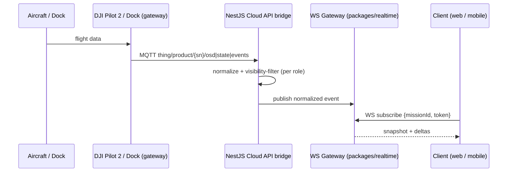

# DJI Frontend Technical Spec — Realtime Contract & Native Bridge

> **Purpose:** The next level of detail below [`dji-frontend-integration.md`](./dji-frontend-integration.md): concrete **wire contracts**, **TypeScript interfaces**, and **native module signatures** for the two hard dependencies — `packages/realtime` (web/mobile WebSocket) and `packages/dji-msdk` (native MSDK bridge).
> **Aligned to:** [`dji-integration-catalogue.md`](./dji-integration-catalogue.md) (Cloud API MQTT topics, MSDK managers) and the visibility rules in [`executive-summary.md`](./executive-summary.md) / [`mvp-build-timeline.md`](./mvp-build-timeline.md).
> **Status:** Proposed design contracts (Phase 1+). Field names are recommendations to lock at build; reconcile with the NestJS `visibility` module and live DJI payloads.

---

## 0. System context — three hops

DJI devices never talk to the browser directly. Data flows **device → DJI gateway → NestJS bridge → client**:



**Two golden rules**
1. **The bridge normalizes** raw DJI thing-model payloads into stable Stravyx types (client is insulated from DJI schema/version churn).
2. **The bridge filters by role** *before* publishing — operators/pilots/dock owners never receive `customerTotal` or Layer 2 fields, even in telemetry envelopes.

---

## 1. Shared types (`packages/types`)

Single source of truth imported by web, mobile, `realtime`, `dji-msdk`, and `api-client`.

```ts
// packages/types/src/mission.ts
export type MissionStatus =
  | 'DRAFT' | 'SUBMITTED' | 'QUOTING' | 'DISPATCHING' | 'CONFIRMED'
  | 'READY' | 'AIRBORNE' | 'COMPLETE' | 'IN_REVIEW' | 'CLOSED' | 'DISPUTED';

export type Role = 'consumer' | 'mobile_operator' | 'admin';

export interface GeoPoint { lat: number; lng: number; altM?: number }

// Normalized from Cloud API OSD (thing/product/{sn}/osd)
export interface Telemetry {
  missionId: string;
  deviceSn: string;
  position: GeoPoint;
  headingDeg: number;
  speedMs: number;
  batteryPct: number;            // never exposes raw cell data
  gimbalPitchDeg?: number;
  homeDistanceM?: number;
  capturedAt: string;            // ISO-8601 (device clock, bridge-stamped)
  seq: number;                   // monotonic per mission for ordering
}

export interface UploadProgress {
  missionId: string;
  fileId: string;
  fileName: string;
  kind: 'raw' | 'preview';
  bytesUploaded: number;
  bytesTotal: number;
  state: 'queued' | 'uploading' | 'done' | 'failed';
  fingerprint?: string;          // for chain-of-custody / dispute audit
}

export type HmsSeverity = 'info' | 'warn' | 'critical';
export interface HmsAlert {
  missionId?: string;
  deviceSn: string;
  code: string;                  // DJI HMS code
  severity: HmsSeverity;
  message: string;               // localized, human-readable
  raisedAt: string;
  blocksFlight: boolean;         // drives READY->AIRBORNE gate + admin freeze
}

export interface Deliverable {
  missionId: string;
  id: string;
  layer: 1 | 2;                  // L1 = raw, L2 = processed (visibility-gated)
  type: 'photo' | 'video' | 'orthomosaic' | 'model3d' | 'gaussian' | 'pointcloud';
  status: 'queued' | 'processing' | 'ready' | 'failed';
  url?: string;                  // signed, short-TTL
  thumbnailUrl?: string;
  shareToken?: string;           // QR share (L2)
}
```

> **Visibility note:** these types are the *maximal* shape. The bridge emits **role-projected** subsets (§ 2.4). `Deliverable.layer === 2` cost fields do not exist on the type at all — margin data lives only in admin-only server DTOs.

---

## 2. `packages/realtime` — WebSocket contract

### 2.1 Connection & auth

| Item | Value |
|---|---|
| Endpoint | `wss://api.stravyx.com/ws` (ap-southeast-2) |
| Auth | `Authorization: Bearer <JWT>` on upgrade (Auth0/Cognito); role claim drives filtering |
| Heartbeat | client `ping` every 20s; server closes stale after 45s |
| Reconnect | exponential backoff 1s→30s + jitter; resubscribe on open |
| Ordering | per-subscription `seq`; client drops out-of-order telemetry |
| Delivery | **snapshot then deltas** — first message on subscribe is a full snapshot |

### 2.2 Message envelope

All frames share one envelope (discriminated union on `type`):

```ts
// packages/realtime/src/protocol.ts
export type ClientFrame =
  | { type: 'subscribe'; channel: Channel; id: string; token: string }
  | { type: 'unsubscribe'; channel: Channel; id: string }
  | { type: 'ping'; t: number };

export type ServerFrame =
  | { type: 'snapshot'; channel: Channel; id: string; data: SnapshotPayload }
  | { type: 'telemetry'; id: string; seq: number; data: Telemetry }
  | { type: 'mission_status'; id: string; data: { status: MissionStatus; at: string } }
  | { type: 'mission_event'; id: string; data: MissionEvent }
  | { type: 'upload_progress'; id: string; data: UploadProgress }
  | { type: 'hms'; id: string; data: HmsAlert }
  | { type: 'fleet'; data: FleetSnapshot }        // admin only
  | { type: 'error'; code: string; message: string }
  | { type: 'pong'; t: number };

export type Channel = 'mission' | 'fleet' | 'device';
```

### 2.3 Bridge mapping — DJI MQTT → Stravyx WS

The NestJS bridge subscribes to gateway MQTT topics and re-emits normalized frames:

| DJI MQTT topic | Bridge action | Emitted `ServerFrame.type` |
|---|---|---|
| `thing/product/{sn}/osd` | throttle to ~1–2 Hz, project fields | `telemetry` |
| `thing/product/{sn}/state` | detect status-relevant changes | `mission_status` / `mission_event` |
| `thing/product/{sn}/events` (file upload) | map progress | `upload_progress` |
| `thing/product/{sn}/events` (HMS) | severity + `blocksFlight` mapping | `hms` |
| `sys/product/{gw}/status` (`update_topo`) | fleet online/offline + capability | `fleet` (admin) |

> Bridge also owns **command** direction (start mission, RTH, dock control) via HTTPS/`services` topics — those are plain REST in `api-client`, not WS (§ 4).

### 2.4 Role projection (enforced server-side)

| Frame | consumer sees | mobile_operator sees | admin sees |
|---|---|---|---|
| `telemetry` | position, status, batteryPct | full (own mission) | full |
| `upload_progress` | high-level % only | full (own files) | full |
| `hms` | none | own device | all |
| `fleet` | — | — | full |
| L2 `Deliverable` | yes (when `ready`) | **never** | yes |

### 2.5 React hooks (web + RN identical surface)

```ts
// packages/realtime/src/hooks.ts
export function useMissionStream(missionId: string): {
  status: MissionStatus;
  telemetry?: Telemetry;
  uploads: UploadProgress[];
  hms: HmsAlert[];
  connected: boolean;
};

export function useFleetStream(): { devices: FleetDevice[]; connected: boolean }; // admin

// Provider wraps the app; one socket multiplexed across subscriptions.
export function RealtimeProvider(props: { url: string; token: string; children: ReactNode }): JSX.Element;
```

Usage (same code path drives web `<MissionTracker>` and mobile `<FlightHud>`):

```tsx
const { status, telemetry, uploads } = useMissionStream(missionId);
// render <StatusPill status/>, <LiveMap aircraft={telemetry?.position}/>, <UploadProgress uploads/>
```

---

## 3. `packages/dji-msdk` — native bridge (mobile only)

Wraps MSDK v5 (Android Kotlin AAR / iOS Swift framework) behind one TS surface. Consumed by `operator-mobile` (full) and `consumer-mobile` (none — it uses `realtime`).

### 3.1 Module surface

```ts
// packages/dji-msdk/src/index.ts
export interface DjiMsdk {
  // --- lifecycle ---
  registerApp(): Promise<void>;                       // uses app key from native config
  isRegistered(): Promise<boolean>;
  connectProduct(): Promise<ProductInfo>;             // resolves when RC+aircraft linked
  getProductInfo(): Promise<ProductInfo | null>;

  // --- missions (IWaypointMissionManager / IWPMZManager) ---
  loadWaypointMission(kmzUri: string): Promise<{ missionId: string }>;
  startWaypointMission(): Promise<void>;
  pauseWaypointMission(): Promise<void>;
  resumeWaypointMission(): Promise<void>;
  stopWaypointMission(): Promise<void>;

  // --- livestream (ILiveStreamManager) ---
  startLiveStream(cfg: { url: string; protocol: 'rtmp' | 'rtsp'; bitrateKbps?: number }): Promise<void>;
  stopLiveStream(): Promise<void>;

  // --- media (IMediaManager) ---
  listMedia(): Promise<MediaFile[]>;
  uploadMedia(opts: { fileIds: string[]; sts: StsCredentials; missionId: string }): Promise<void>;

  // --- safety ---
  getHmsState(): Promise<HmsAlert[]>;
  startReturnToHome(): Promise<void>;
}

export interface ProductInfo {
  model: string;              // e.g. "Mavic 3E"
  serialNumber: string;
  firmware: string;
  cameras: string[];          // feeds verified capability (O-02)
  rcConnected: boolean;
}

export interface MediaFile { id: string; name: string; sizeBytes: number; kind: 'photo' | 'video'; createdAt: string }
export interface StsCredentials { accessKeyId: string; secretKey: string; sessionToken: string; bucket: string; region: string; prefix: string; expiresAt: string }
```

### 3.2 Event emitter

Native → JS events (typed) mirror the WS frames so UI components are source-agnostic:

```ts
export type DjiEvent =
  | { type: 'connection'; data: { rcConnected: boolean; aircraftConnected: boolean } }
  | { type: 'telemetry'; data: Telemetry }             // same type as realtime
  | { type: 'missionState'; data: { status: MissionStatus; waypointIndex?: number } }
  | { type: 'uploadProgress'; data: UploadProgress }
  | { type: 'hms'; data: HmsAlert }
  | { type: 'error'; data: DjiError };

export function addDjiListener(cb: (e: DjiEvent) => void): () => void; // returns unsubscribe
```

> **Design symmetry:** `Telemetry`, `UploadProgress`, `HmsAlert` are the *same* `packages/types` shapes the bridge emits. So `<FlightHud>` binds to either `useMissionStream()` (cloud path) or `addDjiListener()` (direct SDK path) with one adapter — no duplicate UI.

### 3.3 Error model

```ts
export interface DjiError {
  code:
    | 'NOT_REGISTERED' | 'NO_PRODUCT' | 'RC_DISCONNECTED'
    | 'MISSION_INVALID_KMZ' | 'MISSION_EXEC_FAILED'
    | 'IN_RESTRICTED_ZONE' | 'LOW_BATTERY' | 'HMS_BLOCK'
    | 'UPLOAD_STS_EXPIRED' | 'UPLOAD_FAILED' | 'SDK_INTERNAL';
  message: string;
  recoverable: boolean;
  nativeCode?: string;   // raw MSDK error for logs
}
```

### 3.4 Native mapping

| TS method / event | Android (MSDK v5) | iOS (MSDK v5) |
|---|---|---|
| `startWaypointMission` | `IWaypointMissionManager.startMission` | `WaypointMissionOperator.startMission` |
| `missionState` event | `WaypointMissionExecuteStateListener` | mission operator listener |
| `startLiveStream` | `ILiveStreamManager.startStream` | `DJILiveStreamManager` |
| `listMedia` / `uploadMedia` | `IMediaManager` + S3 multipart | `MediaManager` + S3 multipart |
| `telemetry` event | FC/battery/gimbal key listeners | key manager listeners |
| `getHmsState` | HMS manager | HMS manager |

### 3.5 Lifecycle & threading

- `registerApp()` once at app start (needs network for first activation); cache activation.
- All SDK callbacks arrive on native threads → bridge marshals to JS thread before emitting.
- **RC link is the source of truth:** disable Fly/Stream/Upload UI unless `connection.rcConnected && aircraftConnected`.
- Foreground service (Android) / background modes (iOS) keep telemetry + upload alive when screen locks mid-mission.

---

## 4. Command path (`packages/api-client`) — not WebSocket

Outbound actions are REST (idempotent, auditable), not WS:

```ts
// packages/api-client/src/dji.ts
export const djiApi = {
  dispatchWayline: (missionId: string, kmzId: string) => post(`/missions/${missionId}/dispatch`, { kmzId }),
  getStsCredentials: (missionId: string) => post<StsCredentials>(`/missions/${missionId}/upload-credentials`, {}),
  dockCommand: (dockId: string, cmd: 'open' | 'close' | 'start_task' | 'stop_task' | 'force_land') =>
    post(`/docks/${dockId}/command`, { cmd }),   // admin only; server writes audit event (M-07)
};
```

Every `dockCommand` requires a confirm modal client-side **and** server-side RBAC + audit — the UI never assumes success; it awaits the resulting `mission_status`/`fleet` WS frame.

---

## 5. Media viewer inputs (`packages/media`)

FlightHub 2 Modeling API outputs map to viewer props:

```ts
export interface OrthoViewerProps { url: string; boundsGeoJson?: GeoJSON.Polygon }        // 2D orthomosaic (COG/tiles)
export interface Model3DViewerProps { url: string; format: 'glb' | 'obj' | '3dtiles' }     // photogrammetry mesh
export interface PointCloudViewerProps { url: string; format: 'las' | 'laz' | 'potree' }   // LiDAR
export interface GaussianViewerProps { url: string }                                       // 3DGS splat
```

`<DeliverableGallery>` switches viewer by `Deliverable.type`; all sources are **signed short-TTL URLs** issued by `api-client` (never public buckets).

---

## 6. Test & acceptance hooks

| Contract | Test |
|---|---|
| Role projection | Contract tests: consumer/operator WS payloads contain **no** L2 or customerTotal fields |
| Ordering | Inject out-of-order `seq`; client renders latest only |
| Reconnect | Kill socket mid-mission; snapshot re-hydrates tracker within 2s |
| Bridge normalization | Replay recorded DJI OSD fixtures → assert stable `Telemetry` |
| `dji-msdk` parity | Same `DjiEvent` stream shape on Android + iOS simulators (mock SDK) |
| HMS gate | `blocksFlight: true` disables `startWaypointMission` + blocks READY→AIRBORNE |

---

*Related: [`dji-frontend-integration.md`](./dji-frontend-integration.md) · [`dji-integration-catalogue.md`](./dji-integration-catalogue.md) · [`mvp-build-timeline.md`](./mvp-build-timeline.md). All interfaces are proposed contracts — lock field names against the NestJS visibility module and live DJI payloads at build time.*
