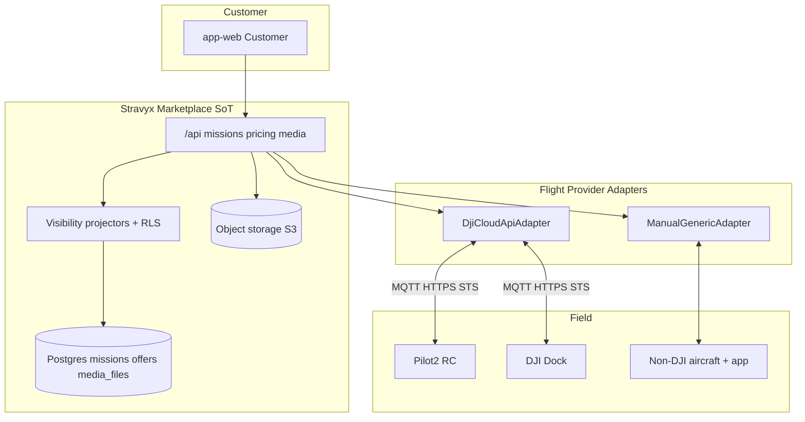
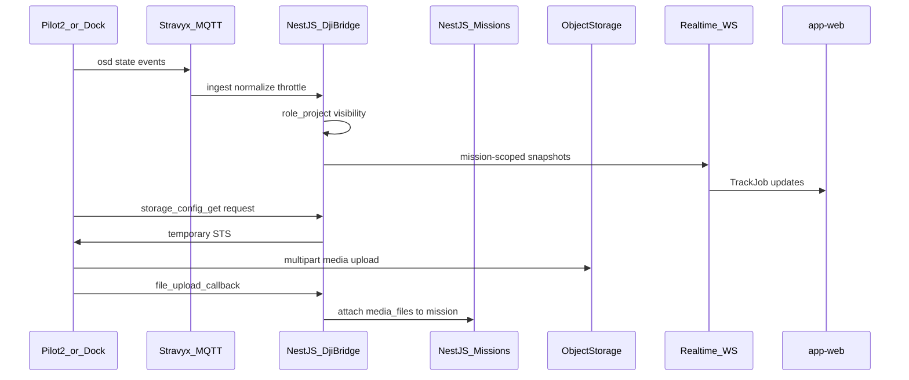

# DJI + non-DJI flight integration architecture

> **Status:** Accepted direction with **open conditions** (specialist redo 2026-08-12; challenger follow-up 2026-08-16). Not an implementation ticket to scaffold NestJS/MQTT.  
> **Date:** 2026-08-12 (conditions extended 2026-08-16)  
> **Authority:** Prefer this doc + [ADR 0005](./adr/0005-flight-provider-cloud-api-only.md) over [dji-integration-catalogue.md](./dji-integration-catalogue.md) for Live-ops A scope.  
> **Layperson path comparison:** [dji-live-ops-path-comparison.md](./dji-live-ops-path-comparison.md) (recommended: Cloud API + manual).  
> **DJI vs non-DJI operator journeys:** [dji-vs-nondji-operator-journeys.md](./dji-vs-nondji-operator-journeys.md).  
> **Layperson challenger findings + fixes:** [dji-live-ops-challenger-findings.md](./dji-live-ops-challenger-findings.md).  
> **APP 8 close-out (Liz / Joel):** [app8-live-ops-gate-closeout.md](./app8-live-ops-gate-closeout.md).  
> **Related:** [ARCHITECTURE.md](./ARCHITECTURE.md) · [ROADMAP.md](./ROADMAP.md) · [data-model-erd.md](./data-model-erd.md) §13.16 · ADRs [0001](./adr/0001-dji-telemetry-unified-types.md)–[0003](./adr/0003-mobile-cross-platform-vs-native.md)

## Specialist gate (2026-08-12; challenger follow-up 2026-08-16)

| Agent | Verdict |
|-------|---------|
| product-analyst | Approve with conditions |
| architect | Approve with conditions |
| architecture-challenger (2026-08-12 and 2026-08-16) | **SUPPORT WITH CONDITIONS** — direction unchanged; new BLOCKERs A-01/A-02 and HIGH A-03–A-08. Layperson write-up: [dji-live-ops-challenger-findings.md](./dji-live-ops-challenger-findings.md) |

**Direction:** Cloud API only + `manual` for Live-ops A. FlightHub 2 **not** required for book → accept → raw L1. No NestJS/MQTT code until Phase 1B + privacy explicitly approved.

### Open conditions (must close before live MQTT / auto media production)

| Sev | Condition | Source |
|-----|-----------|--------|
| BLOCKER | Custody/release SM + ERD Domain E delta; no silent `delivered` on partial/wrong-mission | 2026-08-12 |
| BLOCKER | APP 8: decide if **auto site imagery** is in-gate; DPIA for all hops; fail-closed to manual. Close-out: [app8-live-ops-gate-closeout.md](./app8-live-ops-gate-closeout.md) | 2026-08-12 |
| BLOCKER | Media attribution via capture_session/sortie; STS scoped to mission/session; binding history; object+hash verify | 2026-08-12 |
| BLOCKER | Per-gateway MQTT credentials + topic ACLs (no shared workspace MQTT secret) | 2026-08-12 |
| BLOCKER | Media + telemetry visibility projectors + merge-blocking `assertNoLeak` | 2026-08-12 |
| BLOCKER | **A-01** ReOC tenancy across HTTPS, STS, media **and** MQTT (not MQTT ACLs alone); org/workspace from token claims | 2026-08-16 |
| BLOCKER | **A-02** Gateway→aircraft→mission **capture session** authorises STS; topology freshness; session-prefixed keys | 2026-08-16 |
| HIGH | Bind at `allocated`; one active binding per device; Connect Pilot UX specified | 2026-08-12 |
| HIGH | **A-04** Planned `device_bindings` vs short-lived active `capture_session` (do not use `allocated` as flight lock) | 2026-08-16 |
| HIGH | Device upload bucket = S3/MinIO STS in `ap-southeast-2` (S0 may stay storage-agnostic) | 2026-08-12 |
| HIGH | **A-06** Provider-neutral object locator from S0; no dual `storage_path` / `s3_key` semantics | 2026-08-16 |
| HIGH | COGS scenarios + broker degradation/DLQ/rollback runbook | 2026-08-12 |
| HIGH | **A-10** Decision-grade Cloud vs FH2 Business vs manual COGS at 1 / 100 / 1000 devices before paid S2 | 2026-08-16 |
| HIGH | Supported hardware matrix; unsupported DJI labelled `manual` | 2026-08-12 |
| HIGH | Part B remains a **pinned Live-ops A profile** (not every vendor endpoint) | 2026-08-12 |
| HIGH | **A-03** Honest manual invariant: completion + raw L1, not live-map parity; typed `trackingMode` | 2026-08-16 |
| HIGH | **A-05** Transactional + idempotent accept / mission transition / media release | 2026-08-16 |
| HIGH | **A-07** Lost-callback recovery (durable inbox + prefix reconciliation), not duplicate-callback upsert only | 2026-08-16 |
| HIGH | **A-08** Hostile-file controls before customer download (type/size/magic, malware scan, retention) | 2026-08-16 |
| MEDIUM | Livestream out of A; non-DJI parity; no ranking by device-online; no Link FH2 in Live-ops A UI | 2026-08-12 |
| MEDIUM | **A-09** Capability-split FlightProvider (status / media / devices / telemetry); `manual` does not fake topology | 2026-08-16 |

Recommended remediations, alternatives, human decisions, and slice order: [dji-live-ops-challenger-findings.md](./dji-live-ops-challenger-findings.md).

---

# Part A — Strategic architecture

## FH2 benefits valuation (human ask 2026-08-12)

### What FH2 adds that Cloud API does **not**

Cloud API = devices talk to **Stravyx**. FH2 = Stravyx (or operators) talk to **DJI’s SaaS** for fleet ops + reconstruction.

| Capability | Cloud API alone | With FH2 Public (OpenAPI / Sync / Modeling) | Value class |
|------------|-----------------|-----------------------------------------------|-------------|
| Multi-drone bind, telemetry on Track Job | Yes | Redundant if already on Cloud API | N/A for SoT |
| Auto raw photo/video into Stravyx bucket | Yes (STS + callback) | Possible via Sync/media APIs — duplicate path | Nice if Sync preferred by ReOC |
| First-to-accept marketplace | Stravyx only | Must not move to FH2 | — |
| **2D/3D/LiDAR/3DGS reconstruction (Layer 2)** | Build or buy elsewhere (Pix4D, etc.) | **FH2 Modeling / Open Modeling triggers jobs on media** | **High value** if L2 is product |
| Analyzer / change detection / reports | Build yourself | Built-in FH2 Analyzer | Medium–high for inspection verticals |
| Virtual Cockpit / multi-drone remote ops UI | Build DRC + media plane | FH2 Virtual Cockpit + AR tools | High for dock demos; out of Live-ops A |
| Livestream without owning RTMP/WebRTC stack | You host stream servers | FH2 livestream + quotas (Business ~2000 min/mo) | Medium until scale |
| FlightHub Sync (media/telemetry forward) | N/A | Code-light sync into/out of FH2 | Medium for FH2-native fleets |
| Operator already lives in FH2 daily | Second “bind to Stravyx cloud” friction | Link org; map mission → FH2 task | High adoption for those ReOCs |
| OpenAPI automation of FH2 tasks/devices | N/A | REST into org/project/devices/tasks | Medium if FH2 is ops home |

### Is FH2 nice-to-have or great value?

**For Live-ops A (book → accept → raw deliverables): nice-to-have / not required.** Specialists agreed Cloud API + manual covers the marketplace loop. Paying FH2 seats does not replace MQTT hosting if you still want Stravyx-owned live-ops.

**Great value when (and only when) any of these are true:**
1. **Layer 2 is a paid product soon** — catalogue ties ~blended margin to automated map/3D; FH2 Modeling is the fastest DJI-native way to turn raw media into customer-facing ortho/mesh/3DGS without standing up Terra/Pix4D yourself ([docs/dji-integration-catalogue.md](./dji-integration-catalogue.md) §4).
2. **Inspection/change-detection verticals** need Analyzer-class tooling faster than building it.
3. **Dock remote-ops demos** need Virtual Cockpit without owning DRC UX.
4. **Target ReOCs refuse dual-cloud** and already run FH2 Business day-to-day — Sync/OpenAPI reduces onboarding friction.
5. **Customer livestream at volume** and you do not want to operate streaming infra yet.

**Not great value if:** goal is only multi-drone raw media + Track Job; Enterprise per-device seats (~AUD $5.9k/yr) for that use case is the wrong SKU. Prefer **Business** (unlimited devices + quotas) only after L2/Sync need is real.

**Recommendation unchanged:** defer FH2; treat Modeling as a **separate L2 phase** with an explicit processor choice (FH2 Business vs non-DJI photogrammetry). Do not put FH2 on Live-ops A critical path.

---

## Gap analysis — not in current codebase

### Today (implemented)
- Edge `api`: missions, first-to-accept, status, **`uploadStub`** → `media_files` row only
- `apps/app-web` SPA + `packages/api-client` + `@stravyx/types` projectors
- No `services/api`, no MQTT, no Domain F device tables in demo migrations

### Required for Cloud API live-ops (missing)

| Layer | Missing capability |
|-------|-------------------|
| **Backend / infra** | NestJS (1B); EMQX MQTT TLS **with per-gateway ACLs**; Cloud API HTTPS; **real S3/MinIO STS** for device upload (`ap-southeast-2`); Redis; WS gateway |
| **Backend / domain** | `FlightProvider`; Domain F; `capture_session`/binding history; media `visibility` + release SM; idempotent callback |
| **Packages** | `packages/realtime`; telemetry + **media projectors** + `assertNoLeak`; signed upload/list/download/release in `api-client` |
| **Frontend** | Connect Pilot (no Link FH2 in A); allocate aircraft; Track Job WS; deliverable gallery + Release; gated-off UX when APP 8 open |
| **Security / ops** | APP 8 DPIA; Vault secrets; COGS/observability; DLQ/degradation; manual continuity runbook |
| **Tests** | Media attach idempotency; no silent delivered; binding races; media/telemetry leak contracts; manual-path BDD |

### Additional if FH2 is added later (also missing)

| Layer | Extra beyond Cloud API path |
|-------|-----------------------------|
| **Backend** | FH2 OpenAPI HTTP client (`X-User-Token`, `X-Project-Uuid`); encrypted per-ReOC FH2 credentials; mission→FH2 flight-task mapper; Modeling job create/poll → `processing_jobs` / `deliverables`; optional FlightHub Sync webhook ingress |
| **Frontend** | Optional “Link FH2 org” (ops/admin only — not Live-ops A customer path); L2 deliverable viewer (ortho/3D) once Modeling exists; do **not** replace marketplace UI with FH2 standalone components |
| **Commercial** | FH2 **Business** subscription + mapping/livestream quota monitoring (not Enterprise seats by default) |
| **Docs** | Explicit L2 processor ADR (FH2 vs Pix4D/etc.) |

## Glossary — L2 and APP 8

### Layer 2 (L2)
In Stravyx product language ([docs/PROJECT_CONTEXT.md](./PROJECT_CONTEXT.md), ERD Domain E):

| Term | Meaning |
|------|---------|
| **Layer 1 (L1)** | Flight / raw capture — photos, video, logs from the aircraft. Visible to **customer + operator** (subject to mission authz). Paid partly via flight fee (operator earn / platform share). |
| **Layer 2 (L2)** | **AI / data processing** on top of raw media — orthomosaic, 3D mesh, LiDAR products, analytics, change detection. **100% Stravyx revenue** in the two-layer model. Deliverables with `layer = L2` are **operator-invisible** (visibility firewall). |
| **Network Price** | Single customer-facing price; customers must not see L1/L2 line splits; operators must not see L2 or margin. |

Today L2 is mostly a **placeholder / manual SLA** in the demo. FH2 Modeling (or Pix4D/Roboflow/etc.) is how L2 becomes automated product later.

### APP 8
**Australian Privacy Principle 8** — cross-border disclosure of personal information. ERD §13.16: Pilot-to-Cloud / Dock-to-Cloud can send live video, telemetry, and site imagery through DJI cloud paths that may involve **overseas processing**. Joel locked a **hard build gate**: do not start production live-ops (MQTT ingest, livestreams, dock remote commands) until **Consent & Privacy Policy v4** overseas disclosure is closed (Liz). Separate from APP 3/5 operator-database outreach. Developer account / Cloud API license **application** can proceed now.

**Close-out pack (Liz / Joel):** [app8-live-ops-gate-closeout.md](./app8-live-ops-gate-closeout.md) — in/out of gate, scenarios, hop inventory, decision log, draft v4 clauses, sign-off. Manual S0 upload is **not** waiting on this pack.

---

## Can Cloud API replace FH2 benefits?

**Short answer:** Cloud API can replace FH2 for **connecting drones and delivering raw (L1) media**. It **cannot** replace FH2’s **managed SaaS features** (Modeling, Analyzer, Virtual Cockpit, Sync) unless Stravyx **builds or buys equivalents**.

| FH2 benefit | Doable with Cloud API alone? | How / gap |
|-------------|------------------------------|-----------|
| Multi-drone online + telemetry to Track Job | **Yes** | Pilot 2/Dock → Stravyx MQTT; you host broker + bridge |
| Auto raw photo/video to customer (L1) | **Yes** | STS + `file_upload_callback` → `media_files` |
| Marketplace book / first-to-accept | **Yes (Stravyx only)** | FH2 must not become SoT |
| Livestream to browser | **Partially** | Cloud API can start push to **your** RTMP/WebRTC/Agora; you must run the media plane. FH2 bundles hosting + quotas |
| Ortho / 3D / LiDAR / 3DGS (L2) | **Not built-in** | Cloud API delivers **inputs**. Reconstruction needs FH2 Modeling **or** Pix4D/Terra/internal pipeline |
| Analyzer / change detection / reports | **No (build yourself)** | FH2 product feature; Cloud API has no equivalent SaaS |
| Virtual Cockpit / AR multi-drone ops UI | **No (build DRC + UI)** | Cloud API exposes DRC/control primitives; FH2 ships the cockpit product |
| FlightHub Sync | **N/A** | Only relevant if using FH2; Cloud API is already “your cloud” |
| Operator already lives in FH2 | **Friction remains** | Cloud API asks them to also bind Pilot to Stravyx; FH2 link reduces dual-console pain |

**Conclusion:** FH2 is **not required** to connect pilots/drones or ship L1 deliverables. FH2 is **advantageous** mainly for **L2 productization** and **ops SaaS** you would otherwise build. Those benefits are **not free with Cloud API** — they are a make-vs-buy decision.

---

## User story — connect pilots / drones to Stravyx (Cloud API path)

Persona: **Alex**, chief remote pilot at an AU ReOC already on Stravyx. Goal: bind Pilot 2 fleet so accepted jobs get live Track Job + auto media.

### Preconditions (platform / admin — once)
1. Stravyx holds a **DJI developer account** and **Cloud API license** for the Stravyx workspace.
2. **Privacy/APP 8 gate** closed (or Alex only uses **manual** upload until it is).
3. NestJS + MQTT + STS + storage live in AU region; Operator UI has **Connect Pilot** (not in codebase today).

### Story A — Operator binds a Pilot 2 (gateway)

1. Alex signs into Stravyx as **operator** (`app_metadata.role = operator`).
2. Opens **Account / Devices → Connect DJI Pilot**.
3. Stravyx shows workspace join instructions (QR / org code / cloud URL + token flow per Cloud API manage module — exact UX TBD in bind journey).
4. On the field RC, Alex opens **DJI Pilot 2 → Cloud / third-party platform**, selects Stravyx workspace, logs in / binds.
5. Pilot 2 connects outbound MQTT/HTTPS to Stravyx; gateway SN appears **online** in Stravyx Devices.
6. Topology update lists paired **aircraft** under that RC; Alex confirms aircraft nicknames (e.g. “M30-East”).
7. Alex repeats for a second RC → two gateways online under one ReOC (multi-drone).

**Observable success:** Devices page shows 2 gateways Online; no FH2 subscription required; browser never shows MQTT secrets.

### Story B — Mission flight with bound drone

1. Customer books a Sydney STANDARD 60‑min job → Network Price; mission `dispatched`; offers fan out.
2. Alex **Accepts** first → full address; others get 409.
3. Stravyx creates/updates **device_binding** (aircraft ↔ mission) at **`allocated`** via explicit aircraft selection (architect lock — not at accept; never an accept precondition).
4. Customer **Track Job** receives role-projected telemetry over WebSocket (coarse progress / map as allowed).
5. After flight, Pilot 2 requests **STS**, uploads media to Stravyx bucket, sends **callback**.
6. Files land as `media_files` (initially quarantine / operator_raw).
7. Alex (or policy) **Releases to customer** → `customer_deliverable`; mission `flown`/`delivered`.
8. Customer downloads via Stravyx signed URLs only.

### Story C — Non-DJI / gate not closed (manual)

Layperson stories (Brooke Autel, mixed fleet, unsupported Mini, radio outage): [dji-vs-nondji-operator-journeys.md](./dji-vs-nondji-operator-journeys.md).

1. Same book → accept.
2. No Pilot bind: Alex taps Ready → Airborne → Complete.
3. Uploads via signed PUT; same release → customer download path.

### Story D — If FH2 added later (optional L2 — not connect story)

1. After L1 media in Stravyx (or Sync), admin/operator triggers **FH2 Modeling** (or Pix4D).
2. `processing_jobs` → L2 `deliverables` (operator-invisible).
3. Customer sees processed map/3D; Alex still cannot see L2 economics or L2 product internals beyond what’s allowed.

---

## User story — connect pilots / drones (layperson version)

### Plain-English glossary for this story

| Term | Meaning |
|------|---------|
| **ReOC** | **Remote Operator’s Certificate** — the CASA company licence that lets an Australian drone business take commercial jobs. “Alex’s company” in the story. |
| **RC** | **Remote Controller** — the physical handheld radio/controller the pilot holds (with sticks and screen), e.g. **DJI RC Plus**. It is the radio link to the aircraft in the air. Think: game console controller + tablet for a drone. |
| **Pilot 2** | **DJI Pilot 2** — the official **app** that runs **on the RC’s screen**. Pilots use it to fly, see camera feed, and (for enterprise) log into a **cloud** so the flight can talk to Stravyx. |
| **Aircraft / drone** | The flying machine (e.g. Matrice 30). It usually does **not** talk to the internet by itself for Cloud API — it talks to the **RC**, and the RC (with Pilot 2) talks to Stravyx. |
| **Gateway** | In Cloud API terms, the **RC running Pilot 2** (or a **DJI Dock**) is the “doorway” to the cloud. Stravyx sees the **gateway serial number (SN)** come online, then learns which aircraft are paired under it. |
| **Topology** | Simply the live list: “this RC is online, and these drones are currently linked to it.” |
| **Workspace** | Stravyx’s Cloud API “organisation room” that Pilot 2 logs into — like joining a company Slack, but for drones. |
| **SN** | **Serial number** — unique hardware ID stamped on the RC or aircraft. |
| **First-to-accept** | Job is offered to eligible operators; **first** one who taps Accept wins; others are locked out. |
| **Track Job** | Customer screen that shows mission progress (and later live position) while the job runs. |
| **WS (WebSocket)** | How the **phone/browser app** gets live updates from Stravyx. The browser never speaks the drone radio protocol directly. |
| **MQTT** | The industrial messaging protocol Pilot 2 uses **to Stravyx’s servers**. Customers and operators’ browsers do **not** use MQTT. |
| **Quarantine → Release** | Photos/videos land in Stravyx first as “held”; operator (or policy) confirms they belong to this job, then **releases** them so the customer can download. |
| **Dock** (optional later) | A ground box that stores/charges a drone and can fly missions with less human on site. Same “gateway” idea as an RC, different hardware. |

---

### Story — Alex connects the company’s drones to Stravyx

**Who:** Alex runs a licensed drone company (ReOC) already signed up on Stravyx as an **operator**.  
**What they want:** When they win a job, the customer can follow progress live, and photos/videos upload themselves to Stravyx instead of Alex emailing files.

#### Part 1 — Link the remote controller (one-time per RC)

1. **Alex opens Stravyx** on a laptop or phone and signs in as Operator.  
2. Goes to something like **Devices → Connect DJI Pilot** (this screen is planned; not in the demo app yet).  
3. Stravyx shows simple instructions: “On your **remote controller**, open Pilot 2 and join the Stravyx cloud.”  
4. In the field, Alex picks up the **RC** (the handheld controller). On its screen, **DJI Pilot 2** is running.  
5. In Pilot 2, Alex opens the **cloud / third-party platform** settings and **joins Stravyx’s workspace** (login or bind code — exact steps follow DJI’s Cloud API bind flow).  
6. The RC is now a **gateway**: it has a secure internet link to Stravyx’s servers.  
7. Back in Stravyx, that RC’s **serial number** shows as **Online**.  
8. Pilot 2 also reports which **drone(s)** are currently paired with that RC. They appear in a simple list (“topology”) — e.g. “RC-1 Online → Matrice 30 ‘East’.”  
9. Alex can rename drones for clarity (“Roof unit”, “East M30”).  
10. **Multi-drone:** Alex repeats steps 4–8 with a **second RC** (another pilot’s controller). One company account, many RCs, many aircraft.

**What a layperson should picture:**  
You are not “installing the drone into the website.” You are telling the **controller app** (Pilot 2) which **business cloud** (Stravyx) to report to — the same way a delivery driver’s phone app is logged into the courier company.

#### Part 2 — A real customer job using that link

1. A **customer** books a job in Stravyx (e.g. roof photos in Sydney) and pays the **Network Price** (one clear price).  
2. Stravyx offers the job to eligible operators. **Alex taps Accept first** and wins. Other operators cannot take it.  
3. Only after accept does Alex see the **full street address** (before that, roughly the suburb — privacy/safety rule).  
4. Alex (or the system) **assigns which aircraft** will fly this job at **allocate** — “this mission is bound to East M30.” Binding is never required to Accept (keeps non-DJI fair).  
5. Alex flies as usual with Pilot 2 on the RC. Meanwhile Stravyx receives live status/position from the gateway.  
6. The **customer** opens **Track Job** in the Stravyx app/website and sees **safe, filtered** live updates (progress / map as allowed). Their browser talks only to Stravyx — not directly to the drone.  
7. When the flight finishes, Pilot 2 **automatically uploads** photos/videos into Stravyx storage (no USB stick / email).  
8. Files sit in **quarantine** first (“held for check”) so a wrong job or incomplete set is not shown to the customer by mistake.  
9. Alex confirms **Release to customer** (or an automatic rule does, once product defines it).  
10. Customer downloads the files from **Stravyx** (secure short-lived links) — not from a DJI website.

#### Part 3 — If they have no DJI Cloud link (or privacy gate still closed)

Same booking and Accept. Instead of live auto-upload, Alex taps **Ready → Airborne → Complete** in Stravyx and **uploads files manually**. The customer still gets downloads from Stravyx. Non-DJI brands use this path.

#### Part 4 — FH2 (optional later — not needed to “connect”)

Connecting the RC does **not** require FlightHub 2. FH2 would only appear later if Stravyx wants DJI to **process** raw photos into maps/3D (**Layer 2**), or if the company already lives inside FH2 day-to-day.

---

### Product-analyst findings (REDO Opus / agent frontmatter — supersedes Grok)

**Verdict:** Approve with conditions — Cloud-API-only + `manual`; FH2 **not** needed for raw L1.

| Sev | Gap |
|-----|-----|
| BLOCKER | APP 8 scope over **auto site imagery** undefined — decides if Live-ops A can exist pre-gate |
| BLOCKER | No custody/release state in code/ERD; Domain E “aligned” conflicts with auto-upload |
| BLOCKER | No media/telemetry projectors or contract tests — firewall incomplete for Live-ops A data classes |
| HIGH | Bind authority / device lifecycle roles; mission↔device bind timing (privacy); catalogue re-infection; unquantified success evidence |
| MEDIUM | Livestream pricing linkage; wayline = address-grade; two-tier supply/ranking risk; strip Link FH2 |

**Doc:** Part A+B+C insufficient as product handoff unless it carries release SM, APP 8 checklist, bind UX/authz, bind timing, non-DJI parity, catalogue banner; full depth only for Live-ops A min set.

### Architect findings (REDO Fable 5 / agent frontmatter — supersedes Grok)

**Verdict:** Approve with conditions. Ran as **Fable 5**.

- Bind at **`allocated`** (explicit); never accept precondition; one active binding per device.
- Media: STS → idempotent callback → quarantine → explicit release; no silent `delivered`.
- Slices: **S0** Edge real upload now → S1 Nest+manual registry → S2 bind (APP8) → **S3 auto-media** → **S4 telemetry** → S5 multi-gateway → S6+.
- Storage fork: Cloud API needs real S3/MinIO STS; demo may be Tokyo.
- ADR **0005** required before S1/S2; §13 FH2 non-normative; catalogue supersession mandatory.

### Architecture-challenger findings (REDO GPT Sol — see combined table above)

**Verdict: SUPPORT WITH CONDITIONS** — thesis holds for supported Pilot 2/Dock; not safe to implement/publish durable doc as written until capture_session attribution, MQTT ACLs, APP 8 DPIA, COGS/rollback closed. Cut exhaustive FH2 handbook.

---

## 0. Decision update — Cloud API only? Is FH2 required?

**Yes — for connecting multiple DJI drones to Stravyx (book → accept → fly → return photos/video), use Cloud API only. FlightHub 2 Public is not necessary.**

| Question | Answer |
|----------|--------|
| Can we just use Cloud API? | **Yes.** Pilot 2 / Dock register to **Stravyx’s** cloud (MQTT + HTTPS + object storage). Multiple gateways/aircraft bind into one Stravyx workspace. No FH2 subscription required. |
| Is FH2 Public necessary? | **No** for marketplace SoT, first-to-accept, telemetry into Track Job, auto media into Stravyx storage, or customer download. |
| When would FH2 help later? | Optional: DJI-hosted mapping/LLM/Analyzer, Virtual Cockpit in DJI UI, FlightHub Sync, Open Modeling without owning photogrammetry. Defer until Layer-2 product needs it. |
| If we buy FH2 later, Business or Enterprise? | Prefer **Business**. OpenAPI exists on Standard/Business/Enterprise. **Business = unlimited connected devices** with finite monthly quotas (e.g. ~2000 livestream min/mo, ~3000 mapping images/mo — verify current DJI billing). **Enterprise = seat/online-device caps** (1-device packages + expansions; AU list **AUD $5,940**/device/year) with larger quotas. Multi-drone marketplace fleets fit Business better than per-device Enterprise. |
| Multi-drone on Cloud API? | **Supported by design:** each Pilot 2 RC or Dock is a gateway; topology reports many aircraft. Scale limit is Stravyx infra (MQTT, STS, storage), not an FH2 device SKU. |

**Locked product default:** ship **`dji_cloud_api` + `manual` adapters only**. Keep `dji_fh2` as a documented future adapter; do not put FH2 on the critical path or budget for Enterprise seats.

Sources: [DJI Cloud API architecture](https://github.com/dji-sdk/Cloud-API-Doc/blob/master/docs/en/10.overview/20.product-architecture.md); FH2 plan comparison (Heliguy / DJI FAQ — OpenAPI on all plans; Business unlimited devices; Enterprise device-capped); [AU Enterprise 1-device list price](https://store.dji.com/au/product/dji-flighthub-2-enterprise-version-1-year-1-device).

---

## 1. Executive recommendation (locked defaults)

**Stravyx is the marketplace system of record.** Customers book missions, operators accept via first-to-accept, money/visibility stay on `@stravyx/types` projectors + Edge/Nest APIs. DJI never becomes a second SoT for missions, pricing, or customer delivery.

**DJI surfaces — do not conflate them:**

| Surface | What it is | Stravyx stance |
|---------|------------|----------------|
| **DJI Cloud API** | Pilot 2 / Dock talk **to Stravyx** over MQTT/HTTPS/STS | **Required path for DJI live-ops** (multi-drone). ADRs 0001–0002 + [docs/dji-integration-catalogue.md](./dji-integration-catalogue.md). |
| **FlightHub 2 OpenAPI** | REST into **DJI’s SaaS** | **Not required.** Optional later for L2/Sync; if used, prefer **Business** (unlimited devices), not Enterprise seats. |

**Non-DJI operators** use the same Stravyx mission/media contracts via **`manual` Flight Provider Adapter** (signed upload + status). Same first-to-accept board; no DJI hardware.

**Hard gate (existing ERD / ROADMAP):** do not start live MQTT / livestream / dock remote-command production until APP 8 / privacy disclosure for overseas processing is closed. Developer account + Cloud API license prep can proceed now.

---

## 2. Where we are today vs target

**Today (Phase 1A/2A, implemented):** Browser → `packages/api-client` → Supabase Edge `api` → Postgres. Mission: book → dispatch offers → accept → status → `**uploadStub`** row in `media_files`. No MQTT, no NestJS, no Domain F device tables.

**Target (Phase 1B → live-ops):** Stable `/api/...` moves to NestJS (ADR 0002); Edge remains lead/HubSpot path as needed. Flight execution plugs in behind adapters; customers still only talk to Stravyx APIs/UI.



FH2 OpenAPI adapter is **out of the critical path** (optional later). Do not draw customer traffic through FH2.


---

## 3. Product journey (same UX for DJI and non-DJI)

Side-by-side operator stories: [dji-vs-nondji-operator-journeys.md](./dji-vs-nondji-operator-journeys.md).

### Scenario A — Customer books, DJI Pilot 2 operator delivers (recommended Phase 1 live-ops)

1. Customer books in Stravyx → Network Price → mission `booked`/`dispatched`; offers fan out to eligible online verified ReOCs (**first-to-accept**).
2. Operator accepts in Stravyx → full address revealed; offer race returns 409 to losers (existing Edge behaviour).
3. If operator’s org has a **bound DJI gateway** (Pilot 2 logged into Stravyx Cloud API workspace): NestJS adapter may push wayline / task metadata and open a live session; customer Track Job shows role-projected status (never raw MQTT).
4. During flight: OSD/events → bridge → throttle → **role-project** → Redis → `packages/realtime` WebSocket (browser never speaks MQTT — [docs/dji-frontend-integration.md](./dji-frontend-integration.md)).
5. After flight: Cloud API media path — device requests STS (`storage_config_get`) → uploads to **Stravyx bucket** → `file_upload_callback` → `media_files` rows linked to `mission_id`.
6. Mission → `flown`/`delivered`; customer downloads deliverables via Stravyx (signed URLs), not via DJI console.

### Scenario B — Dock autonomous (Phase 1+ docks)

Same marketplace accept, then Dock-to-Cloud: schedule/wayline on dock, remote health/HMS, auto media return. Remote cockpit/DRC is higher risk (authz + privacy) — gate separately.

### Scenario C — FlightHub 2 (deferred / optional)

Not required for multi-drone marketplace. Revisit only if Stravyx wants DJI-hosted mapping/LLM/Analyzer or Sync. If so: use **Business** (unlimited devices + OpenAPI + Sync), not Enterprise per-device seats. Marketplace accept still stays in Stravyx; FH2 is a side system, never SoT.

### Scenario D — Non-DJI (Autel / Skydio / freestyle)

1–2 same as A.
3. Adapter = **ManualGenericAdapter**: operator marks Ready / Airborne / Complete in Stravyx; uploads photos/videos via signed PUT (real media, replacing `uploadStub`).
4. Optional later: vendor-specific connectors implementing the same `FlightProvider` interface.

**Example mapping:** Mission `M-1842` “Roof inspect, 1 Martin Place, STANDARD 60m” → accepted by ReOC with Matrice 30 → aircraft bound at **allocate** → Pilot 2 uploads via STS → 47 JPGs land in `s3://…/missions/M-1842/raw/` → quarantine → operator **Release** → customer Job History shows “Deliverables (47)” via Stravyx signed URLs only. (Wayline push is A+ optional, not required for this loop.)

---

## 4. Provider-agnostic domain boundary (critical design)

Introduce a narrow interface so frontend/backend stay DJI-agnostic:

```text
FlightProvider  (packages/types; adapters in NestJS after 1B)
  bindDevice(orgId, credentials) → DeviceBinding
  getOnlineTopology(orgId) → Device[]
  prepareMission(missionId) → ExternalJobRef | null
  // startLive — OUT of Live-ops A interface; add when livestream gated in
  ingestMediaWebhook(...) → MediaFile  // idempotent inbound; not callback-registration
  getJobStatus(externalRef) → normalized FlightJobStatus
```

**Invariant (contract-tested):** every customer-visible outcome reachable via `manual` (semantic baseline + rollback).


| Provider id     | Implementation                                                      | When used                                                    |
| --------------- | ------------------------------------------------------------------- | ------------------------------------------------------------ |
| `manual`        | Signed upload + status taps                                         | Default for all; only path for non-DJI initially; **rollback** |
| `dji_cloud_api` | MQTT broker + Cloud API HTTP (manage/media/storage; wayline A+)     | Bound Pilot 2 / Dock — **multi-drone path**                  |
| `dji_fh2`       | FH2 OpenAPI V2 client                                               | **Deferred** — L2/Sync only; prefer Business plan            |


**Normalized mission states** stay ERD vocabulary (`dispatched` → `accepted` → `allocated` → `flown` → `delivered`). External DJI/FH2 statuses map **into** this machine; they do not replace it.

**Binding (architect lock):** at **`allocated`**, explicit aircraft select; never accept precondition; one active binding per device (`released_at IS NULL`); delayed media without active bind → unattributed quarantine (prefer capture_session when specified — challenger BLOCKER).

**Media model:** extend beyond stub — `media_files` gains `provider`, `external_id`, `content_type`, `byte_size`, `sha256`/`fingerprint`, `visibility` (`operator_raw` quarantine → `customer_deliverable` on explicit release). Mission `delivered` requires ≥1 released deliverable or audited override. Customer projection only via Stravyx signed URLs + media/telemetry projectors (product BLOCKER — do not exist today).

---

## 5. DJI Cloud API architecture (primary)

**Reference demos:** [DJI-Cloud-API-Demo](https://github.com/dji-sdk/DJI-Cloud-API-Demo), [Cloud-API-Demo-Web](https://github.com/dji-sdk/Cloud-API-Demo-Web) — use as protocol samples, not as Stravyx product UI.




**Stravyx must host (for Cloud API):** MQTT broker (e.g. EMQX), HTTPS Cloud API surface compatible with Pilot/Dock expectations, object storage + STS, WebSocket gateway (`packages/realtime`), NestJS modules `dji` + `realtime` (ADR 0002).

**Do not put MQTT in the browser.** Frontend continues on `/api` + WS only.

**Shared types (ADR 0001):** normalize OSD into `packages/types` Telemetry; MSDK path later reuses the same types (ADR 0003).

---

## 6. FlightHub 2 — deferred (not on critical path)

You do **not** need FH2 Public to connect multiple drones. Skip OpenAPI/Sync/modeling until Layer-2 needs justify it.

If revisited later: OpenAPI is available on Standard/Business/Enterprise; **Business** is the right commercial fit for many devices (unlimited connections, buy quota add-ons). Avoid Enterprise “1 Device” SKUs as the platform default — they cap online devices and price ~AUD $5.9k/device/year.

Do not embed FH2 standalone frontend as the customer marketplace UI.

---

## 7. Frontend + backend connection plan


| Layer                                          | Responsibility                                                                                                                                  |
| ---------------------------------------------- | ----------------------------------------------------------------------------------------------------------------------------------------------- |
| **Customer UI** ([apps/app-web](../apps/app-web)) | Book, track, download deliverables — no DJI tokens, no FH2 UI                                                                                   |
| **Operator UI**                                | Accept offers, **Connect DJI Pilot** (not Link FH2 in Live-ops A), allocate aircraft, status, upload if manual, **Release** media             |
| **Admin UI**                                   | Device bindings, unattributed/failed media, HMS alerts (admin projection only)                                                                  |
| **api-client**                                 | Extend with media list/download/release, device-binding CRUD — still `/api/...` only                                                            |
| **Edge (now / S0)**                            | Real signed upload + quarantine→release for `manual` (replace `uploadStub`) — no NestJS required                                                |
| **NestJS (Phase 1B / S1+)**                    | Missions (ported), `FlightProvider` registry, Cloud API bridge, media STS/callback; FH2 client **only if L2 later**                             |
| **Supabase**                                   | Auth roles in `app_metadata`; marketplace tables; Domain F when live-ops starts; additive `media_files` columns                                 |


Visibility rule for live views: customer may see coarse progress (+ stream only if later entitlement); operator sees operational detail; admin sees economics + raw diagnostics — enforced in **media + telemetry projectors**, not CSS.

---

## 8. Phased delivery (architect S0–S6 — specialist redo 2026-08-12)

| Slice / phase | Outcome | Gate |
|---------------|---------|------|
| **S0 — Now** | Real signed upload (`manual`): quarantine→release, customer signed download, media contract tests — **Edge** | None (privacy not required) |
| **S1 — Phase 1B** | NestJS cutover same `/api`; `FlightProvider` registry with `manual` only | Explicit 1B approval |
| **Privacy / APP 8** | Consent v4 + DPIA; decide if **auto site imagery** is in-gate; fail-closed UX | Liz/Joel — human |
| **S2** | Domain F + Cloud API bind (login/topology/MQTT status); Connect Pilot; one gateway; **per-gateway MQTT ACLs** | APP 8 |
| **S3** | **Auto media** STS + callback into S0 pipeline (before telemetry) | APP 8 |
| **S4** | Telemetry OSD → projected WS Track Job (`packages/realtime`) | APP 8 |
| **S5** | Multi-gateway / binding race hardening | — |
| **S6+** | Wayline/map A+; Dock; livestream; DRC — each separately gated | Per-feature |
| **L2 later** | FH2 Business Modeling / Open Modeling **or** Pix4D — separate ADR | Not Live-ops A |
| **Mobile** | MSDK HUD (ADR 0003) — parallel; not required for supported Pilot 2 Live-ops A cohort | Separate |

**Hardware:** publish supported Pilot 2 / Dock matrix; unsupported DJI → `manual` label only.


---

## 9. Risks and non-goals

- **FH2 ≠ Cloud API:** buying FH2 does not replace hosting MQTT for Cloud API. **You can ship Cloud API without any FH2 plan.**
- **Business vs Enterprise:** for multi-drone, Business (unlimited devices) beats Enterprise seat packs; Enterprise is for heavy unlimited quotas / SSO-style needs, not “more drones.”
- **Cost:** skip FH2 Enterprise ~AUD $5.9k/device/year unless a specific L2/enterprise feature forces it.
- **Stale docs:** older DJI catalogue lines mentioning BEST MATCH / bidding — ignore; first-to-accept wins.
- **Compliance:** CASA ReOC + privacy gate before remote command/livestream to customers.
- **Non-goal:** replacing Stravyx dispatch with FH2; DJI secrets in the browser; UI-only money/address hiding; mandatory FH2 for every ReOC.

---

## 10. Immediate artefacts (after human accepts merged conditions)

1. **ADR 0005** — FlightProvider: Cloud API only for DJI live-ops; FH2 deferred; `manual` baseline/rollback; pin Cloud API doc version; bind-at-allocate; media idempotency key.
2. Product rules: release/custody SM + APP 8 media-scope ruling + Connect Pilot UX/authz + measurable success thresholds.
3. Media STS/callback + capture_session attribution contract; MQTT ACL/credential design.
4. COGS sketch (pilot / 100 / 1000 devices) + degradation/rollback runbook.
5. Durable doc Part A + **pinned Live-ops A API profile** (Part B) + FH2 non-normative appendix + catalogue supersession banner.
6. S0 Edge signed-upload slice (can start after product release SM agreed — no NestJS/MQTT).

No NestJS/DJI packages until Phase 1B + privacy explicitly approved.

---

## 11. This document

This file **is** the durable handoff described in the architecture plan. Part A = §§0–10 + glossary/stories above. Part B = §12 (Live-ops A profile). Part C = §14. FH2 §13 is **non-normative** until an L2 processor ADR.


## 12. Cloud API — Live-ops A compatibility profile (Part B)

> **Normative for Live-ops A.** Stravyx **hosts** these surfaces. Pin against Cloud-API-Doc ~v1.14.x before build. Wayline/map/control are A+ / later unless noted. Each Live-ops A minimum endpoint below includes purpose, how-to, scenario, and examples.

> **Model:** Stravyx **hosts** MQTT + HTTPS. Pilot 2 / Dock call us. Auth header: `x-auth-token`. Typical JSON envelope `{ "code": 0, "message": "...", "data": { } }`.  
> Pin paths against [Cloud-API-Doc](https://github.com/dji-sdk/Cloud-API-Doc) + [DJI-Cloud-API-Demo Postman](https://github.com/dji-sdk/DJI-Cloud-API-Demo) before coding (~v1.14.x).

### 12.1 Deployed components

MQTT broker (TLS) · HTTPS Cloud API · Object storage + STS · NestJS bridge → browser WebSocket (`packages/realtime`) — browser never speaks MQTT.

### 12.2 MQTT topics (each gets full §11 write-up)

1. `sys/product/{gateway_sn}/status` — online/offline + `update_topo`  
2. `thing/product/{device_sn}/osd` — high-rate telemetry  
3. `thing/product/{device_sn}/state` — sparse state / payloads / live capacity  
4. `thing/product/{gateway_sn}/events` (+ `_reply`) — HMS, upload progress, mission events  
5. `thing/product/{gateway_sn}/services` (+ `_reply`) — cloud→device commands  
6. `thing/product/{gateway_sn}/requests` (+ `_reply`) — especially `storage_config_get` STS  
7. `thing/product/{gateway_sn}/property/set` — property config  
8. `thing/product/{gateway_sn}/drc/up` and `drc/down` — DRC (out of Live-ops A)

### 12.3 HTTPS — Manage `/manage/api/v1` (each gets full write-up)

**Auth**
- `POST /manage/api/v1/login`
- `POST /manage/api/v1/token/refresh`

**User / workspace**
- `GET /manage/api/v1/users/current`
- `GET /manage/api/v1/users/{workspace_id}/users`
- `PUT /manage/api/v1/users/{workspace_id}/users/{user_id}`
- `GET /manage/api/v1/workspaces/current`

**Devices / topology (Connect Pilot)**
- `GET /manage/api/v1/devices/{workspace_id}/devices`
- `GET /manage/api/v1/devices/{workspace_id}/devices/{device_sn}`
- `POST /manage/api/v1/devices/binding`
- `DELETE /manage/api/v1/devices/{device_sn}/unbinding`
- `GET /manage/api/v1/devices/{workspace_id}/devices/bound`
- `GET /manage/api/v1/workspaces/{workspace_id}/devices/topologies`
- `PUT /manage/api/v1/devices/{workspace_id}/devices/{device_sn}/property`

**HMS**
- `GET /manage/api/v1/devices/{workspace_id}/devices/hms`
- `GET /manage/api/v1/devices/{workspace_id}/devices/hms/{device_sn}`
- `PUT /manage/api/v1/devices/{workspace_id}/devices/hms/{device_sn}`

**Logs / firmware** (Live-ops A+ / ops)
- Logs: list/get/upload/cancel/delete under `/manage/api/v1/workspaces/{workspace_id}/devices/{device_sn}/logs...`
- Firmware: OTA, release notes, list, upload, status under `/manage/api/v1/.../firmwares...`

**Livestream (HTTPS helpers; APP 8 gated)**
- `GET /manage/api/v1/live/capacity`
- `POST /manage/api/v1/live/streams/start`
- `POST /manage/api/v1/live/streams/stop`
- `POST /manage/api/v1/live/streams/update`
- `POST /manage/api/v1/live/streams/switch`

### 12.4 HTTPS — Storage & Media (core L1 loop — richest examples)

- `POST /storage/api/v1/workspaces/{workspace_id}/sts` — temporary AWS/Ali/MinIO credentials (`bucket`, `credentials`, `object_key_prefix`, `region`, `provider`)  
  Official: [Obtain temporary credential](https://github.com/dji-sdk/Cloud-API-Doc/blob/master/docs/en/60.api-reference/10.pilot-to-cloud/10.https/30.media-management/30.obtain-temporary-credential.md)
- `POST /media/api/v1/workspaces/{workspace_id}/fast-upload` — fingerprint / already-have-file?
- `POST /media/api/v1/workspaces/{workspace_id}/files/tiny-fingerprints` — batch fingerprint check
- `POST /media/api/v1/workspaces/{workspace_id}/upload-callback` — **primary** `media_files` insert after S3 put
- `POST /media/api/v1/workspaces/{workspace_id}/group-upload-callback` — folder/group complete (if present in pinned doc version)
- `GET /media/api/v1/files/{workspace_id}/files` — list workspace media
- `GET /media/api/v1/files/{workspace_id}/file/{file_id}/url` — download URL (prefer Stravyx marketplace signed URLs for customers)

**Worked scenario to write in the doc:** accept mission → bind aircraft → flight → STS → PUT object → upload-callback → quarantine → release → customer download via `packages/api-client`.

### 12.5 HTTPS — Wayline `/wayline/api/v1`

- `GET .../waylines` · `GET .../waylines/{wayline_id}/url` · `POST .../waylines/file/upload` · `POST .../upload-callback`  
- Favorites add/remove · `GET .../waylines/duplicate-names`  
- Jobs: `POST .../flight-tasks` · `GET .../jobs` · `DELETE .../jobs` · `PUT .../jobs/{job_id}` · `POST .../jobs/{job_id}/media-highest`  
  Official example: [Waypoint upload result report](https://github.com/dji-sdk/Cloud-API-Doc/blob/master/docs/en/60.api-reference/10.pilot-to-cloud/10.https/20.waypoint-management/50.waypointfile-upload-result-report.md)

### 12.6 HTTPS — Map `/map/api/v1`

- Flight areas: GET list · POST create · PUT update · DELETE · POST sync · GET device-status  
- Elements: GET element-groups · POST/PUT/DELETE elements  

**Scenario:** push customer site polygon to Pilot 2 after accept (address-reveal-on-confirm).

### 12.7 HTTPS — Control `/control/api/v1` (mostly post–Live-ops A)

- `POST .../jobs/return_home` · `fly-to-point` · `takeoff-to-point` · DELETE fly-to-point  
- Payload commands · flight/payload authority grab  
- DRC: `.../drc/connect` · `enter` · `exit`  

### 12.8 Minimum Live-ops A set (still each fully documented)

Login + refresh · device bind/unbind · topologies · MQTT status/topo/osd/events/requests · STS · fast-upload · upload-callback · (marketplace `/api` unchanged for book/accept/download).

---

## 13. FlightHub 2 OpenAPI — non-normative L2 appendix (optional future)

> **Not an architecture contract for Live-ops A.** Capability reference only. Prefer thinner depth than §12; pin paths from live Interface Documentation at L2 implement time.

> **Model:** Stravyx is the **HTTP client**. Host (demo): [`https://api-openapi.dji.com`](https://api-openapi.dji.com). Headers: `X-User-Token`, `X-Project-Uuid`, `X-Request-Id`, `X-Language`.  
> Manual: [Public Cloud V2](https://fh.dji.com/user-manual/en/custom-development/open-api/public-cloud-v2.html). Apifox (many paths under `/openapi/v0.1`): [fh2-api-en.apifox.cn](https://fh2-api-en.apifox.cn/). Samples: [FlightHub-2-OpenAPI-V2-Demo](https://github.com/dji-sdk/FlightHub-2-OpenAPI-V2-Demo). **Pin v0.1 vs v2.0 from live Interface Documentation before coding.**

### 13.1 Auth & bootstrap (full write-ups)

- How to obtain org OpenAPI key (console: My Organization → Organization Settings → OpenAPI / FlightHub Sync)  
- `GET /openapi/v0.1/project` (or v2.0) — list projects → `uuid`  
- Project members add/list (Org Project module)

### 13.2 Devices

- `GET /openapi/v0.1/project/device` — project devices (`drone.sn`, `camera_list[].camera_index`)  
- Org device list · device detail · object model · HMS · camera/lens · control acquisition · lens switch · video quality · realtime commands · RTK calibration  
  Tutorial: [Device Management](https://fh2-api-en.apifox.cn/doc-6067877)

### 13.3 Flight tasks

- Route upload-complete notification  
- `POST /openapi/v0.1/flight-task` — create (`name`, `wayline_uuid`, `sn`, `rth_altitude`, …) → [Create Flight Task](https://fh2-api-en.apifox.cn/api-263045304)  
- `GET /openapi/v0.1/flight-task/list` — filters `sn`, `begin_at`, `end_at`, … → [List](https://fh2-api-en.apifox.cn/api-263045307)  
- `GET /openapi/v0.1/flight-task/{task_uuid}` → [Detail](https://fh2-api-en.apifox.cn/api-263045306)  
- `PUT /openapi/v0.1/flight-task/{task_uuid}/status`  
- Get media resources (`preview_url` / `original_url`) · get trajectory  
  Tutorial: [Task Management](https://fh2-api-en.apifox.cn/doc-6067876)

**Scenario:** after Stravyx first-to-accept, optionally **mirror** a dock task into FH2 for FH2-native ReOCs — never move marketplace SoT.

### 13.4 Livestream & converters

- `POST .../live-stream/start` — body `sn`, `camera_index`, `video_expire`, `quality_type` → `{ url, url_type, expire_ts }`  
- Converter create / start / stop `.../live-stream/converter/{converter_id}`  
  Tutorial: [Livestream](https://fh2-api-en.apifox.cn/doc-6067872) · Auth: [Authentication](https://fh2-api-en.apifox.cn/doc-6067870)

### 13.5 Modeling / L2 (primary future FH2 value)

- Model reconstruction from FH2 task media — start / poll / result URIs  
- **Open Modeling** from third-party cloud (Stravyx S3) — preferred when L1 already via Cloud API  
Exact paths: copy from live Interface Documentation at implement time; document with examples + `processing_jobs.pipeline = fh2_open_model` mapping.

### 13.6 Frontend standalone (ops only)

[FlightHub-2-Frontend-Standalone-Component](https://github.com/dji-sdk/FlightHub-2-Frontend-Standalone-Component) — admin/ops evaluation only; never bypass visibility projectors.

---


---

## 12.9 Live-ops A minimum endpoints — detailed cards

Auth header on HTTPS: `x-auth-token`. Typical envelope: `{ "code": 0, "message": "success", "data": { } }`.

### `POST /manage/api/v1/login`

- **Phase:** Live-ops A
- **What it is:** Pilot 2 authenticates into the Stravyx Cloud API workspace and receives an access token.
- **Who calls whom:** Pilot 2 → Stravyx HTTPS
- **When to use:** Operator completes Connect Pilot / workspace join on the RC.
- **How to use:** POST credentials (per pinned Cloud API manage docs); store/return token for `x-auth-token`.
- **Stravyx mapping:** Map authenticated Pilot identity → ReOC operator org; never put token in browser.
- **Scenario:** Alex joins Stravyx workspace from Pilot 2; Devices page can list gateways after MQTT topo.
- **Example request (shape):** `{ "username": "...", "password": "...", "flag": 1 }` (confirm against pinned demo/docs)
- **Example response (shape):** `{ "code": 0, "data": { "access_token": "...", "workspace_id": "..." } }`
- **Failure:** Invalid credentials → clear Pilot-side error; no phantom Online state.
- **Official doc:** [Cloud-API-Doc](https://github.com/dji-sdk/Cloud-API-Doc) · [Demo API index](https://deepwiki.com/dji-sdk/DJI-Cloud-API-Demo/2.3-api-endpoints)

### `POST /manage/api/v1/token/refresh`

- **Phase:** Live-ops A
- **What it is:** Renews an expired workspace access token without full re-login when supported.
- **Who calls whom:** Pilot → Stravyx
- **Stravyx mapping:** Same org binding; audit refresh failures.
- **Official doc:** [Demo API index](https://deepwiki.com/dji-sdk/DJI-Cloud-API-Demo/2.3-api-endpoints)

### `POST /manage/api/v1/devices/binding` / `DELETE /manage/api/v1/devices/{device_sn}/unbinding`

- **Phase:** Live-ops A
- **What it is:** Registers or removes a gateway/aircraft SN under the workspace.
- **Who calls whom:** Pilot/manage flow → Stravyx
- **Stravyx mapping:** Upsert `devices` with `owner_org_id`; unbind must stop attribution to ReOC missions.
- **Scenario:** Alex binds RC-1; later unbinds lost hardware.
- **Official doc:** [Demo API index](https://deepwiki.com/dji-sdk/DJI-Cloud-API-Demo/2.3-api-endpoints)

### `GET /manage/api/v1/workspaces/{workspace_id}/devices/topologies`

- **Phase:** Live-ops A
- **What it is:** Returns gateway→aircraft topology for the workspace UI.
- **Stravyx mapping:** Operator Devices page; complements MQTT `update_topo`.
- **Official doc:** [Demo API index](https://deepwiki.com/dji-sdk/DJI-Cloud-API-Demo/2.3-api-endpoints)

### MQTT `sys/product/{gateway_sn}/status` (`update_topo`)

- **Phase:** Live-ops A
- **What it is:** Online/offline + which aircraft hang off this RC/Dock.
- **Who calls whom:** Device → Stravyx MQTT
- **Stravyx mapping:** Mark gateway Online; upsert topology; ACL must restrict topic to owning org credentials.
- **Scenario:** Second RC comes online under same ReOC (multi-drone).

### MQTT `thing/product/{device_sn}/osd`

- **Phase:** Live-ops A (S4)
- **What it is:** High-rate telemetry (GPS, battery, attitude).
- **Stravyx mapping:** Throttle ~1 Hz → role-project → WS Track Job. Browser never speaks MQTT.
- **Scenario:** Priya sees safe progress on Track Job while Alex flies.

### MQTT `thing/product/{gateway_sn}/requests` (`storage_config_get`) + `POST /storage/api/v1/workspaces/{workspace_id}/sts`

- **Phase:** Live-ops A (S3)
- **What it is:** Temporary object-store credentials for direct media upload.
- **How to use:** Scope `object_key_prefix` to `missions/{mission_id}/raw/` when active binding/capture_session exists; region `ap-southeast-2`; provider `aws`|`ali`|`minio`.
- **Example response fields:** `bucket`, `credentials.{access_key_id,access_key_secret,security_token,expire}`, `object_key_prefix`, `region`, `provider`
- **Official doc:** [Obtain temporary credential](https://github.com/dji-sdk/Cloud-API-Doc/blob/master/docs/en/60.api-reference/10.pilot-to-cloud/10.https/30.media-management/30.obtain-temporary-credential.md)

### `POST /media/api/v1/workspaces/{workspace_id}/fast-upload`

- **Phase:** Live-ops A
- **What it is:** Fingerprint check — “do you already have this file?”
- **Stravyx mapping:** Dedupe against `fingerprint` / object key; define precedence vs Stravyx idempotency keys.
- **Official doc:** [Demo API index](https://deepwiki.com/dji-sdk/DJI-Cloud-API-Demo/2.3-api-endpoints)

### `POST /media/api/v1/workspaces/{workspace_id}/upload-callback`

- **Phase:** Live-ops A (core)
- **What it is:** Pilot reports upload complete + metadata after S3 PUT.
- **How to use:** Verify object exists + size/(async) hash; upsert `media_files` on `(provider, object_key)`; set `visibility=operator_raw`; attribute via capture_session / active binding — never “most recent mission”.
- **Scenario:** After landing, 47 JPGs callback → quarantine → Alex Releases → Priya downloads via Stravyx.
- **Failure:** Wrong mission / no binding → unattributed quarantine; partial set → no silent `delivered`.
- **Official doc:** Cloud-API-Doc media management · [Demo API index](https://deepwiki.com/dji-sdk/DJI-Cloud-API-Demo/2.3-api-endpoints)

### Out of Live-ops A minimum (documented inventory only)

Wayline library/jobs, map flight-areas, livestream start/stop, control/DRC, firmware/logs — **A+ / Dock / later**. Do not wire into Live-ops A acceptance.


## 14. Clickable sources (Part C) (paste into doc Part C)

**Cloud API**
- [DJI Developer — Cloud API tutorial](https://developer.dji.com/doc/cloud-api-tutorial/en/)
- [Cloud-API-Doc (GitHub)](https://github.com/dji-sdk/Cloud-API-Doc)
- [Cloud API HTTPS — media STS](https://github.com/dji-sdk/Cloud-API-Doc/blob/master/docs/en/60.api-reference/10.pilot-to-cloud/10.https/30.media-management/30.obtain-temporary-credential.md)
- [Cloud API HTTPS — wayline upload callback](https://github.com/dji-sdk/Cloud-API-Doc/blob/master/docs/en/60.api-reference/10.pilot-to-cloud/10.https/20.waypoint-management/50.waypointfile-upload-result-report.md)
- [DJI-Cloud-API-Demo](https://github.com/dji-sdk/DJI-Cloud-API-Demo)
- [Demo API endpoint index (DeepWiki)](https://deepwiki.com/dji-sdk/DJI-Cloud-API-Demo/2.3-api-endpoints)

**FlightHub 2**
- [FH2 Public Cloud OpenAPI V2 user manual](https://fh.dji.com/user-manual/en/custom-development/open-api/public-cloud-v2.html)
- [FH2 OpenAPI English Apifox](https://fh2-api-en.apifox.cn/)
- [FH2 authentication tutorial](https://fh2-api-en.apifox.cn/doc-6067870)
- [FH2 device management tutorial](https://fh2-api-en.apifox.cn/doc-6067877)
- [FH2 task management tutorial](https://fh2-api-en.apifox.cn/doc-6067876)
- [FH2 livestream tutorial](https://fh2-api-en.apifox.cn/doc-6067872)
- [Create flight task API](https://fh2-api-en.apifox.cn/api-263045304)
- [FlightHub-2-OpenAPI-V2-Demo](https://github.com/dji-sdk/FlightHub-2-OpenAPI-V2-Demo)
- [FlightHub-2-Frontend-Standalone-Component](https://github.com/dji-sdk/FlightHub-2-Frontend-Standalone-Component)

**Stravyx**
- [docs/dji-integration-catalogue.md](./dji-integration-catalogue.md)
- [docs/data-model-erd.md](./data-model-erd.md) (L2 §7, APP 8 §13.16)
- [docs/ARCHITECTURE.md](./ARCHITECTURE.md)
- [docs/PROJECT_CONTEXT.md](./PROJECT_CONTEXT.md)

Before implementation: re-pull official interface lists; pin Cloud API + FH2 OpenAPI versions in the ADR.