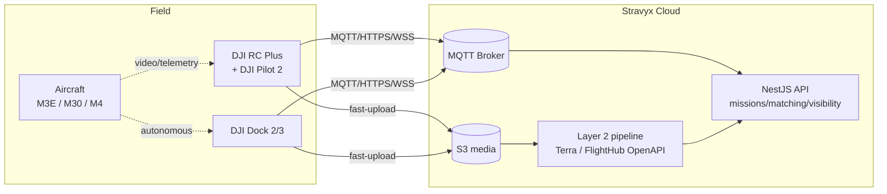

# DJI Integration Catalogue — APIs, SDKs, Resources & Stravyx Use Cases

> **SUPERSEDED FOR LIVE-OPS A SCOPE (2026-08-12):** Prefer [`dji-integration-architecture.md`](./dji-integration-architecture.md) and [ADR 0005](./adr/0005-flight-provider-cloud-api-only.md). Live-ops A is **Cloud API + `manual` only**; FlightHub 2 is **not** on the critical path; dispatch is **first-to-accept** (ignore BEST MATCH / bidding language below). This catalogue remains a useful feature encyclopedia — treat Phase / BEST MATCH / early-FH2-critical-path lines as historical research, not current product authority.

> **Purpose:** A working catalogue of DJI developer APIs, SDKs, functions, and features that Stravyx can integrate, with descriptions, code-level examples, and concrete usage scenarios mapped to our architecture and roadmap.
> **Aligned to:** [`executive-summary.md`](./executive-summary.md) (§ Architecture, § Technology stack — "DJI Phase 1: Pilot-to-Cloud + Dock-to-Cloud") and [`mvp-build-timeline.md`](./mvp-build-timeline.md).
> **Status:** Research reference for the DJI credibility package + Phase 1 integration planning. Verify exact endpoints against the live DJI Developer docs before build.
> **Founder note:** MVP (19 Jun) uses a **manual Pilot-to-Cloud path** (operator uploads raw data). DJI SDK integrations below are **Phase 1+ (2026–2027)** unless flagged otherwise.

---

## 0. TL;DR — the four DJI pillars and where they fit Stravyx

| #   | DJI product                                        | What it is                                                                                                        | Stravyx role                                                                   | Phase                                           |
| --- | -------------------------------------------------- | ----------------------------------------------------------------------------------------------------------------- | ------------------------------------------------------------------------------ | ----------------------------------------------- |
| 1   | **Cloud API**                                      | Server-to-drone/dock over MQTT + HTTPS + WebSocket via DJI Pilot 2 / DJI Dock as gateway. No custom app required. | **Backbone** for live telemetry, auto media return, mission dispatch, dock ops | Phase 1 (docks), optional Phase 1 for operators |
| 2   | **Mobile SDK v5 (MSDK)**                           | Native Android/iOS SDK to build a custom flight app (waypoints, virtual stick, media, livestream).                | **Stravyx operator app** — deep control, branded flight experience             | Phase 1 programme (native apps post-GA)         |
| 3   | **Payload SDK v3 (PSDK)**                          | Firmware SDK to build/integrate custom payloads (sensors, compute, gimbals) via SkyPort/X-Port.                   | **Long-term** — custom sensors, onboard edge AI for Layer 2                    | Phase 2                                         |
| 4   | **FlightHub 2 OpenAPI + Modeling API / DJI Terra** | Cloud fleet ops + photogrammetry, LiDAR, 3D Gaussian Splatting reconstruction.                                    | **Layer 2 processing accelerator** — mapping/3D deliverables                   | Phase 1–2                                       |

**Key architectural fact:** With **Cloud API**, DJI drones and docks talk to *our* backend directly through DJI Pilot 2 (on the RC) or a DJI Dock — we do **not** need to ship a mobile app to get live telemetry, video, or automatic media upload. This is the single most important integration for Stravyx's tracker, dispatch, and Layer 1→Layer 2 handoff.

---

## 1. DJI Cloud API — the integration backbone

**What it is.** A cloud interface set that abstracts the drone/dock into an IoT "thing model." The gateway (**DJI Pilot 2** on an RC, or a **DJI Dock**) connects to *our* cloud over **MQTT** (telemetry + commands), **HTTPS** (REST + media), and **WebSocket** (server push to browser). It exists so platforms whose core business is the cloud (that's us) don't have to build and maintain a full MSDK app just to get data in and commands out.

**Two operating scenarios:**
- **Pilot-to-Cloud** — a human operator flies with DJI Pilot 2; our platform receives live data and can push routes, get media, and stream video.
- **Dock-to-Cloud** — a DJI Dock runs autonomous missions; our platform schedules flights, monitors health, and retrieves media with no human on site.

**Supported hardware (Cloud API 1.14.0, Apr 2025):**
- *Pilot-to-Cloud:* Matrice 4E/4T, Matrice 350 RTK, Matrice 300 RTK, Matrice 30 series, Mavic 3 Enterprise series.
- *Dock-to-Cloud:* DJI Dock 3 (+ Matrice 4D/4TD), DJI Dock 2 (+ Matrice 3D/3TD), DJI Dock (+ M30 series).

**Access prerequisite:** DJI developer account → generate a **Cloud API license** on developer.dji.com → bind Pilot 2 / Dock to our workspace. (This is one of the "three DJI asks" in the commercial one-pager.)

### 1.1 MQTT topic model (how data actually flows)

| Topic pattern                                      | Direction      | Purpose                                                     |
| -------------------------------------------------- | -------------- | ----------------------------------------------------------- |
| `sys/product/{gateway_sn}/status`                  | device → cloud | Online/offline + `update_topo` (topology)                   |
| `thing/product/{device_sn}/osd`                    | device → cloud | High-frequency telemetry: GPS, battery, attitude, speed     |
| `thing/product/{device_sn}/state`                  | device → cloud | Sparse state changes: firmware, payload, live-capacity      |
| `thing/product/{gateway_sn}/services` (+ `_reply`) | cloud → device | Commands we invoke (start mission, take photo, return home) |
| `thing/product/{gateway_sn}/events` (+ `_reply`)   | device → cloud | Device events: file-upload progress, HMS alarms             |
| `thing/product/{gateway_sn}/requests` (+ `_reply`) | device → cloud | Device asks us for data (e.g. STS credentials, org binding) |
| `thing/product/{gateway_sn}/property/set`          | cloud → device | Configure device properties                                 |
| `thing/product/{gateway_sn}/drc/{up\               | down}`         | both                                                        |

**REST module prefixes** (all `/{module}/api/v1`): `manage` (login, workspace, device binding), `wayline` (route library + dispatch), `media` (fast-upload negotiation + callbacks), `storage` (temporary object-store STS credentials), `map`, `control`.

> **Stravyx design tie-in:** Our mission state machine (`SUBMITTED → … → AIRBORNE → COMPLETE`) can be driven automatically by `osd`/`state`/`events` instead of the manual operator taps in the MVP. See § 5.

### 1.2 Cloud API functional modules — catalogue

#### A. Device Management & Topology
- **Description:** Discover and monitor docks, aircraft, payloads, RCs in a gateway→sub-device hierarchy. `update_topo` maintains a live view of what's online.
- **Stravyx scenario — live fleet map (Admin):** Admin "Live mission list + detail" (story A-02) upgrades from manual status to a real-time map of every airborne aircraft and every dock's online/offline state.
- **Scenario — capability match:** Reported payload/model on `state` feeds the **BEST MATCH SCORE** capability factor automatically (operator no longer self-declares equipment tags — story O-02 becomes verified data).

#### B. OSD Telemetry (live position, battery, attitude)
- **Description:** Frequent telemetry stream: lat/lon/alt, battery %, gimbal, speed, home point.
- **Scenario — consumer tracker (C-05):** Replace the "manual Ready/Airborne/Complete" timeline with a **live Mapbox pin** moving in real time. Huge UX/credibility lift for consumers watching their mission.
- **Scenario — geofence/compliance:** Cross-check live position against the job's suburb/site and flag out-of-bounds flights in the audit log (D-01/M-07).

#### C. Live Streaming (RTMP / RTSP / GB28181 / WebRTC / Agora)
- **Description:** Start/stop live video from the aircraft camera, pushed to a streaming endpoint; works in both Pilot-2 and Dock scenarios.
- **Scenario — "watch live" for Immediate/Urgent missions:** Security/surveillance (launch category 5) customers on the 2.0–2.5× Immediate tier get a **live feed** in their portal during the flight — a premium differentiator that justifies the urgency multiplier.
- **Scenario — remote supervision (Phase 1 dock/pilot model):** Stravyx pilot supervises a dock flight via live stream under Stravyx ReOC (user type 5 in exec summary).

#### D. Wayline / Route Library (mission dispatch)
- **Description:** Upload, store, distribute, and execute **KMZ waylines**; report execution progress. Dock 3 adds route distribution via virtual cockpit and simulator altitude settings.
- **Scenario — Scheduled/recurring missions & patrols:** Our "Scheduled" tier (0.85–0.90×) and post-MVP **patrol blocks** (Sentinel/Corridor/Agri) become one saved wayline dispatched on a cron — no operator planning each time. Directly enables the recurring-enterprise revenue in the founder model.
- **Scenario — construction progress (category 3):** Same wayline flown weekly → temporally consistent imagery → better Layer 2 change-detection deliverables.

#### E. Media Library / Media Management (auto raw return)
- **Description:** Coordinated **fast-upload**: device negotiates temporary STS credentials (`storage_config_get`) and pushes files straight to our object storage (S3), with MQTT upload-progress events and HTTPS callbacks.
- **Scenario — automate the Layer 1 → Layer 2 handoff (the core MVP loop):** Today operators manually upload raw data (story O-09). With Cloud API, media lands in S3 **automatically** on landing, the `COMPLETE → IN_REVIEW` transition fires, and the **Layer 2 processing job** is created with zero operator effort. Removes the biggest friction/error point in our loop.
- **Scenario — integrity/audit:** Fingerprint + callback give us a verifiable chain of custody for disputes (M-06).

#### F. HMS — Health Management System
- **Description:** Real-time alarms/diagnostics (battery, motors, sensors, SD full, comms) via event topics.
- **Scenario — dispatch safety gate:** Block or re-dispatch a mission if an operator's aircraft reports critical HMS before/mid-flight; log to audit. Strengthens our CASA/compliance story (D-04).
- **Scenario — dock uptime SLA:** For enterprise docks, HMS drives proactive maintenance and uptime reporting in Admin.

#### G. TSA — Situational Awareness
- **Description:** Push/fetch positions of *other* aircraft/devices for airspace awareness on the map.
- **Scenario — multi-operator metro ops:** As supply grows in Sydney/Melbourne metro, show operators/admin nearby Stravyx aircraft to reduce conflicts — a network-density advantage that compounds with scale.

#### H. Map Elements
- **Description:** Sync shared map annotations (pins, polygons, no-fly areas) between cloud and Pilot 2.
- **Scenario — brief the operator visually:** Push the customer's site polygon / target points to the operator's DJI Pilot 2 map on win, so the operator flies exactly the requested area (ties to address-reveal-on-confirm, M-05).

#### I. Dock control — remote ops (Dock-to-Cloud only)
- **Description:** Open/close dock, start/stop autonomous tasks, remote firmware upgrade, forced landing, remote unlocking, custom flight areas (Dock 3).
- **Scenario — autonomous dock missions (Phase 1–2 vision):** The endgame in the exec summary — dispatch a dock flight from a booking with **no human**, retrieve media, and feed Layer 2. "DJI Cloud API can dispatch docks worldwide from day one."

#### J. DRC — Direct Remote Control
- **Description:** Low-latency real-time control channel (`drc/up`/`drc/down`).
- **Scenario — Stravyx-piloted dock takeover:** A Stravyx RPL pilot nudges a dock aircraft during a supervised mission. **Advanced/Phase 2; out of scope near-term.**

#### K. Organization / Device Binding
- **Description:** Bind Pilot 2 / Dock to a workspace/organization; manage which devices belong to which account.
- **Scenario — operator onboarding:** During RePL/ReOC verification (O-01), the operator binds their DJI account/aircraft to their Stravyx workspace, turning verification into a live, data-backed link.

---

## 2. DJI Mobile SDK v5 (MSDK) — the Stravyx operator app

**What it is.** Native **Android** (and iOS) SDK to build a fully custom flight application. Use this when we want a **branded Stravyx operator app** with deeper control than Pilot 2 + Cloud API gives. Distributed as Gradle packages (`dji-sdk-v5-aircraft`, `-provided`, `-networkImp`). Requires an **MSDK app key** from DJI.

**Supported drones (v5.x):** Matrice 400, Matrice 4 Enterprise series, Matrice 4D Enterprise series, Matrice 350 RTK, Matrice 300 RTK, M30 series, Mavic 3 Enterprise series, Mavic 3TA, plus consumer **Mini 3 / Mini 3 Pro / Mini 4 Pro** (v5.3+ opened to consumer drones — lowers the equipment barrier for our operator supply).

> **Roadmap fit:** Exec summary lists **React Native (Expo)** for native apps in the Phase 1 programme and "MSDK V5 custom app." MSDK is native; plan a thin native module or Kotlin/Swift wrapper bridged to RN, or a dedicated native operator app.

### MSDK v5 key managers — catalogue

| Manager / API                            | Capability                                                                                         | Stravyx scenario                                                                                                                        |
| ---------------------------------------- | -------------------------------------------------------------------------------------------------- | --------------------------------------------------------------------------------------------------------------------------------------- |
| **`IWaypointMissionManager`**            | Upload / execute / pause / resume KMZ waypoint missions; execution + action listeners              | In-app "Fly this Stravyx mission" — operator taps once, aircraft flies the customer's requested route; app auto-advances mission status |
| **`IWPMZManager`**                       | Author/edit KMZ waylines on device                                                                 | Let operators fine-tune the Stravyx-supplied route for site conditions                                                                  |
| **`IVirtualStickManager`**               | Programmatic flight control (normal + advanced modes; obstacle avoidance on M300/M350/M30/M3E/M3M) | Guided/assisted capture patterns (orbit a building for inspection cat. 2; facade sweep) baked into the app                              |
| **`IMediaManager` / `IMediaDataCenter`** | Media list, preview, download, playback from camera SD                                             | In-app raw preview + selective upload to S3; operator confirms coverage before leaving site                                             |
| **`ILiveStreamManager`**                 | RTMP/RTSP live stream from app                                                                     | Operator streams to customer/admin during Immediate/Urgent jobs without Pilot 2                                                         |
| **Camera / Gimbal control**              | Zoom, mode, shutter, gimbal angle                                                                  | Enforce capture specs per mission category (e.g. nadir for mapping, oblique for 3D)                                                     |
| **Flight controller / telemetry**        | Position, battery, RTH, remaining flight time                                                      | Drives our tracker + safety gates identical to Cloud API OSD, but in-app                                                                |
| **Simulator**                            | Flight simulation                                                                                  | Operator training + our QA of mission templates without real flights                                                                    |
| **KeyManager (product info, firmware)**  | Read model/firmware/serial                                                                         | Verified capability data for BEST MATCH SCORE + compliance checks                                                                       |

**Scenario — the Stravyx-branded flight experience:** An operator wins a bid → opens the Stravyx app → the app pulls the mission KMZ, runs the pre-flight **compliance checklist** (gates `READY → AIRBORNE`, story O-07/D-04), executes the waypoint mission, live-streams to the customer, and auto-uploads raw media — all inside our brand, all statuses automatic. This is the native-app end state of the manual MVP operator portal.

---

## 3. DJI Payload SDK v3 (PSDK) — custom payloads & onboard compute

**What it is.** Firmware-level SDK (latest **3.16.0**, Mar 2026) to build custom payloads that mount via **SkyPort V2 / X-Port / E-Port** and talk to the aircraft (flight controller, GPS, transmission). Runs on Linux/RTOS/embedded and DJI **Manifold** onboard computers. Used for automated flight controllers, mapping cameras, video analysis platforms, megaphones/searchlights, etc.

**Stravyx relevance: Phase 2 / strategic, not near-term.**

- **Scenario — onboard "Layer 2 at the edge":** Run Stravyx AI (defect detection, object counting) on a **Manifold 3** onboard computer during flight → deliver *partial processed insights before landing* → a genuinely differentiated Layer 2 product with lower cloud cost.
- **Scenario — specialised deliverables:** Integrate a third-party sensor (gas, multispectral, LiDAR) as a Stravyx payload for premium mission categories (agriculture, infrastructure) deferred past MVP.
- **Scenario — megaphone/searchlight:** Security/surveillance active-response add-on for the Sentinel patrol product.

---

## 4. DJI FlightHub 2 OpenAPI + Modeling API / DJI Terra — Layer 2 accelerator

**What it is.**
- **FlightHub 2** — DJI's cloud fleet-ops + situational-awareness + data-management platform (also On-Premises / AIO editions). Its **OpenAPI** now exposes **Modeling APIs** so third-party systems can trigger cloud reconstruction: **photogrammetry, LiDAR, and 3D Gaussian Splatting (3DGS)**. Models are shareable online via QR — no login required.
- **DJI Terra** — desktop photogrammetry/LiDAR software (2D/3D, LiDAR-RGB fusion, multispectral, cluster reconstruction). *Terra's legacy API is being phased out in favour of FlightHub 2 Modeling APIs* — so build new integrations against **FlightHub 2 OpenAPI**, not the Terra API.

**Stravyx relevance: directly de-risks Layer 2 (our ~30% margin engine).**

| Capability                                | Stravyx Layer 2 scenario                                                         | Mission categories                            |
| ----------------------------------------- | -------------------------------------------------------------------------------- | --------------------------------------------- |
| **Cloud photogrammetry (2D orthomosaic)** | Auto-generate site maps from raw upload → processed deliverable in portal ($-06) | Construction progress, land survey (post-MVP) |
| **3D reconstruction / 3DGS**              | "Digital twin"/3D deliverable, shareable by QR to customer stakeholders          | 3D/digital twin (post-MVP), property          |
| **LiDAR reconstruction (Zenmuse L2/L3)**  | High-accuracy point clouds for infrastructure/survey premium tier                | Infrastructure, survey (post-MVP)             |
| **Multispectral reconstruction**          | Crop-health maps                                                                 | Agriculture (post-MVP)                        |

**Scenario — replace the "manual/placeholder" Layer 2 at MVP:** The build plan accepts a **manual 24–48h SLA** stub for Layer 2 at GA (story $-07). FlightHub 2 Modeling APIs are a fast path to *real* automated map/3D deliverables shortly after launch — turning the placeholder into product and unlocking the full ~40% blended margin sooner.

---

## 5. Where DJI changes the Stravyx MVP loop (before vs after)

| Stravyx step            | MVP (manual, 19 Jun)                           | With DJI Cloud API (Phase 1)                       |
| ----------------------- | ---------------------------------------------- | -------------------------------------------------- |
| Mission dispatch        | Broadcast brief; operator flies with own tools | Push **KMZ wayline** to Pilot 2 / dock             |
| `READY → AIRBORNE`      | Operator taps button + checklist               | Auto from `state`/`events`; HMS safety gate        |
| Consumer tracker (C-05) | Status timeline                                | **Live position + live video**                     |
| `COMPLETE → IN_REVIEW`  | Manual raw upload (O-09)                       | **Auto media fast-upload** to S3, job auto-created |
| Layer 2 (`$-05`/`$-06`) | Manual/placeholder SLA                         | **FlightHub 2 Modeling API** auto reconstruction   |
| Capability score        | Operator self-declared tags                    | **Verified** from device topology/state            |

**Visibility rule reminder:** DJI data flows into our backend, and our **`visibility` module** still enforces field-level filtering — operators/pilots/dock owners never see customer total or Layer 2 fee. Cloud API data enriches missions; it does not bypass the information architecture in the exec summary.

---

## 6. Phasing & prioritisation (recommended)

```mermaid
flowchart LR
  subgraph MVP["MVP · 19 Jun (no DJI SDK)"]
    M1[Manual Pilot-to-Cloud path]
    M2[Manual raw upload → S3]
    M3[Placeholder Layer 2 SLA]
  end
  subgraph P1["Phase 1 · 2026–27"]
    P1a[Cloud API: telemetry + live tracker]
    P1b[Cloud API: auto media return]
    P1c[FlightHub 2 Modeling API<br/>real Layer 2]
    P1d[MSDK v5 operator app]
    P1e[Dock-to-Cloud pilot]
  end
  subgraph P2["Phase 2 · 2028+"]
    P2a[Autonomous dock network]
    P2b[PSDK onboard edge AI]
    P2c[DRC supervised control]
  end
  MVP --> P1 --> P2
```

**Highest-leverage first (post-MVP):**
1. **Cloud API media auto-return** — kills the manual-upload friction in our core loop; small backend surface (MQTT + STS + callbacks).
2. **Cloud API OSD telemetry** — live consumer tracker; big credibility/UX win with modest effort.
3. **FlightHub 2 Modeling API** — converts placeholder Layer 2 into real margin.
4. **Cloud API wayline dispatch** — unlocks Scheduled tier + patrol blocks (recurring revenue).
5. **MSDK v5 app** — branded operator experience once native apps are scoped.
6. **Dock-to-Cloud + PSDK** — the autonomous Phase 2 vision.

---

## 7. Access, licensing & the "three DJI asks"

| Requirement                             | For                                | How obtained                                                                    |
| --------------------------------------- | ---------------------------------- | ------------------------------------------------------------------------------- |
| **DJI developer account**               | All SDKs                           | developer.dji.com signup                                                        |
| **Cloud API license**                   | Cloud API (Pilot 2 / Dock binding) | Generated per workspace on developer site                                       |
| **MSDK app key**                        | Mobile SDK app                     | Registered app on developer site                                                |
| **PSDK app credentials + hardware kit** | Payload dev                        | Dev kit + SkyPort/X-Port/Manifold                                               |
| **FlightHub 2 OpenAPI access**          | Modeling / fleet                   | developer.dji.com/flighthub-api                                                 |
| **Enterprise relationship**             | Volume, support, co-marketing      | The **credibility package** gate (live site + one-pager) → DJI Enterprise intro |

**Ecosystem scale (for the one-pager):** 100,000+ DJI developers; 750+ cloud platforms built on Cloud API since Mar 2022; 110+ PSDK payloads mass-produced. Positions Stravyx as a credible cloud-platform partner, not a hobbyist.

**Suggested three DJI asks** (to firm up in the commercial one-pager, story K-02):
1. **Cloud API + FlightHub 2 OpenAPI enablement** for the Stravyx workspace (Pilot-to-Cloud first, Dock-to-Cloud for pilots).
2. **Enterprise hardware/partner pathway** for docks (Dock 2/3) tied to Stravyx Finance (4K Group white-label).
3. **Co-marketing / reference status** as an Australian drone-services cloud platform.

---

## 8. Open questions to validate before build

- Confirm current **Cloud API version** and exact module endpoints against live docs (this catalogue reflects v1.14.0, Apr 2025).
- Confirm **FlightHub 2 Modeling API** commercial terms, quotas, and output formats vs building our own pipeline (Roboflow/Pix4D alternatives noted in exec summary).
- Decide **MSDK-native vs RN bridge** for the operator app (affects Phase 1 mobile scoping).
- Networking: DJI gateways need outbound access to our MQTT/HTTPS/WSS endpoints — confirm no enterprise-site firewall blockers for dock customers.
- Data residency: Cloud API media into **S3 ap-southeast-2**; confirm DJI region routing meets AU customer expectations.

---

*Related: [`executive-summary.md`](./executive-summary.md) · [`mvp-build-timeline.md`](./mvp-build-timeline.md) · Source: DJI Developer (developer.dji.com), Cloud-API-Doc, MSDK v5 & PSDK references, FlightHub 2 OpenAPI — accessed research pass, verify before implementation.*
