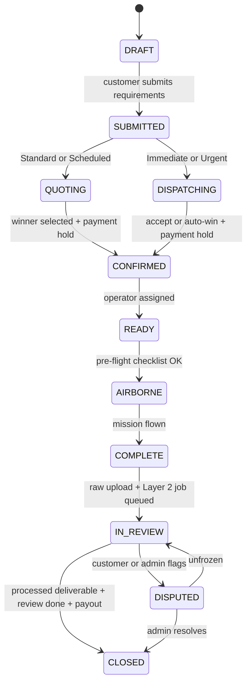
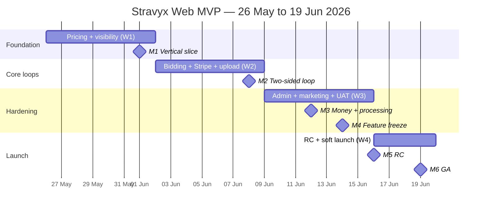
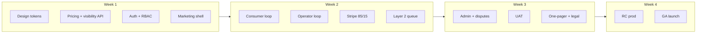

# Stravyx Web MVP — Full Build Breakdown & Timeline

> **Summary also in:** [`executive-summary.md`](./executive-summary.md) § MVP build timeline (19 June 2026)  
> **PDF (8 pages, sections 1–14):** [`stravyx-mvp-build-timeline.pdf`](./stravyx-mvp-build-timeline.pdf) — Regenerate: `python3 scripts/generate_mvp_build_timeline_pdf.py`  
> **Aligned to:** *Stravyx Master Business Summary* (Founder's Mission Statement, April 2026)

**Target launch:** Thursday **19 June 2026**  
**Planning anchor:** Monday **26 May 2026** (Day 1)  
**Duration:** 25 working days (5 weeks)  
**Platform:** Web only — consumer booking, **mobile operator** (own ReOC) portal, admin  
**Design:** Figma → engineering handoff  
**Team (full plan):** 10–12 FTE · **Budget context:** AUD 1.5–2.5M Phase 1 (founder model)

### Contents

1. [Commercial model](#0-commercial-model-at-mvp-founder-alignment)  
2. [MVP scope](#1-mvp-scope-locked-for-19-june)  
3. [Team & workstreams](#2-team--workstreams-1012-fte)  
4. [Calendar & milestones](#3-calendar-overview)  
5. [Week-by-week plan](#4-week-by-week-build-plan)  
6. [Workstream delivery map](#5-workstream-delivery-map)  
7. [Critical path](#6-critical-path)  
8. [Definition of done](#7-definition-of-done-19-june-ga)  
9. [Feature epic breakdown](#9-feature-epic-breakdown)  
10. [Mission lifecycle](#10-mission-lifecycle--state-machine)  
11. [Milestone acceptance criteria](#11-milestone-acceptance-criteria-m0m6)  
12. [Infrastructure & environments](#12-infrastructure--environments)  
13. [QA & UAT schedule](#13-qa--uat-schedule)  
14. [Risks & decision gates](#14-risks--decision-gates)  
15. [Visual timeline](#15-visual-timeline)  
16. [Post-launch](#8-post-launch-20-jun--jul-2026)

> **Goal:** Prove the commercial model on web — customer sees **Stravyx Network Price**, pays once, receives **processed deliverables**; **mobile operator** bids within **Price Guide**, wins on **BEST MATCH SCORE**, flies mission, uploads **raw data** (Layer 1 payout 85%); Layer 2 processing queued for Stravyx AI pipeline.

---

## 0. Commercial model at MVP (founder alignment)

| Element                 | MVP implementation                                                                                                                    |
| ----------------------- | ------------------------------------------------------------------------------------------------------------------------------------- |
| **Customer price**      | Single **Stravyx Network Price** (algorithmic: base $250/hr × equipment factor × urgency multiplier)                                  |
| **Operator economics**  | Sees flight fee + **85%** share only; submits bid within **Price Guide** floor/ceiling                                                |
| **BEST MATCH SCORE**    | Ranks bids: price vs guide, rating, capability, proximity (working name per founder doc)                                              |
| **Layer 2 processing**  | Raw upload → processing job queued; customer portal shows processed output when ready (MVP: manual/placeholder acceptable for launch) |
| **Visibility rules**    | API enforces: operator never receives customer total or processing fee fields                                                         |
| **Supply at launch**    | **Mobile operators (own ReOC)** only — Stravyx pilot / dock owner flows post-MVP                                                      |
| **Credibility package** | **Live marketing website** + **commercial one-pager** — DJI outreach gate (Week 3–4)                                                  |

---

## 1. MVP scope (locked for 19 June)

### In scope (P0 — launch blockers)

| Area                    | Deliverable                                                                                                                                                                                     |
| ----------------------- | ----------------------------------------------------------------------------------------------------------------------------------------------------------------------------------------------- |
| **Consumer web**        | Mission wizard · urgency tier · **Stravyx Network Price** display · pay (Stripe hold) · tracker · **processed deliverables** portal view · review · rating                                      |
| **Mobile operator web** | RePL/ReOC verification · mission brief (suburb only) · **Price Guide** · bid submission · accept/win · manual Ready/Airborne/Complete · **raw data** upload · 85% payout view (flight fee only) |
| **Admin**               | Operator verification · mission oversight · dispute freeze · audit CSV · pricing/visibility config                                                                                              |
| **Pricing engine**      | Network Price calculator · equipment factors (MVP subset) · urgency multipliers · Price Guide generation                                                                                        |
| **Matching**            | **BEST MATCH SCORE v1** · broadcast Urgent/Immediate · quote collection Standard/Scheduled                                                                                                      |
| **Payments**            | Stripe Connect · hold on confirm · capture after review · **15% Stravyx / 85% operator** on Layer 1                                                                                             |
| **Processing**          | Layer 2 job queue · status in customer portal (stub OK if SLA manual 24–48h)                                                                                                                    |
| **Marketing site**      | Professional live site: product, docks vision, operator signup — **DJI credibility threshold**                                                                                                  |
| **One-pager**           | PDF deck: model, two-layer revenue, operator network, three DJI asks                                                                                                                            |

### Launch mission categories (5 of 10)

1. **Aerial photography and videography**  
2. **Property and building inspection**  
3. **Construction / site progress**  
4. **Event coverage**  
5. **Security and surveillance** (single-mission; patrol blocks post-MVP)

*Deferred:* land survey/mapping, agriculture, infrastructure (LiDAR), 3D/digital twin, package delivery, search/emergency, custom.

### Explicitly out of scope (19 June)

| Item                                                | When                                            |
| --------------------------------------------------- | ----------------------------------------------- |
| Stravyx pilot (dock) / dock owner portals           | After ReOC + partner strategy                   |
| Stravyx Finance (4K Group) checkout in app          | Commercial track parallel; reference on website |
| Enterprise rate card / API / reseller               | Phase 1 programme 2026–2027                     |
| Full Layer 2 AI (Roboflow/proprietary)              | Manual/placeholder processing OK at GA          |
| DJI Dock-to-Cloud live dispatch                     | Pilot-to-Cloud manual path for mobile operators |
| Native iOS/Android apps                             | Phase 1 programme post-GA                       |
| Patrol block subscriptions (Sentinel/Corridor/Agri) | Phase 1 — human-led packages                    |

---

## 2. Team & workstreams (10–12 FTE)

| Workstream                   | Roles                                                 | FTE |
| ---------------------------- | ----------------------------------------------------- | --- |
| **Product / design**         | PM, Figma (7 user types, visibility rules)            | 1.5 |
| **Platform / backend**       | Pricing engine, bidding, BEST MATCH SCORE, visibility | 3   |
| **Consumer + marketing web** | Next.js consumer + **public marketing site**          | 2   |
| **Operator + admin web**     | Mobile operator portal + admin                        | 1   |
| **Processing / data**        | Layer 2 queue, deliverable states                     | 0.5 |
| **DevOps**                   | AWS Sydney, CI/CD                                     | 1   |
| **QA**                       | Week 2+                                               | 1   |
| **Commercial**               | One-pager, DJI prep, ReOC thread, 4K Group            | 1   |
| **Compliance**               | CASA checklist copy, operator verification            | 0.5 |

---

## 3. Calendar overview

| Milestone                 | Date       | Gate                                                |
| ------------------------- | ---------- | --------------------------------------------------- |
| **M0** Kickoff            | 26 May     | Founder model locked; visibility matrix in API spec |
| **M1** Vertical slice     | 1 Jun      | Network Price → bid → confirm (staging, mock pay)   |
| **M2** Two-sided          | 8 Jun      | Consumer pays; operator wins bid; raw upload        |
| **M3** Money + processing | 12 Jun     | 85/15 split; Layer 2 job visible in portal          |
| **M4** Feature freeze     | 14 Jun     | P0 only                                             |
| **M5** RC + credibility   | 16 Jun     | Prod deploy; **marketing site live**                |
| **M6** **GA**             | **19 Jun** | Public booking + operator network                   |

---

## 4. Week-by-week build plan

### Week 1 — Foundation (26 May – 1 Jun)

**Theme:** Pricing engine, visibility rules, mission SM, marketing site shell.

| Day | Date   | Focus                                                                             |
| --- | ------ | --------------------------------------------------------------------------------- |
| D1  | 26 May | Figma: Network Price + operator bid UX; monorepo; `pricing`, `visibility` modules |
| D2  | 27 May | Network Price calculator v1; equipment factors; mission schemas (5 categories)    |
| D3  | 28 May | Auth + RBAC (consumer, mobile_operator, admin); operator onboarding               |
| D4  | 29 May | Price Guide model; BEST MATCH SCORE formula; bid API                              |
| D5  | 30 May | Marketing site Next.js (home, product, operators); dispatch notifications         |
| D6  | 31 May | Audit log; information-layer field filters on all API responses                   |
| D7  | 1 Jun  | **M1:** Price → bid → confirm in staging                                          |

**Exit:** Operator API returns flight fee + 85% only; customer API returns Network Price only.

---

### Week 2 — Core loops (2 Jun – 8 Jun)

**Theme:** Bidding, BEST MATCH SCORE UX, Stripe 85/15, raw upload, processing queue.

| Day | Date  | Focus                                                                 |
| --- | ----- | --------------------------------------------------------------------- |
| D8  | 2 Jun | Consumer: urgency + Network Price; operator: mission brief + bid form |
| D9  | 3 Jun | Stripe Connect; PaymentIntent on Network Price; 15% platform fee      |
| D10 | 4 Jun | BEST MATCH SCORE ranking UI; winner selection; address reveal         |
| D11 | 5 Jun | Pre-flight checklist; Ready/Airborne/Complete; raw upload to S3       |
| D12 | 6 Jun | Layer 2 processing job + customer "processed deliverables" state      |
| D13 | 7 Jun | All 5 category forms; review window; payout trigger (85%)             |
| D14 | 8 Jun | **M2:** Full loop staging                                             |

**Exit:** BEST MATCH SCORE visible; 85/15 payout test; processing status in portal.

---

### Week 3 — Hardening (9 Jun – 15 Jun)

**Theme:** Admin, marketing site polish, one-pager, legal, production.

| Day     | Date     | Focus                                                                                  |
| ------- | -------- | -------------------------------------------------------------------------------------- |
| D15–D17 | 9–11 Jun | Verification queue; Scheduled tier; marketing site content; mobile responsive operator |
| D18     | 12 Jun   | Disputes; **M3** prod Stripe; processing SLA copy                                      |
| D19     | 13 Jun   | Legal pages; **commercial one-pager** v1; ReOC strategy page (internal)                |
| D20     | 14 Jun   | **M4 feature freeze**                                                                  |
| D21     | 15 Jun   | UAT; performance; **marketing site sign-off for DJI readiness**                        |

**Exit:** Live professional website; one-pager ready; 10 pilot operators verified.

---

### Week 4 — Launch (16 Jun – 19 Jun)

| Day | Date   | Activities                                         |
| --- | ------ | -------------------------------------------------- |
| D22 | 16 Jun | **M5 RC**; marketing site on production domain     |
| D23 | 17 Jun | Soft launch: Founding Operators (mobile, own ReOC) |
| D24 | 18 Jun | P0 fixes; ops rehearsal                            |
| D25 | 19 Jun | **M6 GA**; Sydney + Melbourne metro; war room      |

**Launch checklist:** Network Price displays correctly · operator cannot see processing fee · ≥50 verified mobile operators · marketing site live · one-pager PDF available.

---

## 5. Workstream delivery map

### 5.1 Design → Cursor handoff

Use **Figma as source of truth**; paste frame URLs (with `node-id`) into Cursor when implementing screens. Optional Stitch ideation → paste into Figma first, then follow this checklist.

#### Week 1 exports (before D2 engineering)

| Export                                                                   | Where it lands                                            | Owner       |
| ------------------------------------------------------------------------ | --------------------------------------------------------- | ----------- |
| **Design tokens** — colour, type, spacing, radius, shadows               | `packages/ui` theme (CSS vars or Tailwind `theme.extend`) | Design      |
| **Core components** — Button, Input, Card, Badge, Modal, Table           | Published Figma library + matching React in `packages/ui` | Design + FE |
| **Layout primitives** — App shell, nav, page header, empty/loading/error | Figma components + shared layout in Next.js apps          | Design + FE |
| **Flow index page** — one Figma page listing all MVP frames with links   | Figma only (Cursor entry point)                           | Design      |

Do not start consumer/operator/admin feature frames until tokens and primitives are exported and merged (target: **end of D1 / morning D2**).

#### Frame naming (Figma pages & frames)

Pattern: `{app}/{feature}/{screen}[/state]`

| App prefix   | Examples                                                              |
| ------------ | --------------------------------------------------------------------- |
| `consumer/`  | `consumer/booking/wizard-step-3`, `consumer/mission/tracker-airborne` |
| `operator/`  | `operator/bid/price-guide-form`, `operator/mission/raw-upload`        |
| `admin/`     | `admin/operators/verification-queue`                                  |
| `marketing/` | `marketing/home`, `marketing/operators-signup`                        |
| `shared/`    | `shared/components/button-variants`                                   |

Use **kebab-case**, match route segments where possible, and suffix states: `/empty`, `/loading`, `/error`, `/success`.

#### Per-frame content (backend hints for Cursor)

Annotate each screen (Figma description or sticky notes) so Cursor can infer API modules without guessing:

| Annotation block    | What to include                                                                                          |
| ------------------- | -------------------------------------------------------------------------------------------------------- |
| **Route & role**    | Next.js path; allowed roles (`consumer`, `mobile_operator`, `admin`)                                     |
| **API touchpoints** | Module + action, e.g. `POST /missions`, `GET /missions/:id/bids`, `PATCH /missions/:id/status`           |
| **Visibility**      | Fields shown/hidden per role (e.g. operator: flight fee + 85% only; never customer total or Layer 2 fee) |
| **State machine**   | Mission status on this screen; valid transitions (e.g. `Ready → Airborne` requires compliance checklist) |
| **Pricing**         | Network Price vs Price Guide vs bid; urgency tier; equipment factor if applicable                        |
| **Matching**        | BEST MATCH SCORE display rules; broadcast vs quote-collection tier                                       |
| **Payments**        | Stripe step (hold / capture / payout); 85/15 split note on operator earnings views                       |
| **Processing**      | Layer 1 (raw upload) vs Layer 2 (processed deliverable) states shown to customer                         |
| **Validation**      | Required fields, max lengths, file types for uploads                                                     |
| **Errors & empty**  | Copy for 403, 404, no bids, dispute frozen — link separate `/error` frames                               |

**Minimum on every P0 flow frame:** route, role, primary API, mission status, and visibility rule.

#### Cursor prompt habit

When asking Cursor to build a screen, include:

1. Figma URL with `node-id`
2. App name (`consumer` | `operator` | `admin` | `marketing`)
3. Pointer to exported tokens / `packages/ui` component names
4. Copy-paste of the frame’s annotation block (table above)

#### Week-by-week design deliverables (Figma)

| Week | Frames to complete                                                                   |
| ---- | ------------------------------------------------------------------------------------ |
| 1    | Tokens + primitives; Network Price + bid UX; wizard shell; operator onboarding       |
| 2    | Checkout/hold; BEST MATCH SCORE ranking; tracker; raw upload; processed deliverables |
| 3    | Admin verification/disputes; edge states; marketing site; legal pages                |
| 4    | Launch assets only — **no new flows**                                                |

---

### Backend modules

| Module       | Week 1                                    | Week 2                      | Week 3            |
| ------------ | ----------------------------------------- | --------------------------- | ----------------- |
| `pricing`    | Network Price, urgency, equipment factors | Price Guide                 | Admin tuning      |
| `matching`   | —                                         | BEST MATCH SCORE, broadcast | Proximity weights |
| `visibility` | Role-based field matrix                   | Integration tests           | —                 |
| `missions`   | State machine                             | Bidding, confirm            | Disputes          |
| `payments`   | Stub                                      | Stripe 85/15                | Capture           |
| `processing` | —                                         | Layer 2 queue + status      | SLA monitoring    |
| `compliance` | Checklist                                 | Ready→Airborne gate         | Export            |

### Parallel commercial (founder doc)

| Activity                              | Window                       |
| ------------------------------------- | ---------------------------- |
| ReOC strategy (HAO, partner)          | 26 May – ongoing             |
| 4K Group / Stravyx Finance discussion | 26 May – 5 Jun               |
| DJI credibility package complete      | Before 20 Jun outreach       |
| CASA engagement planning              | Post-GA (per founder timing) |
| Founding mobile operator outreach     | 26 May – 19 Jun              |

---

## 6. Critical path

```
Pricing engine → Visibility rules → Bidding + BEST MATCH SCORE → Stripe 85/15
  → Raw upload → Layer 2 handoff → Marketing site live → GA 19 Jun
```

**Cut lines:** 3 mission categories only · price-only ranking · manual Network Price (no equipment factors) · slip GA to 26 Jun.

---

## 7. Definition of done (19 June GA)

1. Customer books at displayed **Stravyx Network Price** and pays.  
2. **Mobile operator** submits bid within Price Guide; **BEST MATCH SCORE** selects winner.  
3. Operator completes mission; uploads **raw data**; sees **85% of flight fee** only.  
4. Customer receives **processed deliverable** in portal (AI or documented manual SLA).  
5. Stravyx retains **15% Layer 1** + Layer 2 fee not exposed to operator.  
6. **Marketing website** live and professional.  
7. **Commercial one-pager** ready for DJI/partner meetings.

---

## 9. Feature epic breakdown

Each epic lists **P0 stories**, **owner workstream**, and **target week**. Stories marked *(cut)* are first scope reductions if behind by 10 Jun.

### 9.1 Platform — pricing & visibility

| ID   | Story                          | Acceptance                                                                    | Week  |
| ---- | ------------------------------ | ----------------------------------------------------------------------------- | ----- |
| P-01 | Network Price calculator       | Base $250/hr × equipment factor × urgency; returned on mission submit         | W1    |
| P-02 | Equipment factors (MVP subset) | At least 3 tiers (e.g. standard / thermal / heavy lift) configurable in admin | W1–W2 |
| P-03 | Urgency multipliers            | Immediate 2.0–2.5×, Urgent 1.25–1.5×, Standard 1.0×, Scheduled 0.85–0.90×     | W1    |
| P-04 | Price Guide generation         | Floor/ceiling per mission; operator bid API validates range                   | W1    |
| P-05 | Visibility field matrix        | Role-based serializers: operator never sees customer total or Layer 2 fee     | W1    |
| P-06 | Admin pricing tuning           | Override multipliers and equipment table without deploy                       | W3    |

### 9.2 Platform — matching & missions

| ID   | Story                      | Acceptance                                                                                                        | Week  |
| ---- | -------------------------- | ----------------------------------------------------------------------------------------------------------------- | ----- |
| M-01 | Mission state machine      | Draft → Submitted → Quoting/Dispatching → Confirmed → Ready → Airborne → Complete → In Review → Closed / Disputed | W1    |
| M-02 | BEST MATCH SCORE v1        | Weighted rank: price vs guide, rating, capability, proximity                                                      | W2    |
| M-03 | Standard/Scheduled quoting | Collect bids; customer or system selects winner by score                                                          | W2    |
| M-04 | Immediate/Urgent broadcast | Push brief to eligible operators; accept or auto-win rules                                                        | W2    |
| M-05 | Address reveal on confirm  | Suburb on card; full address only after winner + payment hold                                                     | W2    |
| M-06 | Dispute freeze             | Admin freezes mission; blocks payout and status advance                                                           | W3    |
| M-07 | Audit log + CSV export     | Immutable events; admin download for compliance review                                                            | W1–W3 |

### 9.3 Platform — payments & processing

| ID   | Story                          | Acceptance                                                                  | Week  |
| ---- | ------------------------------ | --------------------------------------------------------------------------- | ----- |
| $-01 | Stripe Connect onboarding      | Mobile operators complete Connect; platform account configured              | W2    |
| $-02 | PaymentIntent on Network Price | Hold at confirm; amount = customer-facing total only                        | W2    |
| $-03 | Layer 1 split 85/15            | Transfer 85% of **flight fee** (winning bid) to operator on review complete | W2–W3 |
| $-04 | Capture after review           | Customer review window ends → capture hold → trigger payout                 | W2–W3 |
| $-05 | Layer 2 job queue              | Job created on raw upload; statuses: queued / processing / ready / failed   | W2    |
| $-06 | Processed deliverables portal  | Customer downloads/views processed output when job ready                    | W2    |
| $-07 | Manual processing SLA          | Ops can mark job ready with placeholder assets; copy states 24–48h SLA      | W3    |

### 9.4 Consumer web

| ID   | Story                         | Acceptance                                              | Week  |
| ---- | ----------------------------- | ------------------------------------------------------- | ----- |
| C-01 | Mission wizard (5 categories) | Dynamic forms per category; geo + requirements          | W1–W2 |
| C-02 | Urgency tier selection        | Updates Network Price in real time                      | W2    |
| C-03 | Network Price display         | Single price; no fee breakdown                          | W2    |
| C-04 | Checkout / Stripe hold        | Payment succeeds → mission Confirmed                    | W2    |
| C-05 | Mission tracker               | Ready / Airborne / Complete with map or status timeline | W2    |
| C-06 | Raw + processed deliverables  | List uploads; processing status badge                   | W2–W3 |
| C-07 | Review & rating               | 48h window; triggers capture path                       | W2    |
| C-08 | Auth (consumer)               | Sign up / login; mission history                        | W1    |

### 9.5 Mobile operator web

| ID   | Story                           | Acceptance                                                                   | Week  |
| ---- | ------------------------------- | ---------------------------------------------------------------------------- | ----- |
| O-01 | RePL/ReOC verification upload   | Admin approves before bidding                                                | W1–W3 |
| O-02 | Operator profile + capabilities | Equipment tags feed capability match score                                   | W1–W2 |
| O-03 | Mission brief card              | Suburb, category, urgency, requirements; no full address pre-win             | W2    |
| O-04 | Price Guide + bid form          | Bid rejected outside floor/ceiling                                           | W2    |
| O-05 | BEST MATCH SCORE visibility     | Operator sees rank context (not other operators’ bid amounts) *(policy TBD)* | W2    |
| O-06 | Win notification + address      | Full address after accept/win                                                | W2    |
| O-07 | Pre-flight checklist            | Blocks Ready → Airborne until complete                                       | W2    |
| O-08 | Status controls                 | Manual Ready / Airborne / Complete                                           | W2    |
| O-09 | Raw data upload                 | S3 multipart; mission marked complete triggers Layer 2 job                   | W2    |
| O-10 | Earnings view                   | Flight fee + 85% estimate only; never customer total                         | W2    |

### 9.6 Admin web

| ID   | Story                       | Acceptance                                      | Week |
| ---- | --------------------------- | ----------------------------------------------- | ---- |
| A-01 | Operator verification queue | Approve/reject with reason                      | W3   |
| A-02 | Live mission list + detail  | Status override read-only except dispute freeze | W3   |
| A-03 | Dispute freeze control      | Stops payout pipeline                           | W3   |
| A-04 | Pricing / visibility config | Edit multipliers and field rules                | W3   |
| A-05 | Audit CSV export            | Date-range filter                               | W3   |

### 9.7 Marketing & commercial

| ID   | Story                        | Acceptance                                                 | Week  |
| ---- | ---------------------------- | ---------------------------------------------------------- | ----- |
| K-01 | Marketing site (Next.js)     | Home, product, operators, contact; production domain       | W1–W4 |
| K-02 | Commercial one-pager PDF     | Model, two-layer revenue, operator network, three DJI asks | W3    |
| K-03 | Legal pages                  | Terms, privacy, CASA disclaimer copy                       | W3    |
| K-04 | Founding Operator signup CTA | Captures leads; ops manual verify                          | W1–W4 |

### 9.8 DevOps & compliance

| ID   | Story                           | Acceptance                                       | Week |
| ---- | ------------------------------- | ------------------------------------------------ | ---- |
| D-01 | Monorepo + CI/CD                | PR checks; deploy staging/prod (AWS Sydney)      | W1   |
| D-02 | Postgres + PostGIS + Redis + S3 | Mission geo queries; media storage               | W1   |
| D-03 | Observability baseline          | Logs, errors, uptime check on prod               | W3   |
| D-04 | CASA checklist copy             | Consumer + operator pre-flight UI text           | W2   |
| D-05 | RBAC enforcement                | consumer / mobile_operator / admin on all routes | W1   |

---

## 10. Mission lifecycle & state machine



| Transition                      | Gate                                  | System action                              |
| ------------------------------- | ------------------------------------- | ------------------------------------------ |
| SUBMITTED → QUOTING/DISPATCHING | Network Price computed                | Notify eligible operators                  |
| → CONFIRMED                     | BEST MATCH SCORE winner + Stripe hold | Reveal full address                        |
| READY → AIRBORNE                | Compliance checklist complete         | Log audit event                            |
| COMPLETE → IN_REVIEW            | Raw files in S3                       | Create Layer 2 job (invisible to operator) |
| IN_REVIEW → CLOSED              | Processed asset ready + review timer  | Capture payment; 85/15 payout              |

**Information layers on API responses**

| Role            | Sees                                          | Never sees                                  |
| --------------- | --------------------------------------------- | ------------------------------------------- |
| Customer        | Stravyx Network Price, processed deliverables | Operator bid amounts, Layer 2 cost build-up |
| Mobile operator | Flight fee, 85% share, Price Guide            | Customer total, processing fee              |
| Admin           | Full economics, audit                         | —                                           |

---

## 11. Milestone acceptance criteria (M0–M6)

| Milestone                 | Date   | Must demonstrate                                                                                                | Sign-off            |
| ------------------------- | ------ | --------------------------------------------------------------------------------------------------------------- | ------------------- |
| **M0** Kickoff            | 26 May | Visibility matrix in OpenAPI/spec; founder pricing constants locked; Figma flow index started                   | PM + founder        |
| **M1** Vertical slice     | 1 Jun  | Staging: create mission → Network Price → operator bid → confirm (mock Stripe); API tests prove field filtering | Eng lead            |
| **M2** Two-sided loop     | 8 Jun  | Staging: real Stripe test mode; consumer pays; operator wins; raw upload; Layer 2 job visible to customer       | PM + QA             |
| **M3** Money + processing | 12 Jun | Prod Stripe: 85/15 on test mission; processing status in portal; dispute freeze blocks payout                   | Eng + ops           |
| **M4** Feature freeze     | 14 Jun | No new P0 stories; only P0 bugs and copy                                                                        | PM                  |
| **M5** RC                 | 16 Jun | Prod deploy consumer + operator + admin; marketing site on public domain; smoke tests green                     | Eng + commercial    |
| **M6** GA                 | 19 Jun | Public booking Sydney + Melbourne metro; ≥50 verified operators; war room checklist complete                    | Founder + board ops |

**M1 demo script (5 min):** Consumer creates construction mission (Standard) → sees Network Price → operator bids within Price Guide → BEST MATCH SCORE ranks → confirm with mock pay → statuses through Complete (staging seed).

**M6 war room checklist (19 Jun):**

- [ ] Network Price matches calculator for all 5 categories × 4 urgency tiers (spot check matrix)
- [ ] Operator API response inspection: no `customerTotal`, `processingFee`, or Layer 2 fields
- [ ] Stripe dashboard: platform fee 15% on Layer 1 test transaction
- [ ] Marketing site loads on production URL; one-pager PDF linked
- [ ] Founding Operator soft-launch comms sent
- [ ] On-call rotation and dispute playbook printed

---

## 12. Infrastructure & environments

| Environment    | Purpose                                | Ready by |
| -------------- | -------------------------------------- | -------- |
| **Local**      | Docker compose: API + Postgres + Redis | D1       |
| **Staging**    | Integration, QA, demo (M1+)            | D3       |
| **Production** | RC (M5) and GA (M6)                    | D16      |

| Component    | Service                                        | Notes                     |
| ------------ | ---------------------------------------------- | ------------------------- |
| API          | NestJS on ECS/Fargate or Elastic Beanstalk     | ap-southeast-2            |
| Web apps     | Next.js (consumer, operator, admin, marketing) | Vercel or CloudFront + S3 |
| Database     | RDS PostgreSQL + PostGIS                       | Mission geo, coverage     |
| Cache        | ElastiCache Redis                              | Sessions, dispatch queues |
| Media        | S3 + CloudFront                                | Raw upload, deliverables  |
| Auth         | Auth0 or Cognito                               | RBAC claims map to roles  |
| Payments     | Stripe Connect                                 | AU accounts               |
| Maps         | Mapbox                                         | Geocode, tracker          |
| Email / push | SendGrid + web push (MVP: email OK)            | Dispatch notifications    |

**Repo structure (target monorepo):**

```
apps/consumer-web | operator-web | admin-web | marketing-web
packages/ui | api-client | types
services/api (NestJS modules: pricing, matching, visibility, missions, payments, processing, compliance)
```

---

## 13. QA & UAT schedule

| Phase                | Dates        | Focus                                      | Entry                    | Exit                  |
| -------------------- | ------------ | ------------------------------------------ | ------------------------ | --------------------- |
| **Smoke**            | W1 daily     | Auth, pricing API, visibility filters      | D3                       | No P0 API regressions |
| **Integration**      | W2 (D8–D14)  | End-to-end staging loops                   | M1 done                  | M2 sign-off           |
| **Regression**       | W3 (D15–D21) | Full P0 matrix; mobile operator responsive | M2 done                  | M4 freeze             |
| **UAT**              | D15–D21      | Founder + 3 pilot operators + 2 consumers  | Feature-complete staging | Sign-off D21          |
| **Launch rehearsal** | D24          | Ops playbook, dispute, manual processing   | RC on prod               | Go/no-go              |

**P0 test matrix (minimum cases before M4)**

| Area       | Cases                                                       |
| ---------- | ----------------------------------------------------------- |
| Pricing    | Each urgency tier; bid below floor / above ceiling rejected |
| Visibility | Automated contract tests per role on mission + bid payloads |
| Matching   | BEST MATCH SCORE ordering stable with fixture operators     |
| Payments   | Hold → complete → capture → 85% transfer (Stripe test)      |
| Processing | Raw upload creates job; customer sees status transitions    |
| Compliance | Cannot go Airborne without checklist                        |
| Categories | One happy path per live mission category (5)                |

---

## 14. Risks & decision gates

| Risk                                    | Likelihood | Impact      | Mitigation                                    | Decision date |
| --------------------------------------- | ---------- | ----------- | --------------------------------------------- | ------------- |
| Stripe Connect operator onboarding slow | Medium     | High        | Start Founding Operator Connect onboarding D8 | 26 May        |
| BEST MATCH SCORE tuning delays dispatch | Medium     | Medium      | Ship v1 weights; tune post-GA                 | 10 Jun        |
| Layer 2 AI not ready                    | High       | Medium      | Manual/placeholder SLA documented             | 12 Jun (M3)   |
| Supply &lt; 50 verified operators       | Medium     | High        | Outreach D1; verification SLA 48h             | 15 Jun        |
| Scope creep (dock portals, native apps) | Medium     | High        | M4 freeze; cut lines enforced                 | **10 Jun**    |
| ReOC not granted                        | High       | Low for MVP | Mobile-only GA; dock flows post-MVP           | Ongoing       |

**Cut-line decision (mandatory by EOD 10 Jun if &lt; M2 exit criteria):**

| Option                   | Trade-off                                |
| ------------------------ | ---------------------------------------- |
| A — 3 categories only    | Drop events + security at GA             |
| B — Price-only ranking   | Drop rating/capability/proximity weights |
| C — Manual Network Price | Drop equipment factors; flat multipliers |
| D — GA slip to 26 Jun    | Full P0 scope; move M5/M6 one week       |

Only one of A–C may combine with D. Founder + PM decide in writing.

---

## 15. Visual timeline

### Gantt (working days D1–D25)



### Workstream parallel view



### Epic → calendar heatmap

| Epic                   |  W1   |  W2   |  W3   |  W4   |
| ---------------------- | :---: | :---: | :---: | :---: |
| Pricing & visibility   | ████  |  ██   |   █   |       |
| Matching & missions    |  ██   | ████  |  ██   |       |
| Payments & processing  |   █   | ████  |  ██   |       |
| Consumer web           |  ██   | ████  |  ██   |   █   |
| Operator web           |  ██   | ████  |  ██   |   █   |
| Admin                  |       |   █   | ████  |   █   |
| Marketing / commercial |  ██   |   █   | ████  |  ██   |
| DevOps / QA            | ████  | ████  | ████  |  ██   |

---

## 8. Post-launch (20 Jun – Jul 2026)

| Window    | Focus                                                                         |
| --------- | ----------------------------------------------------------------------------- |
| 20–27 Jun | BEST MATCH SCORE tuning; operator feedback; processing automation             |
| Jul 2026  | Mission categories 6–10; patrol blocks; dock pilot flows; native apps scoping |

---

*Related: [executive-summary.md](./executive-summary.md) · Founder source: Master Business Summary, April 2026*
